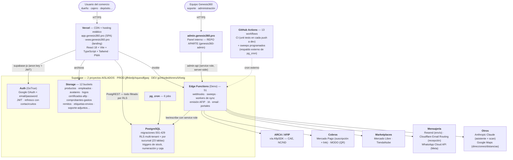

# Infraestructura — topología y jobs programados

> **Por qué existe esta página.** Hasta el 2026-09-18 `wiki/architecture/` era **texto puro, sin un solo
> diagrama**: los 10 `.drawio` de `G360.Wiki/diagrams/` son todos de **procesos de negocio**, no de
> infraestructura. Esta página cierra ese hueco.
>
> **Todo lo de acá está contado desde el repo, no de memoria**: las Edge Functions se contaron sobre
> `supabase/functions/`, los jobs de `pg_cron` se buscaron con `cron.schedule(` en `supabase/migrations/`,
> los buckets sobre los `storage.from('…')` reales del código y los workflows sobre `.github/workflows/`.
> Donde un número difiera de otra página del wiki, **manda éste** (ver "Drift detectado" al final).

## 🗺️ Diagrama 11 — Topología

Editable en draw.io: [`G360.Wiki/diagrams/11-infraestructura-topologia.drawio`](../../diagrams/11-infraestructura-topologia.drawio).

> 🛑 **El navegador nunca habla con los externos.** Toda credencial de tercero vive en secrets de Edge
> Function o de Vercel. El frontend solo lleva la **anon key**, y lo que ésa puede ver lo decide **RLS** —
> por eso una `service_role` filtrada es crítica: saltea RLS y ve todos los negocios (ver
> [[wiki/architecture/multi-tenant-rls]]).

## ⏱️ Qué corre solo, y desde dónde

Hay **dos relojes distintos**, y conviene no confundirlos:

| | Dónde vive | Cuántos | Qué dispara |
|---|---|---|---|
| **`pg_cron`** | Dentro de Postgres | **6 jobs** | SQL directo (funciones `fn_*`), sin salir de la base |
| **GitHub Actions** | Fuera de Supabase | **13 workflows** | `curl` a Edge Functions (sweeps) + CI de tests |

**Los 6 jobs de `pg_cron`** (verificados con `cron.schedule(` en las migraciones):

| Job | Migración | Cadencia |
|---|---|---|
| Aplicar precios programados | 422 | cada minuto |
| Avisar precios que entran mañana | 422 | 12:00 diario |
| Notificar cuentas corrientes vencidas | 091 | diaria |
| Limpieza de `integration_job_queue` | 104 | diaria |
| Limpieza de tokens de envío vencidos | 143 | diaria |
| Sync de fulfillment TiendaNube | 338 | cada 5 min |

**Los 13 workflows** (`.github/workflows/`): `tests` (CI) · `sweeps` · `birthday-notifications` ·
`monitoring-check` · `mp-reconciliacion` · `tn-stock-sync` · `meli-stock-sync` · `tn-fulfillment-sync` ·
`repricing-sweep` · `repositores-cierre-dia-sweep` · `tenant-hard-delete-sweep` · `nc-afip-retry-sweep` ·
`wa-briefing-sweep`.

> ⚠️ Un workflow programado **solo se dispara desde el branch por defecto** del repo. Una feature que vive
> en `dev` no ejecuta su cron hasta mergear — en DEV se invoca a mano por `curl`.

## 🔑 API keys de Supabase — legacy vs nuevas (2026-09-20)

> Motivado por la `service_role` de PROD filtrada en el chat el 2026-09-16. Detalle completo, con los números
> medidos, en `log.md` (2026-09-20, "Migración de API keys legacy"). Acá queda el modelo, para no repetir la
> investigación la próxima vez.

**No existe un botón para "regenerar solo la `service_role`".** El modelo legacy de Supabase tiene DOS keys,
`anon` y `service_role`, y ambas son JWT firmados con el **JWT secret** del proyecto — no hay control
individual. Las únicas dos formas de invalidar una:

1. **Rotar el JWT secret entero** — invalida `anon` y `service_role` a la vez (deslogueo masivo + rompe la PWA
   cacheada, porque el frontend lleva la `anon` hardcodeada en el bundle).
2. **Desactivar las legacy keys** (Settings → API → "Disable JWT-based API keys") — un solo botón, todo-o-nada,
   confirmado contra la Management API (`PUT /api-keys/legacy?enabled=true|false`, sin parámetro para elegir una
   sola key).

Supabase ya tiene un modelo **nuevo** de API keys (`sb_publishable_…` reemplaza a `anon`, `sb_secret_…`
reemplaza a `service_role`), independiente del JWT secret. DEV y PROD **ya las tenían creadas** desde el
2026-03-06, y Supabase **ya remapeó el contenido** de las variables que inyecta en las Edge Functions:
`SUPABASE_SERVICE_ROLE_KEY` trae hoy la SECRET nueva, `SUPABASE_ANON_KEY` la PUBLISHABLE nueva (verificado con
una EF de diagnóstico y los logs del gateway). **Las 51 Edge Functions no necesitan ningún cambio de código.**

> ⚠️ **La trampa del botón "Disable legacy keys"**: avisa *"remain valid as a JWT"*. Verificado con datos en
> DEV: tras desactivar, la key vieja en el header `apikey` da 401, pero **como `Authorization: Bearer` sigue
> dando 200**. Para matar de verdad una `service_role` filtrada hace falta además **revocar la JWT signing key
> vieja** (HS256 "previously used") en Settings → JWT Keys — DEV y PROD ya usan signing keys (ES256 `in_use`)
> desde 2026-03-06, así que revocar la HS256 vieja no desloguea a nadie.

**Estado al 2026-09-20**: DEV con las legacy keys **desactivadas** (verificado funcionando). PROD con las
legacy keys **todavía activas** — `VITE_SUPABASE_ANON_KEY` ya apunta a la publishable en Vercel (`genesis360`)
y en el secret de GitHub, pero **`genesis360-admin` todavía sirve la key vieja** (pendiente redeploy). Plan:
esperar 3-5 días a que las PWA cacheadas se renueven solas, medir en los logs del gateway que ya nadie manda la
key vieja, y recién ahí desactivar legacy + revocar la HS256 en PROD.

> 🐛 **Dos gotchas de deploy que costaron tiempo**: (1) la env var de Vercel solo entra al bundle al reconstruir
> **ese branch** — "Preview" es el ENTORNO, `dev` es la RAMA, son cosas distintas. (2) el **service worker de la
> PWA** no se da de baja con un hard-refresh — hay que ir a DevTools → Application → Service Workers →
> Unregister + Clear site data (o probar en incógnito) para confirmar que el navegador ya pide con la key nueva.

## 💾 Backups y continuidad (verificado 2026-09-20)

Organización **"Argentum Business Group"** en plan **Pro** — cubre PROD (`us-east-1`) y DEV (`sa-east-1`).

| | Estado |
|---|---|
| Backup de base de datos | **Diario, automático, 7 días de retención** (medido: 9 backups guardados, el más viejo del 13/09) |
| PITR (Point-in-Time Recovery) | Disponible como add-on, **NO contratado** (~USD 100/mes por 7 días · 200 por 14 · 400 por 28) |
| Backup de **Storage** | 🛑 **NO existe** — ver abajo |
| Restore | Del **proyecto entero**, no de un cliente/tenant suelto; el proyecto queda caído mientras dura |
| Borrar el proyecto | Borra también los backups — irreversible |

🛑 **Hueco crítico para lo que se le promete a un cliente**: el backup de Supabase **no incluye los archivos de
Storage**. Textual de Supabase: *"Database backups do not include objects you store via the Storage API"*. Eso
significa que sin mitigación **no había respaldo** de fotos de productos, certificados AFIP, comprobantes de
gastos, legajos de empleados, remitos ni adjuntos de soporte — todo lo que vive en los 12 buckets del diagrama de
arriba.

**Mitigación implementada (2026-09-20)**: `.github/workflows/backup-storage.yml` — baja **todos los buckets** a
diario con el CLI de Supabase y los guarda como **artifact de GitHub, 90 días de retención**. Usa a propósito el
**token de cuenta** (`SUPABASE_ACCESS_TOKEN`), no una key de datos del proyecto, para no dejar una credencial de
acceso a datos en GitHub Actions. Dos gotchas de la CLI verificados contra PROD: la ruta de storage lleva **TRES
barras** (`ss:///bucket`, no `ss://bucket`) y el flag `--experimental` es **obligatorio**. Secrets nuevos que
necesita: `SUPABASE_ACCESS_TOKEN` y `SUPABASE_PROJECT_REF` (🔴 pendiente de cargar en GitHub).

## 🌐 Dominio propio para Supabase (pedido de GO, NO hecho)

GO quiere que el login no muestre `jjff…supabase.co`. El add-on **Custom Domain no está contratado**
(~USD 10/mes por proyecto). Camino: contratar el add-on → elegir subdominio (sugerido `api.genesis360.pro`) →
cargar CNAME+TXT en el DNS → activar → actualizar `VITE_SUPABASE_URL` en Vercel (los 2 proyectos) + `.env.local`
+ el secret `SUPABASE_URL` de GitHub → **actualizar el redirect URI de Google OAuth** en Google Cloud Console.
Queda priorizado, sin empezar.

## 🛑 Drift detectado al construir esta página (2026-09-18)

Se encontró contando contra el repo. Estas páginas **quedaron desactualizadas** y se corrigen por separado:

| Dónde | Dice | Realidad |
|---|---|---|
| [[wiki/architecture/backend-supabase]] | 83 migraciones · 26 Edge Functions · rol `OWNER` | **429** · **51** · `OWNER` **no existe** (es `DUEÑO`; ver [[wiki/architecture/multi-tenant-rls]]) |
| [[wiki/architecture/edge-functions]] | 30 funciones Deno | **51** |
| `sources/raw/genesis360_overview.html` (doc de producto, v2.0) | 823 tests / 55 archivos · 249 migraciones · **"pg_cron no habilitado"** | **1848 tests / 112 archivos** · **429** · **pg_cron SÍ habilitado, con 6 jobs** |

El error de `pg_cron` es el más importante de los tres porque ese documento **va a externos**.

## Links relacionados

- [[wiki/architecture/backend-supabase]] · [[wiki/architecture/edge-functions]] · [[wiki/architecture/frontend-stack]]
- [[wiki/architecture/multi-tenant-rls]] — cómo RLS aísla tenant y sucursal
- [[wiki/architecture/guards-server-side]] — auditoría de seguridad completa (Tanda G, 2026-09-20): RLS, Storage, webhooks, XSS, contraseñas
- [[wiki/architecture/resiliencia]] — techo de capacidad medido, consumo por usuario y palancas
- [[wiki/development/deploy]] — cómo se despliegan app, Edge Functions y migraciones
- `G360.Wiki/diagrams/README.md` — convención de los diagramas (`.drawio` + Mermaid)
