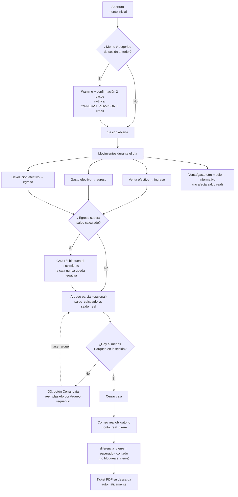

# Módulo Caja

La caja es el registro de efectivo físico del negocio. Es obligatoria para registrar ventas y gastos en efectivo.

> **v1.80.0 (EN DEV, 2026-06-19):** "Capital total del negocio" ahora se muestra **discriminado por moneda** (ya no suma ARS+USD sin convertir) + tooltip que explica qué cuenta. Las **aperturas de caja NO se suman al capital** (decisión: evita doble conteo del arrastre; el capital inicial real se asienta como **"Ingreso externo"** a la bóveda, flujo ya existente). El tab **"Caja actual"** volvió a **columna centrada** (resumen+acciones arriba, movimientos abajo). Tabs del módulo migrados al componente compartido `PageTabs` (degradé de marca + drag-scroll). Ver [[reference_caja_fuerte_capital_efectivo]].

**Página:** `src/pages/CajaPage.tsx` · panel cajero simplificado `src/pages/PanelCajeroPage.tsx` (`/caja/panel`, M3)  
**Shortcuts:** `Shift+I` = ingreso · (egreso solo vía Gastos)  
**Última actualización:** 2026-06-10 — 🎉 **relevamiento Caja A-M COMPLETO en PROD**. Tanda final v1.50.0 (PROD, mig 203, PR #178): E1 bóveda roles custom · E3 arqueo de bóveda · L3 préstamo a empleado · M3 panel cajero · M4 sonido al cobrar. Ver "Estado del relevamiento" abajo.

## 🔀 Diagrama de flujo — Ciclo de caja (apertura → movimientos → cierre)

Editable en draw.io: [`G360.Wiki/diagrams/04-caja-ciclo.drawio`](../../diagrams/04-caja-ciclo.drawio).



---

## Regla fundamental

> **"Sin caja abierta = sin negocio"**
> No se puede registrar ninguna venta (despachada o reservada) ni gasto en efectivo si no hay sesión de caja abierta.

### Integridad del efectivo (no caja negativa) — CAJ-18 (v1.76.0)

Todo egreso de efectivo (gasto, devolución, traspaso) se **bloquea si supera el saldo** de la sesión → la caja nunca queda en negativo. El saldo se calcula con `src/lib/cajaSaldo.ts` (`calcularSaldoEfectivo` puro + `saldoEfectivoSesion`), considerando solo los tipos que mueven efectivo real (`ingreso`/`ingreso_reserva`/`ingreso_traspaso` − `egreso`/`egreso_devolucion_sena`/`egreso_traspaso`). Caja **no tiene egreso manual**: los egresos entran por Gastos / traspaso / devolución (el traspaso ya validaba saldo desde antes). Además, todo asiento de efectivo va **`await`eado + toast si falla** (clase bug #26, v1.74.0/v1.76.0) — nunca se pierde del arqueo en silencio.

---

## Ciclo de una sesión de caja

```
Apertura (monto inicial)
  ↓
Movimientos durante el día (ventas, gastos, traspasos)
  ↓
Arqueo parcial (opcional, sin cerrar)
  ↓
Cierre (conteo real obligatorio → diferencia calculada)
```

La apertura **sugiere el monto del cierre anterior** de esa misma caja.

---

## Medios de pago en caja

| Medio | Efecto en caja |
|-------|---------------|
| Efectivo | `ingreso` / `egreso` — **afecta saldo real** |
| Tarjeta / MP / Transferencia | `ingreso_informativo` / `egreso_informativo` — solo registro, **no afecta saldo** |
| Seña en reserva (efectivo) | `ingreso_reserva` |
| Devolución de seña | `egreso_devolucion_sena` |
| Traspaso entre cajas | `ingreso_traspaso` / `egreso_traspaso` |
| Pago nómina | `egreso_nomina` |

> [!NOTE] El saldo de caja solo considera tipos sin `_informativo`. Tarjeta y MP se registran por trazabilidad pero no mueven el efectivo.

---

## Flujo ventas ↔ caja (v0.27.0)

- **Venta despachada** con efectivo → INSERT `ingreso` automático en `caja_movimientos`
- **Reserva** con efectivo → INSERT `ingreso_reserva`
- **Cancelar reserva señada** → INSERT `egreso_devolucion_sena`
- **Al despachar desde reservada** → consulta si ya existe ingreso_reserva para evitar duplicado
- **Cobranza CC** (v1.52.0, auditoría de procesos) → las 3 vías (ficha del cliente, POS, Caja → Cobranzas) registran el movimiento vía `cobrarDeudaCCFIFO`: Efectivo → `ingreso` real (entra al arqueo), otro método → `ingreso_informativo` `[Método] Cobranza CC — Cliente` (+cuenta de origen en POS). Sesión imputada: explícita (POS) > caja propia del usuario > única abierta; sin caja imputable y era efectivo → warning al operador. Antes la cobranza NO tocaba caja → descuadre de arqueo garantizado.
- **🔴 Auditoría efectivo↔caja (v1.74.0):** regla unificada para TODO asiento de efectivo (despacho/reserva/saldo/devolución/cancelación): la caja imputada = **elegida ∥ activa ∥ única abierta** (fallback), el insert se **aguarda** (`await`, no `void`) y si falla se avisa con toast ("se procesó pero el efectivo no se asentó, registralo manual"). Origen: bug de la devolución en efectivo de la venta #26 (Kiosko) — el `egreso` era fire-and-forget y un fallo lo perdía en silencio; además el modal "Caja única" no fijaba la caja ni tenía fallback. Los `*_informativo` (no afectan saldo) quedan best-effort.

---

## Multi-caja

- Un tenant puede tener múltiples cajas (para múltiples sucursales o cajeros)
- Si hay múltiples cajas abiertas → selector UI en checkout/modal
- Si hay 1 sola caja abierta → auto-selección con badge verde
- Query key compartida: `['caja-sesiones-abiertas', tenant.id]` con `refetchInterval: 60_000`
- **Caja preferida por usuario**: `caja_preferida_{tenantId}_{userId}` en localStorage

---

## Reglas por rol

| Rol | Puede abrir | Puede cerrar | Restricción |
|-----|------------|-------------|------------|
| OWNER/SUPERVISOR/ADMIN | Cualquier | Cualquier | — |
| CAJERO | Solo 1 propia simultánea | Solo la propia | No puede cerrar caja de otro |

> [!WARNING] CAJERO no puede tener más de 1 sesión propia abierta simultáneamente. El botón "Cerrar caja" está bloqueado para CAJERO en sesiones ajenas.

---

## Traspasos entre cajas (migration 034)

- `es_caja_fuerte BOOLEAN` en `cajas`
- Tabla `caja_traspasos`: sesion_origen_id, sesion_destino_id, monto, concepto, usuario_id
- Mutation `realizarTraspaso`: valida monto ≤ saldo → inserta egreso en origen + ingreso en destino + registro en `caja_traspasos`
- Botón `ArrowRightLeft` visible solo cuando `cajasAbiertas.length >= 2`

---

## Arqueo parcial (migration 039)

- `caja_arqueos`: saldo_calculado, saldo_real, diferencia GENERATED STORED, notas
- Permite contar el efectivo sin cerrar la sesión
- Visible en historial de movimientos

---

## Cierre de caja

- **Conteo real obligatorio** (`*`) — botón deshabilitado si está vacío
- Campos guardados: `monto_real_cierre` + `diferencia_cierre`
- Ticket PDF se descarga automáticamente al cerrar
- El cierre muestra: Ingresos efectivo / Egresos efectivo / Efectivo esperado / Efectivo contado
- Nota: "Tarjeta, transferencia y MP no se cuentan aquí"
- Incluye `ingreso_traspaso` / `egreso_traspaso` en el cálculo de saldo

---

## Movimientos de sesión enriquecidos

Cada movimiento en la vista detalle de sesión muestra:
- Badge tipo: Venta / Seña / Egreso / No efectivo / Traspaso
- Concepto limpio (sin prefijo `[Tipo]`)
- Hora HH:MM:SS
- Badge medio de pago
- Badge `#N` número de ticket
- **Totales por método** al pie: Efectivo neto, Tarjeta, MP, etc.

---

## Caja y Gastos (ISS-136 · v1.8.37)

Los gastos aparecen en los movimientos de caja igual que las ventas:

| Flujo | Movimiento | Tipo |
|---|---|---|
| Gasto en Efectivo | `egreso` | Descuenta saldo real |
| Gasto en Transferencia/Tarjeta/etc. | `egreso_informativo` | "No efectivo", no descuenta |
| Gasto en Efectivo eliminado | `ingreso` "[Corrección]..." | Revierte el egreso |

**Cuándo se registra en caja:**
- Al crear un gasto nuevo con medio de pago
- Al **editar un gasto borrador** para agregarle el medio de pago (antes solo lo hacía en el INSERT)
- Al usar **Gastos Fijos → Generar** con cualquier medio de pago

**Prioridad de sesión:** sesión propia del usuario > única disponible > primera disponible (evita enviar a la caja de otro usuario cuando hay múltiples cajas abiertas)

**Selector de caja en el formulario:** muestra la caja que recibirá el movimiento con badge ★ (tu caja). Si hay múltiples cajas, permite cambiar con dropdown.

---

## Caja y Nómina

```sql
pagar_nomina_empleado(salario_id, sesion_id, medio_pago)
```
Para `medio_pago='efectivo'`:
- Calcula saldo = `monto_apertura + ingresos - egresos`
- Lanza EXCEPTION si saldo < neto del empleado

---

## Diferencia de apertura — v1.5.0

Al abrir una caja con monto ≠ al sugerido (cierre anterior):
- **Warning inline** en tiempo real: ámbar (diferencia leve) o rojo (diferencia significativa)
- **Confirmación en 2 pasos** antes de proceder
- Al confirmar → INSERT en `notificaciones` para OWNER y SUPERVISOR + email automático vía EF `send-email`

**Nuevos campos en `caja_sesiones`** (migration 084):
```sql
monto_sugerido_apertura DECIMAL   -- cierre anterior de esa caja
diferencia_apertura DECIMAL        -- monto_apertura - monto_sugerido
```

---

## Tab Caja Fuerte — v1.5.0

Visible para roles en `tenants.caja_fuerte_roles` (default: `['DUEÑO']`):
- Saldo por cuenta de origen (bóveda discriminada)
- Historial de retiros (privado, solo DUEÑO/roles con acceso)
- Botón "Depositar" y "Extraer" según permisos del rol

**v1.10.2 (ISS-194):** default cambia a solo `['DUEÑO']`. SUPERVISOR y SUPER_USUARIO son opciones habilitables desde Config → Caja. ADMIN no tiene acceso por defecto ni como opción.

**Trigger `fn_crear_caja_fuerte`**: crea automáticamente la caja fuerte para tenants nuevos.

---

## Tab Configuración de Caja — v1.5.0

Visible solo para DUEÑO y SUPERVISOR:
- **Soft delete de cajas operativas** (deshabilitado si hay sesión activa)
- **Toggles de roles** que pueden acceder a la Caja Fuerte (`tenants.caja_fuerte_roles`): SUPERVISOR · SUPER_USUARIO · CAJERO · CONTADOR · DEPOSITO · RRHH

---

## `getTipoDisplay(tipo, concepto)` — v1.5.0

Helper para distinguir tipos de movimiento en el historial de sesión:
- Si `tipo='ingreso'` y concepto contiene `#N` → **"Venta"**
- Si `tipo='ingreso'` y concepto NO contiene `#N` → **"Ingreso Manual"**

---

## Historial de sesiones — v1.5.0

Diferencia de **apertura** y **cierre** mostradas por separado (antes solo se mostraba la del cierre).

---

## Monitoring operativo

La EF `monitoring-check` alerta cuando hay **cajas abiertas > 16 horas** (umbral configurable en el código).

---

## Links relacionados

- [[wiki/features/ventas-pos]]
- [[wiki/features/gastos]]
- [[wiki/features/rrhh]]
- [[wiki/database/schema-overview]]

---

## Mejoras v1.8.21

### ISS-087 — Caja predeterminada visual
- Ícono ★ (amarillo) junto al nombre de la caja predeterminada en el selector y los botones rápidos
- La preferida se guarda en `localStorage` con clave `caja_preferida_{tenantId}_{userId}`

### ISS-088 — Sugerido de apertura corregido
- Al abrir caja, el monto sugerido usa `monto_real_cierre` (si > 0) o `monto_cierre` como fallback
- Corrige bug que mostraba `diferencia_cierre` en lugar del saldo real

### ISS-089 — Ingresar a Caja Fuerte con selector de caja origen
- Modal "Ingresar a Caja Fuerte" incluye selector de caja de origen (antes usaba solo la caja activa)
- Valida saldo disponible en la caja de origen
- Sin caja seleccionada = ingreso externo (sin límite)
- Query `sesionesAbiertasAll` habilitada también cuando `showDepositoFuerte = true`

---

## Cajas por sucursal (migration 111 · v1.8.28-dev)

### Schema
- `cajas.sucursal_id UUID` FK a `sucursales` (nullable)
- **Caja Fuerte/Bóveda:** `sucursal_id = NULL` siempre (compartida a nivel tenant)
- **Cajas operativas:** cada una asignada a su sucursal

### Filtro en CajaPage
```typescript
// Con sucursal activa: muestra cajas de la sucursal + Caja Fuerte siempre
if (sucursalId) q = q.or(`sucursal_id.eq.${sucursalId},es_caja_fuerte.eq.true`)
// sucursalId en queryKey → refetch automático al cambiar sucursal
```

### Tab Configuración
- Selector de sucursal por caja (visible con ≥2 sucursales) — permite reasignar cajas existentes
- Al crear caja nueva: recibe `sucursal_id` de la sucursal activa en el header
- Empty state descriptivo cuando no hay cajas en la sucursal seleccionada

### Al registrar negocio nuevo
El seed automático (migration 114) crea la **Caja Principal** asignada a **Sucursal 1** desde el primer momento.

---

## Selector de cajas simplificado (ISS-104 · v1.8.36)

Cuando hay múltiples cajas operativas, el selector cambió de:
- **Antes:** select box + fila de píldoras (duplicado)
- **Ahora:** solo la fila de **píldoras** con botón **★** integrado en cada una para predeterminar

Comportamiento del ★:
- ★ en amarillo = ya es la predeterminada
- Click en ★ de otra caja = la predetermina para el usuario

---

## Configuración de Caja en Config (v1.8.37)

Desde **Configuración → Caja** (nueva tab):
- **Contraseña maestra**: requerida para cerrar la caja de otro usuario (DUEÑO/SUPERVISOR)
  - Se guarda en `tenants.clave_maestra`
- **Umbral bóveda**: monto máximo en caja antes de alertar para transferir excedente a bóveda
  - Se guarda en `tenants.boveda_umbral_caja`

---

## Reglas relevadas — Tanda 1 (v1.9.1 · migration 136)

Resultado del relevamiento con Gastón Otranto + socio (2026-05-25, respuestas A-I del PDF `relevamiento-caja-reglas-negocio.pdf`). Esta tanda cubre 4 features self-contained; el resto queda para tandas siguientes cuando se completen las preguntas J-N.

### F1 · Cajas separadas por moneda

- Nueva columna `cajas.moneda` (default `'ARS'`, seedeada desde `tenants.moneda` para cajas existentes).
- Una caja maneja **una sola moneda** fija (no multimoneda intra-caja).
- Modal **Nueva Caja** en CajaPage tab Configuración: selector de moneda obligatorio (default = moneda del tenant).
- Listados: badge `MONEDA` junto al nombre en pílulas del selector (solo si difiere de la moneda del tenant) y en lista del tab Configuración.
- Para manejar varias monedas, crear cajas separadas (ej: `Caja USD` además de `Caja Principal`).

> [!NOTE] **🚧 EN CONSTRUCCIÓN — proyecto "Caja en USD" (relevamiento G5, 2026-08-18).** Hasta acá
> `cajas.moneda` era solo una ETIQUETA visual — `caja_movimientos`/`caja_sesiones`/`caja_arqueos` no
> tenían columna de moneda propia, y "efectivo real" (línea de arriba: ingreso/egreso que afecta saldo)
> era un string hardcodeado `'Efectivo'` en varios lugares del código. **Fase 1 de 8 completa en DEV**
> (migs 368/369): se agregó `moneda` real a `caja_sesiones`/`caja_movimientos`/`caja_arqueos`
> (denormalizada desde `cajas.moneda`), `ventas.cotizacion_usd` (snapshot interno), y
> `metodos_pago.es_efectivo`/`moneda` reemplaza el string hardcodeado en los 4 lugares que lo usaban
> (`ventasValidation.ts`, `VentasPage.tsx`, `GastosPage.tsx`, y los RPC `fn_pedido_generar_venta`/
> `marcar_envios_pagados`/`registrar_pago_oc`) — comportamiento idéntico a hoy para todo tenant existente.
> **Fase 2 de 8 completa** (mig 370, ver sección "Fase 2 de Caja USD — permisos y configuración" más
> abajo): permisos de quién elige tipo de cotización, quién opera Caja USD, umbrales propios en USD, y el
> checkbox `productos.acepta_cualquier_moneda`. **Fase 3 de 8 completa** (mig 371, ver sección "Fase 3 de
> Caja USD — ciclo operativo" más abajo): el ciclo apertura/movimientos/arqueo/cierre YA ES moneda-aware —
> fix del bug de formato "$" en caja USD, conteo por denominación de billete, umbral de diferencia propio
> en USD, y 2 triggers server-side que bloquean traspaso cross-moneda y abrir Caja USD sin permiso de rol.
> **Estado real: migs 368-370 APLICADAS Y VERIFICADAS en DEV, código COMMITEADO Y PUSHEADO a
> `origin/dev` (commit `310d9b3b`, tag `v1.171.0`); mig 371 (Fase 3) APLICADA Y VERIFICADA en DEV, código
> TODAVÍA SIN COMMITEAR al cierre de esta tanda. SIN deploy a PROD en ningún caso.** Ya hay una Caja USD de
> prueba operando de verdad en DEV (tenant "Almacén Jorgito"). Falta Fase 4 en adelante: venta con pago
> combinado ARS+USD, Bóveda por moneda, devoluciones/NC, reportes, cotización fiscal AFIP. Ver el
> relevamiento completo (29 preguntas respondidas) en [[wiki/development/reglas-negocio]] → "Caja en USD /
> Venta física en USD".

### H1 · Cuentas de Origen + Bóveda discriminada

> Feature transversal que vincula cobros a cuentas bancarias/billeteras para conciliación virtual.

**Schema (migration 136)**:
- Tabla `cuentas_origen(id, tenant_id, nombre, tipo, banco, numero, alias, moneda, activo, notas)` con `tipo IN ('banco','billetera','efectivo','otro')` + RLS tenant-aware + seed automático de cuenta `Efectivo` por tenant
- `metodos_pago.cuenta_origen_id` → FK opcional a `cuentas_origen` · "Efectivo" se autoasocia al seed
- `caja_movimientos.cuenta_origen_id` → FK opcional, se setea al crear cada movimiento informativo (ventas + gastos) leyendo el default del método de pago
- Vista `vw_boveda_cuentas(tenant_id, cuenta_origen_id, nombre, tipo, banco, moneda, activo, saldo, movimientos_count, ultimo_movimiento_at)` con `security_invoker=true`

**UX**:
- ABM **Cuentas de Origen** en ConfigPage → tab Caja (alta inline, edición inline, toggle activo/inactivo, eliminar con guard de FK)
- Selector "Acredita en" en cada método de pago (ConfigPage → Ventas → Métodos de pago) con badge `→ Cuenta` cuando está asignada
- Tab **Caja Fuerte / Bóveda** ahora muestra cards de saldos por cuenta: card Efectivo (caja fuerte tradicional) + una card por cada cuenta de origen activa, con icono según tipo + moneda + cantidad de movimientos
- Empty state: si no hay cuentas configuradas, banner azul invita a Config

**Asociación automática**:
- VentasPage y GastosPage cargan `metodos_pago(id, nombre, cuenta_origen_id)` y aplican el `cuenta_origen_id` al insertar `ingreso_informativo`/`egreso_informativo` según el `mp.tipo` (nombre del método). Match case-insensitive.
- Movimientos efectivo (`ingreso`/`egreso` reales) **no** llevan `cuenta_origen_id` (NULL) — el efectivo se ve en la card "Efectivo".

### G2 · Eliminar UI de egreso manual de Caja

- El modal de movimiento manual ahora **solo registra ingresos** (`tipo='ingreso'`). Todo egreso pasa por Gastos.
- Removido `setMovTipo` y branches dead de "egreso". El estado `movTipo` queda como constante.
- Header del modal: solo "Ingreso de caja" + texto guía explicando que los egresos van por Gastos.
- Shortcut `Shift+I` simplificado.

### D3 · Arqueo pre-cierre obligatorio

- El botón "Cerrar caja" se reemplaza por **"Arqueo requerido antes de cerrar"** (amber, click abre modal de arqueo) cuando `arqueosSesion.length === 0`.
- Validación dura en la mutation `cerrarCaja`: throw si no hay arqueos en la sesión.
- Mantiene la posibilidad de hacer múltiples arqueos por sesión (sin límite superior).

### Estado del relevamiento — 🎉 A-M COMPLETO (reconciliado 2026-06-10)

> ⚠ Esta lista estuvo **stale** mucho tiempo: las migs 140-142 (v1.9.3→v1.10.0) cerraron casi todo el relevamiento A-M y no se reflejó acá. Reconciliado el 2026-06-10.

**En PROD (migs 136-142, v1.9.1→v1.10.2):** C2 (mail al DUEÑO + sin PDF auto, v1.10.2) · B7 (doble validación al cierre, `config_caja.doble_validacion_cierre`) · E4/E5 (retiros bóveda) · B4/B5/B6 (clave maestra ampliada) · B1/B2/B3 (alertas de diferencia con umbral) · G1 (botón "Corregir" con reversa + audit) · C1/C3 (ticket enriquecido + 58/80mm) · K2/K3 (snapshot + numeración correlativa) · I1/I2 (reportes + export, `CajaReportes.tsx`) · J permisos (matriz J3, `cajaPermisos.ts`) · L1 (selector de caja en devolución efectivo).

**Tanda final ✅ PROD (v1.50.0, mig 203, 2026-06-10, PR #178) — cierra los ítems chicos que faltaban:**
- **E1** — visibilidad de bóveda configurable para **roles personalizados** (helper `accedeABoveda`; `caja_fuerte_roles` acepta `custom:<rolCustomId>`; Config → Caja lista roles estándar + custom).
- **E3** — **arqueo manual de bóveda** (`boveda_arqueos`, RLS DUEÑO/ADMIN/SUPER_USUARIO): botón "Arquear bóveda" + modal conteo por cuenta vs sistema + historial. La bóveda no se cierra.
- **L3** — **préstamo a empleado** (RRHH → Anticipos): checkbox "Es préstamo" + nota firmada adjunta (`rrhh_anticipos.es_prestamo`/`documento_url`). Egreso por Gastos + descuento del próximo sueldo.
- **M3** — **panel de cajero simplificado** (`/caja/panel`, `PanelCajeroPage`, full-screen): botones grandes Cobrar/Operar + toggle de sonido.
- **M4** — **sonido al confirmar cobro** (`src/lib/sonidoCobro.ts`, Web Audio, pref localStorage, toggle en el panel).

**N** (top 3 / abiertos) — nunca respondido; moot. **🎉 Módulo Caja: relevamiento A-M COMPLETO.**

---

## Bóveda como billetera del negocio — Tanda 1.5 (v1.9.2 · migrations 137 + 138)

Cierra parcialmente **E4 + E5** del relevamiento.

### Consolidación de capital del negocio

La bóveda muestra **TODO el capital del negocio** discriminado por cuenta de origen. Cada movimiento de caja con `cuenta_origen_id` impacta el saldo de la cuenta correspondiente en `vw_boveda_cuentas`:

- Ventas en efectivo → cuenta `Efectivo`
- Ventas con débito → cuenta `Tarjeta de débito` (banco)
- Ventas con MP → cuenta `Mercado Pago` (billetera)
- Ventas con transferencia → cuenta `Transferencia` (banco)
- Traspasos caja → caja fuerte → cuenta `Efectivo`
- Gastos / pagos OC con cualquier medio → restan al saldo de la cuenta

Migration 138 auto-crea una cuenta por cada método de pago activo del tenant y las vincula. El backfill aplica `cuenta_origen_id` a movimientos históricos cuyo concepto empieza con `[Nombre del Método]`.

### Botón "Extraer dinero" (solo DUEÑO/ADMIN/SUPER_USUARIO)

Botón rojo en la barra del tab Bóveda. Modal pide cuenta de origen, monto, tipo de retiro (`retiro_personal | banco | inversion | gasto | pago_proveedor | otro`), motivo y notas opcionales.

**Mutation `extraerDeBoveda`**:
1. Valida permiso de rol, monto > 0 y monto ≤ saldo de la cuenta
2. Obtiene/crea sesión permanente de caja fuerte
3. Inserta `caja_movimientos` con tipo `egreso_traspaso` (cuenta efectivo) o `egreso_informativo` (otras) + `cuenta_origen_id`
4. Inserta `boveda_retiros` con `motivo`, `tipo_retiro`, `notas`, `usuario_id`, `movimiento_id`
5. Log en `actividad_log`

### Sección "Historial de extracciones (privado)"

Card con borde rojo, listado de últimos 50 retiros con motivo, tipo, cuenta, monto, fecha/hora y usuario. Solo se renderiza si `puedeExtraerBoveda`.

**RLS de `boveda_retiros`** (migration 137):
```sql
USING/WITH CHECK: tenant_id IN (mi tenant)
                  AND EXISTS user con rol IN ('DUEÑO','ADMIN','SUPER_USUARIO')
```
Otros usuarios reciben array vacío al hacer SELECT — la información no puede filtrarse aunque conozcan los IDs.

### Card "Capital del negocio por cuenta" + Total

Se eliminó la card hardcodeada "Efectivo (caja fuerte)" basada en `fuerteSaldo`. Ahora la card Efectivo viene de `vw_boveda_cuentas` (cuenta tipo='efectivo' única por tenant). Esto unifica la fuente de verdad.

Indicador **Total: $X** arriba a la derecha (visible solo para DUEÑO+) sumando todas las cuentas activas.

### Asociación automática en traspasos efectivo

`operarCajaFuerte` ahora setea `cuenta_origen_id = id de cuenta tipo='efectivo'` en los 4 inserts (depósito caja → fuerte + retiro fuerte → caja). Así esos movimientos también se reflejan en la vista discriminada.


---

## Caja Fuerte + Caja: cambios v1.78.2–v1.79.0 (2026-06-18)

- **2 tarjetas destacadas** en el header de la bóveda (estilo Dashboard): **"En la caja fuerte"** (`fuerteSaldo`, degradé violeta→cian — sube al depositar) + **"Capital total del negocio"** (`capitalTotal` = suma de `vw_boveda_cuentas`). Reemplazan el "Total" chico.
- **Fix conteo de capital (mig 226):** `vw_boveda_cuentas` ahora atribuye el efectivo **sin cuenta** (ventas/gastos con `cuenta_origen_id` NULL, no informativos) a la cuenta Efectivo del tenant vía `COALESCE`. Antes el "capital por cuenta" no reflejaba el efectivo de ventas/gastos. **Limitación conocida:** las aperturas de caja (`monto_apertura`) no son movimientos → no se cuentan (gap a evaluar).
- **Ingreso a Caja Fuerte — selector de cuenta destino** (cuentas_origen activas, default Efectivo). La pata de ingreso a la bóveda usa la cuenta elegida; la de egreso de la caja queda en Efectivo. **Modo básico:** el selector de **Caja de origen** queda bloqueado a la caja activa.
- **Efectivo por default en alta de tenant (mig 225):** cada tenant nuevo nace con la Cuenta de Origen Efectivo (tipo efectivo, en su moneda) + 5 métodos default con Efectivo vinculado. Trigger `fn_seed_tenant_defaults` + backfill. Ver [[gastos]] / wiki de tenants.
- **Selector de caja en la VENTA (v1.78.3):** excluye la sesión permanente de la Caja Fuerte (solo cajas operativas); con 1 caja abierta se autopreselecciona (antes la bóveda inflaba el conteo y obligaba a elegir).
- **Arqueo repetible (v1.78.4):** se pueden hacer **varios arqueos parciales por sesión** (siempre se pudo — no hay constraint ni guard; era descubribilidad). El botón ahora dice "Arqueo" + tooltip. La fila de acciones es `flex-wrap`.
- **Layout:** el módulo Caja usa **pantalla completa**; el tab principal va en **2 columnas** (izq: saldo + acciones sticky / der: movimientos + arqueos + cierre).

---

## 🚧 Caja en USD — Fase 2 de 8 (permisos y configuración) — EN DEV, mig 370 (2026-08-18)

Segunda fase del proyecto "Caja en USD" (relevamiento G5, ver [[wiki/development/reglas-negocio]] → "Caja
en USD / Venta física en USD"). La Fase 1 (migs 368/369, ver nota en "F1 · Cajas separadas por moneda"
arriba) generalizó el dato ("efectivo real" ya no es un string hardcodeado); esta fase agrega **quién**
puede configurar/operar cada pieza — el ciclo operativo real (que ya activa a esta Caja USD) llegó con la
Fase 3, ver sección siguiente. **Estado real: mig 370 APLICADA Y VERIFICADA en DEV, código COMMITEADO Y
PUSHEADO a `origin/dev` (commit `310d9b3b`, tag `v1.171.0`), SIN deploy a PROD.**

### Columnas nuevas (migration 370)

| Columna | Tabla | Uso |
|---------|-------|-----|
| `cotizacion_usd_compra` | `tenants` | Pata de compra de la cotización (la API ya la devolvía; antes se descartaba y solo se guardaba `venta`) |
| `cotizacion_usd_casa` | `tenants` | Qué casa (blue/oficial/bolsa/cripto) se usó la última vez que se actualizó la cotización |
| `cotizacion_usd_roles_permitidos` | `tenants` (jsonb) | Roles ADICIONALES a DUEÑO que pueden elegir tipo de cotización o cargar un valor manual — DUEÑO siempre puede, sea cual sea lo guardado. Acepta roles fijos y custom (`custom:<id>`) |
| `caja_usd_roles_permitidos` | `tenants` (jsonb) | Mismo patrón aditivo, para quién puede operar la Caja USD — enforcement real (triggers server-side) llega con la Fase 3, ver sección siguiente |
| `diferencia_caja_umbral_usd` | `tenants` | Umbral de diferencia de arqueo propio en USD, separado del umbral en pesos (`boveda_umbral_caja`) |
| `caja_usd_clave_maestra_umbral` | `tenants` | Umbral USD para exigir clave maestra en un retiro/movimiento de Caja USD — el campo nace acá, el **enforcement real llega en la Fase 5** |
| `acepta_cualquier_moneda` | `productos` (boolean, default `false`) | Checkbox "puede cobrarse en cualquier moneda" (A2 del relevamiento), independiente de `moneda_venta`/`precio_usd`. Solo se persiste en esta fase — el cobro mixto real de monedas es Fase 4, sin construir |

### Gate de rol para elegir tipo de cotización — `useCotizacion.ts` (defensa en profundidad)

Antes de esta fase, **cualquier usuario con acceso al sidebar** podía elegir el tipo de dólar (blue/
oficial/bolsa/cripto) o cargar un valor manual — sin ningún gate de rol. Ahora:

- **DUEÑO**: siempre puede elegir tipo y cargar manual, sea cual sea lo guardado en `cotizacion_usd_roles_permitidos`.
- **Roles habilitados** (`tenants.cotizacion_usd_roles_permitidos`): mismo permiso que DUEÑO.
- **Resto de roles**: solo puede "refrescar" — repite la última casa usada (`cotizacion_usd_casa`), sin poder cambiar de casa ni cargar un valor manual.
- El gate está implementado **en el hook** (`src/hooks/useCotizacion.ts`), no solo ocultando el control en la UI — defensa en profundidad, coherente con el resto de guards de REGLA #0.
- El hook ahora guarda **compra + venta + casa** de la API (antes solo guardaba `venta`).

`src/components/CotizacionWidget.tsx` respeta el gate: dropdown de casas + edición manual solo visibles
para roles permitidos; el resto ve un simple botón "Actualizar".

### `rolEnLista()` — helper genérico nuevo (`cajaPermisos.ts`)

`src/lib/cajaPermisos.ts` gana una función genérica `rolEnLista(rol, rolCustomId, lista)` (roles fijos +
roles custom `custom:<id>`), usada por los checks de `cotizacion_usd_roles_permitidos`/
`caja_usd_roles_permitidos`. `accedeABoveda` (la función existente que gatea la Caja Fuerte) fue
refactorizada para reusar este helper — **verificado que su comportamiento no cambió**.

### Checkbox "Puede cobrarse en cualquier moneda" — `ProductoFormPage.tsx`

Cableado en los 4 puntos: estado inicial del formulario, carga desde DB al editar, payload de creación/
edición, y payload de "Duplicar producto". Ver [[wiki/features/productos]] → "Card 2: Clasificación".

### Config → Negocio → sección "Caja en Dólares" — `ConfigPage.tsx`

Nueva sección (junto a "Diferencias en cierre de caja"):
- Pills de roles habilitados para elegir tipo de cotización
- Pills de roles habilitados para operar Caja USD
- Input de umbral de diferencia de arqueo en USD
- Input de umbral de clave maestra en USD
- Botón de guardado propio (independiente del resto de Config → Negocio)

### Revisión y verificación

`migration-reviewer`: APTA, sin hallazgos bloqueantes. `code-reviewer`: OK para commitear, sin hallazgos
🔴 (2 mejoras de forma ya aplicadas: `setTenant` alineado al patrón `.select().single()` del resto del
código, y agregado de escenarios UAT). Verificado en DEV con `information_schema.columns` (las 7 columnas
nuevas, tipo/nullable/default correctos). Typecheck + build + suite completa de tests (99 archivos, 1574
tests) verdes antes y después. UAT nuevos: `PRD-20` (checkbox persiste) y `CAJ-30` (gate de rol en
cotización) en `tests/specs/uat-modo-basico.md`.

**Próximo paso al cierre de la Fase 2: Fase 3** (ciclo operativo de Caja USD — apertura/arqueo/cierre
moneda-aware en `CajaPage.tsx`, corrige el bug de formato que hoy muestra "$" en una caja USD, bloquea
traspasos entre cajas de distinta moneda). **Construida y cerrada el mismo día — ver sección siguiente.**

---

## 🚧 Caja en USD — Fase 3 de 8 (ciclo operativo) — EN DEV, mig 371, SIN COMMITEAR (2026-08-18)

Tercera fase del proyecto "Caja en USD" (relevamiento G5, ver [[wiki/development/reglas-negocio]] → "Caja
en USD / Venta física en USD"). Continúa directo sobre la Fase 2 (mig 370, permisos y configuración, ya
commiteada/pusheada). Con esta fase, **el ciclo apertura→movimientos→arqueo→cierre de una Caja USD ya
funciona de verdad** — antes de esta fase la moneda `USD` de una caja era solo una etiqueta configurable,
sin ningún comportamiento distinto en la operación diaria. **Estado real: mig 371 APLICADA Y VERIFICADA en
DEV (`gcmhzdedrkmmzfzfveig`), código TODAVÍA SIN COMMITEAR** al cierre de esta tanda (se commitea junto con
el resto del wiki al final de la sesión). SIN deploy a PROD.

### Triggers nuevos (migration 371) — defensa en profundidad server-side

| Trigger | Tabla / evento | Qué bloquea |
|---------|-----------------|-------------|
| `fn_validar_traspaso_misma_moneda` | `BEFORE INSERT ON caja_traspasos` | Un traspaso entre 2 sesiones de caja de **distinta moneda** (F1 del relevamiento). Antes se podía traspasar "100" de una caja ARS a una USD y acreditar 100 dólares directamente. |
| `fn_validar_rol_opera_caja_usd` | `BEFORE INSERT ON caja_sesiones` | Abrir una sesión en una caja `moneda='USD'` si el rol de quien la abre (`abierta_por`/`usuario_id`) no es DUEÑO ni está en `tenants.caja_usd_roles_permitidos` (mig 370, I1 del relevamiento). DUEÑO siempre puede — mismo criterio aditivo que `cotizacion_usd_roles_permitidos`. |

Ambos triggers ya existían del lado cliente (`CajaPage.tsx` filtra el selector de traspaso y el picker de
cajas operativas), pero eso es solo UI — REGLA #0 exige guard server-side además. **Verificados con tests
manuales reales en DEV** (INSERT dentro de transacciones con `ROLLBACK`, sin dejar datos): ARS→USD
rechazado con `P0001 No se puede traspasar entre cajas de distinta moneda`, ARS→ARS permitido; CAJERO
rechazado con `P0001 Tu rol no tiene permiso para operar una Caja USD`, DUEÑO permitido. Para el 100% de
cajas ARS (todo tenant real hoy) ambos triggers cortan temprano en la primera consulta sin tocar nada más
— cero impacto en el flujo actual. Existe 1 caja de prueba real en DEV con `moneda='USD'` (tenant "Almacén
Jorgito", caja "Caja USD"), creada durante el desarrollo de este feature.

### `formatMonedaCaja` — fix del bug de formato (E1)

Antes de esta fase, `formatMoneda` (helper existente) **siempre** formateaba con la moneda del tenant
(`tenant.moneda`), sin importar la moneda real de la caja/sesión que se estuviera mirando — una Caja USD
mostraba sus montos con "$" en vez de "US$". Nueva función `formatMonedaCaja` en `CajaPage.tsx` usa la
moneda REAL de la caja/sesión activa (`sesionActiva.moneda ?? cajaActual.moneda`), y reemplaza a
`formatMoneda` en todo lo que muestra montos de la caja actualmente operada: saldo, apertura, ingresos/
egresos, movimientos, arqueos, y los modales de apertura/cierre/arqueo/traspaso/corrección. El **historial
de cierres** (que puede listar sesiones de otras cajas, en otras monedas) usa la moneda de **cada fila**
(`s.moneda`), no la de la caja actualmente seleccionada. `formatMoneda` (moneda del tenant) se dejó **sin
tocar a propósito** en todo lo de Bóveda/Caja Fuerte — esa parte todavía no tiene soporte multi-moneda (es
la Fase 5).

### Conteo por denominación de billete USD (E2/J2) — `ConteoDenominaciones.tsx`

Componente nuevo `src/components/ConteoDenominaciones.tsx`. Cuando la caja/sesión activa es USD, el modal
de **Arqueo parcial** y el de **Cierre** reemplazan el input de monto total único por un conteo por
denominación de billete (US$1/5/10/20/50/100). Solo billetes enteros — J2 del relevamiento (sin
"centavos de dólar"). Lógica pura nueva en `src/lib/cajaArqueo.ts`: `DENOMINACIONES_USD` (array de
denominaciones válidas) + `sumaDenominaciones()` (suma cantidad × valor, clampea a enteros). 6 tests
nuevos en `tests/unit/cajaArqueo.test.ts` (`CAJA-USD-01` a `06`).

### Umbral de diferencia propio en USD (E3)

La alerta de diferencia al cerrar caja ahora compara contra `tenants.diferencia_caja_umbral_usd` (mig 370)
cuando la caja cerrada es USD, en vez del umbral en pesos (`boveda_umbral_caja`) — un mismo número absoluto
ya no dispara la misma alerta en ambas monedas.

### Bloqueo cliente de traspaso cross-moneda (F1)

`realizarTraspaso` valida la moneda antes de insertar + el selector de caja destino en el modal de
traspaso solo ofrece cajas de la **misma moneda** que la caja origen. Defensa en profundidad junto al
trigger `fn_validar_traspaso_misma_moneda` de la migración.

### Quién puede operar Caja USD, del lado cliente (I1)

Nueva variable `puedeOperarCajaUsd` (DUEÑO siempre + roles en `tenant.caja_usd_roles_permitidos`, mig 370)
filtra `cajasOperativas` para que una Caja USD **ni aparezca** en el picker de un rol sin permiso. Defensa
en profundidad junto al trigger `fn_validar_rol_opera_caja_usd`.

### Moneda stampeada de extremo a extremo

Cada movimiento/sesión/arqueo **nuevo** del ciclo operativo (abrir caja, ingreso manual, corrección de
movimiento, traspaso, ajuste de diferencia al cerrar, arqueo) ahora escribe la columna `moneda` real —
antes esas columnas existían desde la Fase 1 (mig 368) pero nadie las escribía con el valor real.

### 2 hallazgos de code-review, ya corregidos en la misma sesión

Encontrados y cerrados durante la revisión del diff, no quedan pendientes:
- Los selectores de **"Ingresar a Caja Fuerte"** / **"Enviar desde Caja Fuerte"** ahora **excluyen Cajas
  USD** — para no mezclar dólares con pesos en la Bóveda, que todavía no soporta multi-moneda (Fase 5).
- El picker **"Abrir caja para"** (A2, abrir una sesión a nombre de otro cajero) ahora también respeta el
  permiso de Caja USD cuando la caja elegida es USD.

### Revisión y verificación

Typecheck + build verdes, suite completa de tests unitarios verde (incluye los 6 tests nuevos de
`sumaDenominaciones`). Migración 371 revisada por `migration-reviewer` (APTA, sin hallazgos bloqueantes) y
revisión de código completa del diff de `CajaPage.tsx` (sin hallazgos 🔴, los 2 hallazgos 🟡 de arriba ya
corregidos). Escenarios agregados al UAT (`tests/specs/uat-modo-basico.md`): `CAJ-31` a `CAJ-36`.

**Con esto, la Fase 3/8 de Caja USD queda 100% completa en DEV** — Fases 1+2+3 completas (migs 368-371).

**Próximo paso: Fase 4** (venta con pago combinado ARS+USD — toca `VentasPage.tsx`, `calcularVuelto`,
`registrarVenta`). Fases 4-8 siguen sin construir. C2 (cotización BNA para AFIP, Fase 8) sigue pendiente de
un contador real, no bloquea nada de las Fases 1-7.
