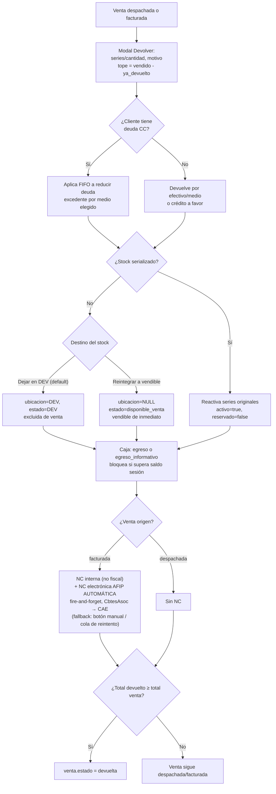

# Devoluciones

Módulo de devoluciones de ventas. Implementado en v0.58.0 (migration 030).

## 🔀 Diagrama de flujo — Devolución → Nota de Crédito

Editable en draw.io: [`G360.Wiki/diagrams/03-devolucion-nc.drawio`](../../diagrams/03-devolucion-nc.drawio).



---

## Marco legal (Argentina) — base de la política de devoluciones

> ⚠️ **Información general, NO asesoramiento legal.** Ley Nacional **24.240** (Defensa del Consumidor) + ley local **CABA 3281**. Puede cambiar con reformas y **varía por provincia**. Validar la política oficial con abogado/contador. Investigado 2026-06-26 (ver [log.md](../../log.md)).

**Regla de fondo: hay 3 casos donde el cliente tiene derecho a la PLATA (no se le puede forzar el crédito/vale), y uno donde el crédito es válido.**

| Caso | ¿Obligación de devolver dinero? | Plazo |
|---|---|---|
| **Producto fallado** (garantía legal, Art. 11-17) | **SÍ** — puede exigir el reintegro del importe pagado (Art. 17) si no se repara bien | **6 meses** (3 si usado) desde la entrega |
| **Compra online/a distancia** — arrepentimiento (Art. 34) | **SÍ** — reintegro del dinero; flete de devolución a cargo del vendedor | **10 días corridos** desde la entrega |
| **Cambio de opinión, presencial (fuera de CABA)** | **NO** hay obligación nacional → aceptar es política propia; puede condicionarse a crédito/cambio | Sin plazo legal |
| **Cambio de opinión, presencial EN CABA** (no perecederos, Ley 3281) | Debe aceptar el cambio, **pero puede dar vale O efectivo a elección del comercio** | Cambio **30 días hábiles** · vale válido **≥90 días hábiles** |

**Implicancia para el "crédito a favor":** si la devolución es por **fallado** o **arrepentimiento online ≤10 días**, aunque el cliente "elija" crédito conserva el derecho a la plata dentro del plazo. Si es **cambio de opinión presencial**, el crédito a favor / cambio es válido (en CABA el vale es expresamente legal).

**Recomendaciones (a confirmar con abogado):**
1. **Clasificar el motivo** (el modal ya guarda "motivo"): para **fallado / online ≤10 días** el **default debe ser DINERO** (mismo medio de pago), no empujar el crédito.
2. **Documentar la libre elección** cuando el cliente opta por crédito sin estar obligado (origen + nota + conformidad).
3. **Vencimiento del crédito:** si se aplica, **≥90 días hábiles** (piso CABA) y comunicado; plazos cortos pueden caer como cláusula abusiva (Art. 37). Lo más seguro: **sin vencimiento** o plazo amplio avisado.
4. **Política de devoluciones escrita y visible** (cartel/web/ticket), revisada por el abogado, distinguiendo los casos.
5. **Cubrir el reclamo posterior:** si el crédito nació de un caso donde correspondía dinero y el cliente después reclama la plata, hay que poder devolvérsela **asentada** → feature **cash-out de saldo a favor** (egreso de caja + `cliente_creditos` negativo atómico).

**Fuentes:** [Ley 24.240 actualizada](https://www.argentina.gob.ar/normativa/nacional/ley-24240-638/actualizacion) · [Ley 3281 CABA](http://www2.cedom.gov.ar/es/legislacion/normas/leyes/ley3281.html) · [Mendoza: ¿obligación de cambios?](https://www.mendoza.gov.ar/prensa/defensa-del-consumidor-es-obligacion-del-comercio-admitir-cambios-o-devoluciones-de-productos/) · [Mendoza: plazo de garantía](https://www.mendoza.gov.ar/prensa/defensa-del-consumidor-cual-es-el-plazo-de-garantia-de-un-producto-nuevo/) · [Argentina.gob.ar: Voy de compras](https://www.argentina.gob.ar/justicia/derechofacil/aplicalaley/comprar).

---

## Prerequisito de configuración

Antes de usar devoluciones, configurar en ConfigPage:
1. **Ubicación DEV** (`ubicaciones.es_devolucion = true`) — solo 1 por tenant
2. **Estado DEV** (`estados_inventario.es_devolucion = true`) — solo 1 activo a la vez

Sin esta configuración, la lógica bloquea con error descriptivo.

---

## Acceso

Botón **"Devolver"** en el modal de detalle de una venta.  
Disponible para ventas en estado `despachada` o `facturada`.

---

## Reglas de devolución (v1.76.0 — auditoría UAT básico)

### Tope de cantidad (DEV-07)
No se puede devolver más de lo que queda: el cap es **`vendido − ya_devuelto`** por producto (no la cantidad vendida total). En el modal (`abrir`) se calcula el remanente a partir de las devoluciones previas de esa venta; si ya se devolvió todo → "nada para devolver". Hay además un **guard server-side** en `procesarDevolucion` que re-chequea contra `devolucion_items` previos (defensa ante UI desactualizada).

### Devolución vs. deuda CC del cliente (DEV-04)
Regla GO: **a un cliente con deuda no se le da efectivo.**
- Cliente **con deuda CC** → la devolución se **aplica a reducir la deuda** (FIFO sobre sus ventas CC pendientes, sin movimiento de caja). Un banner avisa "se aplicarán $X a la deuda". Si la devolución supera la deuda, el **excedente** se devuelve por el medio elegido.
- Cliente **sin deuda** → se devuelve por efectivo / otro medio / **crédito a favor** (a elección). "Crédito a favor" genera un saldo en `cliente_creditos` (origen `devolucion`) y exige cliente.

### Efectivo y caja
- El egreso de efectivo de la devolución va **`await`eado + toast si falla** + fallback a la única caja abierta (bug #26, v1.74.0).
- **No se permite caja en negativo (CAJ-18, v1.76.0):** si el efectivo a devolver supera el saldo de la sesión, se bloquea ("hacé un ingreso a la caja o devolvé por otro medio/crédito a favor"). Helper `src/lib/cajaSaldo.ts`.

### Modo básico
El reingreso es **directo** (sin ubicación/estado — `ubicacion_id`/`estado_id` NULL) y **consolida** en la línea de stock existente del producto. La ubicación/estado `es_devolucion` solo se exige en modo avanzado.

---

## Flujo de devolución

**Puntos de entrada:** historial de Ventas (botón Devolver) y, desde v1.52.0, el módulo **Envíos** — un envío en estado `devolucion` muestra el CTA "Registrar devolución de la venta" que abre este flujo pre-apuntado (`/ventas?id=<venta>&devolver=1`). Ver [[wiki/features/envios]].

### Stock no serializado

1. Crea nueva `inventario_lineas` con destino según selección del operador (ver "Destino del stock devuelto" abajo)
2. `notas = "Devolución de venta #N"` (o `"Devolución de LPN {lpn_original}"`)
3. Trigger recalcula `stock_actual` automáticamente
4. Registra movimiento tipo `ingreso`

### A7 — Destino del stock devuelto (2026-05-29)

El modal de devolución tiene un radio con 2 opciones (default **DEV**):

- **Dejar en DEV para revisión** (default): la línea va a `ubicacion_id = ubicDevId` con `estado_id = estadoDevId`. Queda excluida de venta hasta decisión manual. Es el flujo previo.
- **Reintegrar a stock vendible**: la línea queda con `ubicacion_id = NULL` y `estado_id = primer estados_inventario.es_disponible_venta = true`. Entra al stock disponible inmediatamente; aparece en la alerta "Inventario sin ubicación" para que el operador la asigne a la ubicación correcta.

No aplica a items serializados — esos siempre reactivan a su línea original (mantienen ubicación y estado previos al despacho).

### Stock serializado

1. Reactiva las series originales: `activo=true, reservado=false`
2. Reactiva su línea (`inventario_lineas`)
3. Recalcula `stock_actual` manualmente (+cantDev)

### Nota de Crédito

- Si origen = `facturada` → `numero_nc = "NC-{venta.numero}-{n}"` (n = count previas + 1) — esto es el **ticket interno NO fiscal** (comprobante de ajuste).
- Si origen = `despachada` → sin NC
- **NC electrónica AFIP: ✅ desde v1.71.0** (CAE). **PDF / imprimir / email de la NC fiscal desde v1.72.0** — ESO es lo que se le entrega legalmente al cliente, NO el ticket interno. La **letra de la NC se deriva de la factura original y queda fija** (Factura C→NC-C; antes defaulteaba a NC-B y rebotaba con AFIP 10040). Datos en `devoluciones.nc_*`; PDF vía `facturasPDF.ts` con `clase:'nota_credito'`.
- **🆕 Emisión AUTOMÁTICA desde mig 359 (2026-08-13, ✅ EN PROD desde v1.170.0)**: al confirmar la
  devolución, el sistema intenta emitir la NC solo, en segundo plano (fire-and-forget, nunca bloquea ni
  revierte la devolución ya confirmada). Si falla, encola en `nc_afip_pendientes` y un sweep
  (`nc-afip-retry-sweep`, cada 15 min) reintenta con escalamiento a revisión humana ante cualquier error
  ambiguo (REGLA #0 — riesgo de NC duplicada en AFIP). El botón manual "Emitir NC" sigue existiendo
  como fallback (forzar antes del sweep, o resolver un caso escalado). Detalle completo en
  [[wiki/features/facturacion-afip]] → "NC automática al confirmar la devolución (A10)".
- **🟡 G5 Fase 6 de 8 (mig 375, 2026-08-19, commiteado y pusheado, tag `v1.175.0`): si la venta original tuvo componente
  USD, la NC AFIP sigue usando la cotización de la venta original** — ya era así por construcción, sin
  cambio de código real (solo comentarios documentando el invariante). Ver sección "Caja en USD — Fase 6
  de 8" más abajo.

### Caja

- Efectivo en `medio_pago` de la devolución → INSERT `egreso` en `caja_movimientos`. **v1.74.0:** el insert se **aguarda** + fallback a la **única caja abierta** + aviso si falla (antes era fire-and-forget y un fallo perdía el egreso en silencio — bug venta #26). Ver [[caja]] (auditoría efectivo↔caja).
- Otro medio → `egreso_informativo`
- Bloquea si no hay sesión de caja abierta y el medio es efectivo
- **🟡 G5 Fase 6 de 8 (mig 375, 2026-08-19, commiteado y pusheado, tag `v1.175.0`): devolución vía "Efectivo USD"** — egreso
  real en la Caja USD elegida, con su propio guard CAJ-18 (no negativo) y su propia cotización (hoy por
  default, o la de la venta original si el tenant activó el toggle). Ver sección "Caja en USD — Fase 6 de
  8" más abajo.

---

## Schema (migration 030)

```sql
devoluciones(
  id, tenant_id, venta_id,
  numero_nc TEXT,
  origen TEXT,        -- 'despachada' | 'facturada'
  motivo TEXT,
  monto_total DECIMAL,
  medio_pago TEXT,    -- JSON [{tipo, monto}]
  created_by
)

devolucion_items(
  devolucion_id, producto_id, cantidad, precio_unitario,
  inventario_linea_nueva_id  -- nullable, para no-serializado
)
```

---

## UI

- **Modal de devolución** desde el detalle de venta:
  - Selección de series (chips) o cantidad (input) por ítem
  - Motivo de devolución
  - Medios de devolución (efectivo, transferencia, etc.)
- **Comprobante imprimible** al finalizar
- **Sección colapsable "Devoluciones (n)"** en el modal si ya existen devoluciones previas

### Estado `devuelta`

Al finalizar `procesarDevolucion`:
- Suma todas las devoluciones de la venta
- Si `totalDevuelto >= venta.total` → `UPDATE ventas SET estado='devuelta'`
- Badge naranja "Devuelta" en historial
- Botón "Devolver" ya no aparece

### Rollback de seguridad

Si cualquier operación falla después del INSERT del header `devoluciones`:
- DELETE automático del header para evitar registros huérfanos con 0 ítems

---

## Notas de Crédito electrónicas (✅ implementado)

Para ventas facturadas con AFIP, la devolución habilita la NC electrónica. **Tabla `devoluciones` ya extendida (mig 088):** `nc_cae`, `nc_vencimiento_cae`, `nc_numero_comprobante`, `nc_tipo` (`NC-A/B/C`), `nc_punto_venta`. EF `emitir-factura` (esNC, con `CbtesAsoc` a la factura original) → CAE. **PDF/imprimir/email desde v1.72.0.**

**🆕 Disparador (mig 359, 2026-08-13, ✅ EN PROD desde v1.170.0):** ya NO hace falta abrir el botón manual
"Emitir NC" — al confirmar la devolución (`procesarDevolucion`) se dispara automáticamente en segundo
plano el mismo llamado a `emitir-factura`. Éxito → toast con el CAE; falla → cola `nc_afip_pendientes`
+ sweep `nc-afip-retry-sweep` (cron 15 min) con escalamiento a revisión humana (DUEÑO/SUPER_USUARIO/
CONTADOR) ante cualquier error donde AFIP pudo haber autorizado el comprobante sin que quede registrado
(REGLA #0 — evita NC duplicada). El botón manual sigue disponible como fallback. Detalle completo,
diseño de seguridad y verificación en [[wiki/features/facturacion-afip]] → "NC automática al confirmar
la devolución (A10)".

---

## 💵 Caja en USD — Fase 6 de 8 (Devoluciones/NC con soporte USD) — EN DEV, mig 375, commiteado y pusheado (2026-08-19)

Sexta fase del proyecto "Caja en USD" (relevamiento G5, ver [[wiki/development/reglas-negocio]] → "Caja en
USD / Venta física en USD"). Continúa directo sobre la Fase 5 (migs 373+374, Bóveda ARS/USD, ya
commiteada/pusheada como tag `v1.174.0`). Con esta fase, **la devolución en caja y la Nota de Crédito AFIP
quedan completamente cableadas para ventas con componente USD** — hasta acá el modal de devolución de
`VentasPage.tsx` era 100% ciego a USD, pese a que la Fase 4 ya había resuelto el mismo problema del lado de
la venta. **Estado real: mig 375 APLICADA Y VERIFICADA en DEV (`gcmhzdedrkmmzfzfveig`), código completo —
typecheck + build + suite completa de tests verdes —, COMMITEADO Y PUSHEADO a `origin/dev`** (commit
`e55a1009`, tag+release `v1.175.0` publicados). SIN deploy a PROD.

### G1 — reintegro en caja de una devolución cobrada en USD (configurable)

El disparador es que el **CAJERO elija un medio "Efectivo USD"** en el modal de devolución —
**independiente de cómo se pagó la venta original** (decisión de diseño confirmada con GO: no hay
prorrateo por línea de pago combinado, porque esa data no existe a nivel de línea). Default: convierte el
monto en pesos de la devolución a dólares usando la cotización **DE HOY** (`tenant.cotizacion_usd`).
Configurable por tenant (`tenants.reintegro_usd_cotizacion_original`, toggle nuevo en **Config → Ventas →
Caja en Dólares**, junto a los umbrales de la Fase 2): si está activado, usa la cotización de la **VENTA
ORIGINAL** (`ventas.cotizacion_usd`) en su lugar — mismo criterio que la NC (G2) — salvo que esa venta no
tenga cotización registrada, en cuyo caso cae a la de hoy igual (no bloquea).

### G2 — la NC AFIP usa la cotización de la venta original (ya confirmado por Fede, no era punto abierto)

Investigado a fondo: **ya es correcto por construcción** en el código existente —
`devolucion_items.precio_unitario` se copia de `venta_items.subtotal/cantidad`, que quedó fijo en pesos al
momento de la venta original y nunca se recalcula. **No hizo falta ningún cambio de lógica** en
`emitir-factura` — solo se agregaron comentarios documentando el invariante (para que un futuro dev no lo
"arregle" pensando que es un bug, ya que el código nunca leía `cotizacion_usd` explícitamente pese a que
era necesario para cumplir G2). G1 y G2 usan cotizaciones potencialmente distintas a propósito: el
reintegro en caja es plata real moviéndose hoy (refleja el valor de hoy salvo que el tenant configure lo
contrario), mientras que la NC es un comprobante fiscal que preserva coherencia con lo ya declarado ante
AFIP — "no deben usar la misma cotización entre sí, y no hay que buscar unificarlos" (Fede).

### Migración 375 (`375_caja_usd_fase6_devoluciones_nc.sql`)

Puramente aditiva, **sin funciones/triggers/vistas nuevas** — los `caja_movimientos` que este flujo
inserta ya quedan protegidos por los triggers existentes `fn_validar_moneda_coincide_sesion` (mig 372) y
`fn_validar_moneda_coincide_cuenta_origen` (mig 373), que se disparan sobre CUALQUIER insert a esa tabla
sin filtrar por origen.

| Cambio | Detalle |
|--------|---------|
| `tenants.reintegro_usd_cotizacion_original` (boolean, `NOT NULL DEFAULT false`) | Toggle de G1 |
| `devoluciones.monto_usd` (`numeric(14,2)`) | Dólares reales devueltos, NULL si la devolución no tuvo componente USD |
| `devoluciones.cotizacion_usd_usada` (`numeric(14,4)`) | Cotización efectivamente usada para convertir `monto_usd`, NULL en el mismo caso |
| `CHECK devoluciones_usd_ambos_o_ninguno` | Exige que las 2 columnas de arriba vayan siempre juntas (ambas NULL, o ambas presentes y positivas) |

**🐛 Bug real encontrado y corregido durante la verificación en DEV, antes de commitear**: la primera
versión del CHECK usaba `monto_usd > 0 AND cotizacion_usd_usada > 0` sin `IS NOT NULL` explícito — en SQL
de 3 valores, comparar contra NULL da NULL (no `false`), y un CHECK constraint trata NULL como "la fila
pasa" (no como rechazo). Esto significaba que el constraint **NO rechazaba** una fila con
`monto_usd=50, cotizacion_usd_usada=NULL` (o viceversa) — el gap exacto que el CHECK debía cerrar. Se
detectó corriendo **4 INSERTs reales dentro de una transacción con `ROLLBACK`** en DEV (no se asumió que
el CHECK funcionaba, se probó). Se corrigió agregando `IS NOT NULL` explícito en cada rama, y se
reverificó con los mismos 4 tests — los 4 dieron el resultado esperado. La migración aplicada en DEV ya
tiene la versión corregida (se corrigió con un `ALTER` antes de que ninguna fila real dependiera del
constraint viejo). `migration-reviewer` revisó la migración antes de aplicar: 3 notas menores, ninguna
bloqueante (RLS de `devoluciones` sin policy UPDATE, fallback de cotización null, la sugerencia del CHECK
que luego se encontró rota en la verificación real de arriba).

### Código — `src/lib/ventasValidation.ts`

**`elegirCotizacionReintegro(usarCotizacionOriginal, cotizacionVentaOriginal, cotizacionHoy)`** — función
pura (5 tests nuevos, `DEV-CTZ-01` a `05`, en `tests/unit/ventasValidation.test.ts`) que decide qué
cotización usar para G1: si el tenant activó el toggle y la venta original tiene una cotización > 0 real,
usa esa; en cualquier otro caso (toggle apagado, o venta sin cotización registrada / en 0 / `undefined`),
cae a la de hoy. Fallback siempre seguro, nunca bloquea.

### Código — `src/pages/VentasPage.tsx` (el cambio grande de la fase)

Todo dentro del modal/flujo de devolución (`abrirModalDevolucion`/`procesarDevolucion`), que hasta ahora
estaba 100% ciego a USD pese a que la Fase 4 ya había resuelto el mismo problema del lado de la venta:

- **Nuevo estado `devCajaSesionUsdId`** — selector de Caja USD para el egreso, paralelo al
  `devCajaSesionId` existente que ahora queda escopeado a `sesionesArs`.
- **`cotizacionParaDevolucion`** (computado, usa `elegirCotizacionReintegro`) + **`updateDevMedioPagoUsd`**
  (handler, mismo patrón que `updateMedioPagoUsd` de la Fase 4 del lado de venta: el cajero tipea dólares,
  el `monto` en pesos se deriva).
- **Validaciones separadas ARS/USD**: `hayEfectivoArs`/`hayEfectivoUsd`, cada una con su propio guard de
  "caja requerida" y su propio chequeo **CAJ-18** (no dejar la caja en negativo) — el de USD compara contra
  el saldo real de la Caja USD elegida, no contra el de pesos.
- **2 `caja_movimientos` posibles por devolución** (antes solo 1, siempre ARS): el egreso en pesos (ahora
  con `moneda:'ARS'` explícito, antes caía al default de la columna) y el nuevo egreso en USD
  (`moneda:'USD'`, cuenta de origen resuelta del método USD real elegido, sesión = la Caja USD
  seleccionada).
- **El INSERT de `devoluciones` ahora completa `monto_usd`/`cotizacion_usd_usada`** cuando aplica, en el
  MISMO INSERT — `devoluciones` no tiene policy RLS de UPDATE (hallazgo de `migration-reviewer`), así que
  no se puede completar después.
- **UI**: selector de Caja USD paralelo al de pesos (mismo estilo, verde en vez de ámbar); en el picker de
  "Medio de devolución", si la fila es un medio USD aparece un input en dólares con "≈ $X" de referencia en
  vez del input genérico en pesos.

### Código — `src/pages/ConfigPage.tsx`

Nuevo toggle **"Reintegro de devolución en USD: usar cotización de la venta original"** en la sección
"Caja en Dólares" (Fase 2), junto a los umbrales ya existentes.

### Código — `supabase/functions/emitir-factura/index.ts`

**SOLO comentarios nuevos, sin cambio de lógica** — documentan el invariante de G2: dónde exactamente el
código ya usa el monto congelado de la venta original, y una nota junto a `MonId:'PES'` recordando que la
factura/NC nunca usa `MonId='DOL'` (decisión C1, ya cerrada, sin cambios). Ver
[[wiki/features/facturacion-afip]].

### 🐛 2 bugs reales corregidos ANTES de commitear (hallazgos de code-review)

1. **Guard de cotización inalcanzable**: el guard "No hay cotización de dólar cargada" quedaba
   inalcanzable en la práctica — dependía de que la fila ya estuviera en `mediosValidos` (filtrado por
   `monto > 0`), pero si no había cotización, `.monto` nunca se completaba (por diseño, ver
   `updateDevMedioPagoUsd`), así que la fila jamás entraba a `mediosValidos` y el guard específico nunca se
   disparaba — el cajero veía un error genérico de descuadre de totales en vez de la causa real. **Fix**:
   se movió el chequeo para que corra ANTES del filtro, sobre `devMediosPago` crudo (mirando `montoUsd`
   directamente, no `monto`).
2. **Mismo espíritu que el bug que la Fase 4 corrigió del lado de venta pero NUNCA se aplicó del lado de
   devolución**: el código hardcodeaba `m.tipo === 'Efectivo'` en TODAS las validaciones/cálculos de
   devolución (guard de caja requerida, cálculo de CAJ-18, el INSERT del egreso) — cualquier medio efectivo
   con nombre distinto de "Efectivo" (no solo "Efectivo USD") nunca generaba ningún movimiento de caja, la
   plata "devuelta" quedaba **sin ningún rastro contable**. **Fix**: reemplazado por
   `mediosEfectivo.has()`/`mediosEfectivoUsd.has()` (las mismas utilidades que ya existían desde la Fase 4,
   nunca aplicadas acá) en los 5 puntos afectados.

### Revisión y verificación

Typecheck + build + suite completa de tests unitarios verdes (100 archivos, 1605 tests — 5 nuevos de
`elegirCotizacionReintegro`). Migración 375 revisada por `migration-reviewer` (3 notas menores, ninguna
bloqueante). Código revisado por `code-reviewer` — 2 hallazgos 🟡 corregidos antes de commitear (ver arriba)
más `Number()` faltante sobre `ventas.cotizacion_usd` (que llega como string de Postgres — bug de REGLA #0
fiscal/contable evitado). Escenarios agregados al UAT (`tests/specs/uat-modo-basico.md`): `VEN-44` a
`VEN-48`.

### Limitaciones conocidas (documentadas, no resueltas en esta fase)

- Un `.find()` que no discrimina si un tenant configurara 2+ métodos "Efectivo USD" con cuentas de origen
  distintas — mismo patrón preexistente del lado ARS, no es una regresión nueva de esta fase.
- Desfasaje teórico de auditoría de muy baja probabilidad si la cotización cambia en vivo con el modal de
  devolución abierto (`cotizacionParaDevolucion` se computa una vez al abrir el modal).

**Con esto, la Fase 6/8 de Caja USD queda 100% completa en DEV** — Fases 1+2+3+4+5+6 completas (migs
368-375). El plan de 8 fases **NO tiene ningún punto abierto propio** salvo **C2** (cotización Banco Nación
para AFIP, Fase 8), pendiente de confirmación con un contador real, sin bloquear el resto. **Próximo paso:
Fase 7** (Reportes — H1/H2 del relevamiento: total único en pesos + desglose por moneda en reportes;
Dashboard excluye ventas USD de los totales/indicadores en pesos).

---

## Links relacionados

- [[wiki/features/ventas-pos]]
- [[wiki/features/inventario-stock]]
- [[wiki/features/facturacion-afip]]
- [[wiki/features/caja]]
