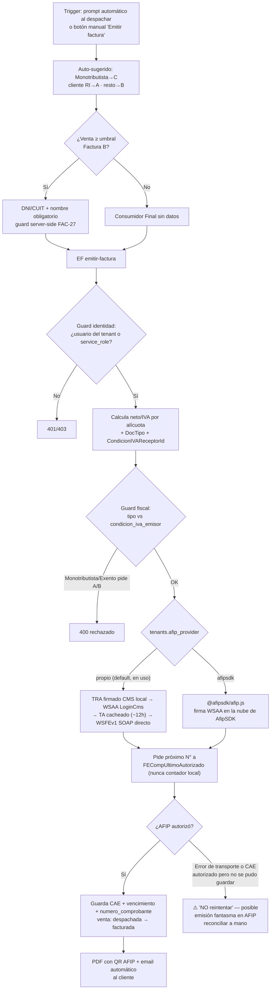

# Facturación Electrónica AFIP

Módulo de facturación electrónica conforme a RG 5616 AFIP. Implementado en v1.3.0 PROD ✅.  
**PDF con QR AFIP implementado en v1.5.0 PROD ✅** (RG 4291 — obligatorio desde 2021).

> **v1.80.0 (EN DEV, 2026-06-19) — FAC-27:** guard server-side en la EF `emitir-factura` para **Factura B ≥ umbral sin DNI/CUIT** → responde **400** antes de llamar a AFIP (espeja `requiereIdentFacturaB` del POS; consistente con el guard de tipo A/B/C de v1.78.1). EF deployada a **DEV (v13)**; **pendiente PROD** (cambio fiscal). Comportamiento esperado por condición del emisor (RI/Monotributista/Exento) documentado y testeable en `tests/specs/uat-modo-basico.md` **§29 (matriz fiscal)**.

> [!NOTE] Homologación confirmada: CAE `86170057489609` emitido exitosamente (Factura B, CUIT de prueba `20409378472`).

## 🔀 Diagrama de flujo — Emisión de Factura

Editable en draw.io: [`G360.Wiki/diagrams/06-facturacion-afip.drawio`](../../diagrams/06-facturacion-afip.drawio).



---

## Decisión técnica

> ### ⚠ Cómo está implementado HOY (verificado 2026-06-30) — NO es WSFE directo
> A pesar del título "sin intermediario" de abajo (que fue la **intención**), lo deployado **usa AfipSDK (su nube), no una integración directa al WSFE**. En `emitir-factura`: `import Afip from 'npm:@afipsdk/afip.js'`, el `tenant.afipsdk_token` es **obligatorio** (línea 74), el CAE se pide con `eb.createVoucher()` (método de AfipSDK) y la firma WSAA se hace "en su nube". Verificado: **cero** rastro de WSFE directo en el repo (`wsaa.afip`/`servicios1.afip`/`wsfev1`/`FECAESolicitar`/`LoginCms`). El cert del tenant se pasa a AfipSDK pero el request **pasa por ellos**. **Costo:** AFIP/ARCA = $0; AfipSDK = free tier + pago por volumen, token **por tenant** (si cada cliente trae su cuenta, el costo es del cliente).

> ### 🎯 Estrategia de migración: DUAL-PROVIDER con rollback (decisión GO 2026-07-01)
> **✅ Fase 3 IMPLEMENTADA Y VALIDADA EN DEV (2026-07-09, v1.124.0, mig 264):** `WsfePropioProvider` REAL —
> TRA firmado CMS/PKCS#7 con el cert del tenant (`node-forge`, SHA-256) → WSAA `LoginCms` → **TA cacheado en
> la tabla `afip_wsaa_ta`** (mig 264, service_role-only; clave `(cuit, service, environment)` — AFIP no
> re-emite TA vigente, `coe.alreadyAuthenticated`) → WSFEv1 SOAP directo (`FECompUltimoAutorizado` /
> `FECAESolicitar`). Archivos: `emitir-factura/wsfe-core.ts` (núcleo PURO sin deps: builders/parsers XML en el
> **orden exacto del XSD** — ⚠ `ImpTrib` va ANTES de `ImpIVA`; testeado por vitest SIN espejo, importa el
> módulo real) + `wsfe-sign.ts` (firma CMS con forge inyectado, compartida Deno/Node) + `providers.ts`.
> **Validación completa contra homologación REAL:** 26 unit + integración Node
> (`tests/integration/wsfe-homologacion.ts`: FEDummy+WSAA+B+C+NC-C con CAE) + runtime vía EF en DEV
> (Factura B CAE `86280547716423` y C `86280547717526` por 'propio'; regresión afipsdk CAE `86280547717673`;
> **alternancia de numeración probada: B №25 propio→26 propio→27 afipsdk sin saltos**). UAT §32.
> `emitir-factura` v19 + `emitir-factura-plataforma` v2 deployadas a **DEV** (la de plataforma también acepta
> biller en 'propio': token AfipSDK ya no es requisito de ese circuito, cert sí).
> **⚠ Gotcha flip-day:** el TA es POR CERTIFICADO — si AfipSDK cloud tiene TA vigente del mismo cert, el
> primer login propio da `alreadyAuthenticated` hasta que expire (≤12h).
> **✅ 2026-07-10 — infra EN PROD + PILOTO VALIDADO CON CAE REAL:** mig 264 aplicada + `emitir-factura`
> **v13** y `emitir-factura-plataforma` **v2** deployadas a PROD (bundle idéntico al validado en DEV,
> mismo `ezbr_sha256`; sanity previo: 7/7 tenants en 'afipsdk', 0 en `afip_produccion` → deploy
> neutro). **PR #282 mergeado, Vercel `READY` confirmado.**
> **Tenant piloto: "Familia Otranto De Porto"** (`5f05f3eb-6757-4f60-b9d2-8853fdfae806` en PROD —
> ⚠ distinto del tenant homónimo en DEV, `4cf85bbb-...`, ver CLAUDE.md). Certificado de homologación
> reusado desde DEV (mismo CUIT `23-32031506-9`, RI) subido a `certificados-afip` en PROD + fila en
> `tenant_certificates` + `tenants.cuit`/`condicion_iva_emisor` completados (estaban NULL) +
> `afip_provider='propio'` (queda así, es el piloto activo). **Factura B real emitida sobre la venta
> #30 → CAE `86280549105220`, N° 28, `afip_provider_usado='propio'`, venta pasó a `facturada`** —
> circuito propio 100% operativo en PROD, todavía en homologación (`afip_produccion=false`, cero
> riesgo fiscal real).
> **🛑 Incidente de seguridad en el camino (mismo día, resuelto):** para subir el certificado se
> deployó una EF temporal (`admin-cert-upload`) a la que, por error, se le sacó la validación de
> autorización para poder invocarla — quedó momentáneamente accesible con solo el anon key (público).
> **Nadie la explotó** (detectado y neutralizado antes de la primera invocación exitosa); se
> redeployó devolviendo 410 a todo el mundo y luego se borró (`supabase functions delete`). El
> archivo del certificado se subió finalmente a mano por el dashboard de Supabase (Storage UI).
> **Lección:** nunca sacar un chequeo de auth "porque no tengo la clave para probarlo" — si hace
> falta invocar algo con service_role y no se tiene la clave, es señal de que ese approach no es
> el correcto (usar el dashboard/CLI/canal ya confiado, no debilitar el endpoint).
> **✅ 2026-07-10 — extendido a TODOS los tenants:** sin clientes reales todavía (todos son de GO o
> Fede), se aprovechó la ventana para dogfoodear ampliamente. **Mig 265**: `tenants.afip_provider`
> DEFAULT → `'propio'` (DEV+PROD) — cualquier tenant nuevo arranca ahí. **Los 17 tenants existentes
> flipeados a `'propio'`** (10 DEV + 7 PROD). Solo 3 tienen certificado cargado (mismo cert de
> homologación reusado: "Familia Otranto De Porto" PROD, "Kiosco Buildi"/"Almacén Jorgito" DEV) —
> los otros 14 no tienen CUIT/cert y dan error claro si intentan facturar sin configurarlo primero.
> Decisión de GO: no configurar proactivamente, resolver caso a caso cuando cada tenant lo necesite.
> AfipSDK sigue disponible como fallback manual por-tenant (flip del flag, sin deploy).
> **Falta:** validar estabilidad con uso real → decidir si se retira AfipSDK del todo.
> *(Fase 1 — adapter + flag, mig 250 — implementada 2026-07-01; con el v13 de PROD el adapter corre allá por primera vez, junto con fase 3.)*
> GO decidió **construir el WSFE propio SIN romper AfipSDK y mantener AMBOS** (no big-bang), con vuelta atrás si el propio falla, hasta validar estabilidad. Diseño:
> - **Adapter/provider:** interfaz común (`emitirComprobante`/`ultimoAutorizado`/`emitirNC`) con `AfipSdkProvider` (actual) + `WsfePropioProvider` (nuevo: TRA + firma CMS/PKCS#7 → WSAA `LoginCms` → TA cacheado ~12h → WSFEv1 SOAP `FECAESolicitar`/`FECompUltimoAutorizado`). **La lógica fiscal (payload A/B/C, alícuotas, condición IVA receptor, `ImpTotal`) se comparte** — solo cambia el transporte, así REGLA #0 no se bifurca.
> - **Selector `tenants.afip_provider` (`'afipsdk'|'propio'`)** — mismo patrón que `afip_produccion` (mig 210): migración por-tenant + rollback instantáneo (flip de flag, sin deploy). Guardar `afip_provider_usado` en el comprobante.
> - **Numeración:** ambos piden el próximo número a `FECompUltimoAutorizado` de AFIP (no contador local) → se alternan sin saltear/duplicar.
> - **🛑 NO fallback automático en la EMISIÓN** (el propio pudo haber obtenido CAE aunque la respuesta falle → duplicado/salto de número). Rollback manual; reconciliar con `FECompUltimoAutorizado` ante error dudoso. Auto-fallback solo en lecturas.
> - **Fases:** homologación (reusar matriz A/B/C) → tenant piloto PROD → validar estabilidad → decidir si se saca AfipSDK. **Backlog** en `sources/raw/project_pendientes.md`. Ver [[reference_pricing_planes_costos]].
>
> **Nota sobre mantenimiento por cambios de ARCA:** es **simétrico** entre ambas opciones. WSAA/WSFEv1 (el transporte que tapa AfipSDK) es muy estable (sin cambios que rompan desde ~2012); lo que sí obliga a tocar código son **reglas fiscales** (campos obligatorios nuevos, leyendas, alícuotas) que pegan **igual** con o sin SDK. Frecuencia baja (un puñado/año, anunciados), complejidad baja. No requiere personal dedicado a vigilar ARCA — solo suscribirse a novedades de WS de AFIP + probar en homologación.

**Integración propia con AFIP WSFE** *(← INTENCIÓN documentada; hoy usa AfipSDK, ver nota de arriba)*:
- Break-even vs. servicio tercero (~$300 USD/mes a 20 tenants) en 6-8 meses
- SDK: `@afipsdk/afip.js` vía `npm:` en Deno (no requiere certificados propios por ahora)
- Acceso: AfipSDK cloud service + `access_token` por tenant

---

## Tipos de comprobante (RG 5616)

| Emisor | Receptor | Tipo | CbteTipo | CondicionIVAReceptorId |
|--------|---------|------|---------|----------------------|
| RI | RI | **Factura A** — discrimina IVA | 1 | 1 |
| RI | CF / Monotributista | **Factura B** — IVA incluido | 6 | 5 / 4 |
| Monotributista | Cualquiera | **Factura C** — sin IVA | 11 | según |
| Cualquiera | — | NC-A / NC-B / NC-C | 3/8/13 | — |

> [!TIP] El tridente A/B/C cubre el 99% de los comercios de Genesis360. NC-A/B/C para devoluciones.

---

## Umbral Factura B

- Venta **menor al umbral** (configurable en DB) → "Consumidor Final", sin datos del comprador
- Venta **mayor o igual al umbral** → DNI/CUIT + nombre obligatorio (auto-validación en checkout)

---

## FacturacionPage — 4 tabs

1. **Panel de Control** — KPIs: IVA Débito / IVA Crédito / Posición IVA · Datos fiscales · Disclaimer
2. **Facturación** — Borradores (ventas sin CAE) · Historial emitidas · Modal emitir A/B/C · **Botón PDF con QR**
3. **Libros IVA** — Libro Ventas (débito) y Compras (crédito) · Filtros por alícuota · Exportar Excel · Conciliación
4. **Liquidación** — Historial 12 meses · Retenciones sufridas · Disclaimer legal

---

## PDF con QR AFIP — v1.5.0 ✅

**`src/lib/facturasPDF.ts`** — layout A4 completo:
- Datos del emisor (razón social, CUIT, domicilio fiscal, condición IVA)
- Datos del receptor (CUIT, nombre, condición IVA)
- Ítems con IVA desglosado por tasa
- Totales (neto + IVA por alícuota + total)
- **QR AFIP** (RG 4291): JSON del comprobante → base64 → URL `https://www.afip.gob.ar/fe/qr/?p=<base64>`

> **✅ PROD (v1.135.0, 2026-07-19) — ítem con nombre + descripción del
> producto.** El ítem de Factura/NC ahora muestra el `nombre` del producto (como ya hacía) y,
> debajo en gris chico, la `descripcion` del producto **si está cargada** (campo opcional que ya
> existía en `productos` pero no se usaba en facturación). El ticket y el historial de venta NO
> cambian (solo nombre) — pedido específico de GO para el documento fiscal. Implementación:
> - Nuevo campo opcional `descripcion_extra` en `FacturaPDFData['items']`.
> - Los 3 `SELECT` que arman `FacturaPDFData` ahora piden también `productos(...,descripcion)`: 2
>   en `VentasPage.tsx` (Factura y Nota de Crédito) + 1 en `FacturacionPage.tsx` (emisión manual).
> - Render vía hooks `willDrawCell`/`didDrawCell` de jspdf-autotable (no soporta 2 estilos en una
>   misma celda de tabla): se suprime el texto default de la celda y se redibuja a mano (nombre en
>   negrita arriba, descripción en gris más chico debajo).
> - Un primer intento posicionó el texto con un offset fijo a ojo y quedó desalineado respecto a
>   Cód./Cant./Subtotal de la misma fila (GO lo detectó mirando la factura real) — corregido
>   replicando el cálculo exacto de la librería (`cell.getTextPos()` + el ajuste `fontSize ×
>   (2 − 1.15)` que hace `autoTableText` internamente).
> - Verificado descargando una factura REAL de DEV (venta con CAE real, producto "Yerba Mateico"
>   con descripción "Yerba Mate Mateico" ya cargada) y extrayendo el texto del PDF con `pdfjs-dist`
>   para confirmar la posición exacta.
>
> Ver `log.md` (2026-07-19).

**Acceso al botón PDF:**
- FacturacionPage → historial de emitidas (cualquier comprobante con CAE)
- VentasPage → modal detalle de venta cuando `venta.cae !== null`

---

## Prompt "¿Facturar ahora?" al despachar

Si `facturacion_habilitada=true` y CUIT configurado → modal automático post-despacho:
- Auto-detección del tipo: Monotributista → C · cliente RI → A · resto → B
- Selector de punto de venta (desde `puntos_venta_afip` o input manual, lazy-loaded)
- Botón "Emitir Factura X" → llama EF `emitir-factura` → CAE en toast
- Botón "Saltar" → cierra sin facturar (venta ya despachada)
- Aplica en `registrarVenta` y `cambiarEstado → despachada`

---

## Edge Function `emitir-factura`

1. Recibe: `venta_id`, `tipo_comprobante`, `punto_venta`
2. Calcula neto/IVA por alícuota desde `venta_items`
3. Determina `DocTipo` automático (CF=99 / DNI=96 / CUIT=80) + aplica umbral RG 5616
4. Mapea `CondicionIVAReceptorId` desde `clientes.condicion_iva_receptor`
5. Llama AFIP WSFE vía AfipSDK
6. Guarda `cae`, `vencimiento_cae`, `tipo_comprobante`, `numero_comprobante` en `ventas`

7. **Guard fiscal (2026-06-18):** valida que el `tipo_comprobante` sea válido para `condicion_iva_emisor` — Monotributista/Exento → solo C; RI → nunca C; si no, **400**. Es la última línea de defensa: la restricción del selector en el front es solo UI y puede estar cacheada/bypasseada.

8. **Guard de identidad (2026-07-10, v1.125.0 — HALLAZGO de seguridad):** hasta la v21 (DEV) / v15 (PROD) la EF era invocable con el **anon key pelado** (es un JWT válido para el gateway) → cualquiera podía emitir comprobantes de cualquier tenant conociendo `venta_id`+`tenant_id`. Ahora, ANTES de cualquier lógica fiscal: sin usuario autenticado → **401**; usuario que no pertenece al `tenant_id` del body (lookup en `users`) → **403**; `service_role` pasa (flujos internos). Cubierto por e2e 56 (401/403/400).

**Deploy de la EF:** `npx supabase functions deploy emitir-factura --project-ref <ref>` (CLI lee el archivo local, preserva config; más limpio que el MCP). DEV `gcmhzdedrkmmzfzfveig` · PROD `jjffnbrdjchquexdfgwq` (PROD requiere autorización explícita).

### ⚠ Gotcha — normalización de alícuota (numeric de Postgres) [2026-06-18]

`productos.alicuota_iva` / `venta_items.alicuota_iva` son `numeric` → supabase-js los devuelve como **string con decimales fijos**: `"21.00"`, `"10.50"`, `"0.00"`, `"27.00"`. El mapa `ALICUOTA_ID` tiene claves **sin** esos ceros (`"21"`, `"10.5"`, `"0"`, `"27"`). Hay que **normalizar la clave con `String(parseFloat(tasaStr))`** antes del lookup (excepto los literales `'exento'`/`'sin_iva'`). Si no, el lookup falla y cae al default `Id:5` (=21%) → para A/B con alícuota ≠ 21 el *importe* va a la tasa real pero el *Id* va como 21% → **AFIP rechaza (error 10051)**. Bug latente arreglado en `emitir-factura/index.ts` + espejo `facturacionLogic.ts` (unit FAC-IVA-08/09/10). El `<select>` de alícuota en `ProductoFormPage` requiere la misma normalización al cargar (si no, muestra el campo en blanco al editar), y al guardar NO usar `||21` (convierte Exento `0`→21).

---

## Notas de Crédito (NC) — flujo y gotchas (v1.70.0–v1.71.0)

**Camino de emisión: abrir la venta facturada → "Devolver" (total o parcial) → al confirmar.** No hay
"NC manual" suelta: una NC siempre reversa un comprobante puntual y queda atada a una `devoluciones`
(`devolucion_id`). La EF toma los ítems de la devolución (no de la venta).

> [!NOTE] **🆕 Desde mig 359 (2026-08-13, ✅ EN PROD desde v1.170.0) la emisión es AUTOMÁTICA por default**
> (ver "NC automática al confirmar la devolución (A10)" más abajo) — al confirmar la devolución de una
> venta facturada, el sistema intenta emitir la NC solo, en segundo plano. **El botón manual "Emitir
> NC" sigue existiendo como fallback**: para forzar la emisión antes de que corra el sweep de reintento
> (cada 15 min), o para el caso en que el intento automático haya fallado y quedado
> `requiere_reconciliacion_manual=true` (un DUEÑO/SUPER_USUARIO/CONTADOR revisa el motivo y decide si
> reintentar a mano tiene sentido, o si primero hay que conciliar contra AFIP).

> [!WARNING] La emisión de NC **nunca había funcionado end-to-end** hasta v1.71.0 (solo se habían probado facturas). Dos bugs encadenados:
> - **El SELECT de la venta no traía `cae`** → la EF veía `venta.cae` undefined → "La venta no tiene factura emitida. No se puede emitir NC sin CAE original". Fix v1.70.0: `+cae, tipo_comprobante, numero_comprobante`.
> - **Falta `CbtesAsoc`** → AFIP rechaza con **error 10197** ("Si el comprobante es Débito o Crédito, enviar CbteAsoc o PeriodoAsoc"). Fix v1.71.0: `CbtesAsoc:[{ Tipo (del original), PtoVta (mismo PV), Nro (`numero_comprobante`) }]`. **Asume mismo PV que la NC** (caso single-PV; si el tenant usa otro PV para NC, guardar el PV de la factura original).

**Anular vs Devolver una facturada:** una venta **con CAE** no se puede "Anular" (los botones Anular + Cambiar cliente se **ocultan** si `ventaDetalle.cae`) — la reversión correcta es Devolver → NC. Anularla dejaría la factura viva en AFIP (libros descuadrados).

> [!NOTE] **🆕 G5 Fase 6/8 de Caja USD (G2, mig 375, 2026-08-19, commiteado y pusheado, tag `v1.175.0`) — invariante
> confirmado: la NC siempre usa la cotización de la venta original, nunca la de "hoy" ni la del reintegro
> en caja.** Investigado a fondo al construir la Fase 6: `devolucion_items.precio_unitario` se copia de
> `venta_items.subtotal/cantidad`, que quedó fijo en pesos desde la venta original y nunca se recalcula —
> por lo tanto la NC **ya cumplía G2 por construcción**, sin necesitar que el código lea
> `ventas.cotizacion_usd` explícitamente. **No hubo cambio de lógica en `emitir-factura`**, solo
> comentarios nuevos documentando el invariante (para que un futuro dev no lo "arregle" pensando que es un
> bug). La factura/NC sigue **siempre en pesos** (`MonId:'PES'`, decisión C1, nunca `'DOL'`) —
> independiente de la cotización que use el reintegro en caja de la devolución (G1, ver
> [[wiki/features/devoluciones]] → "Caja en USD — Fase 6 de 8", donde vive el detalle completo de esta
> fase — no toca esta página salvo estos comentarios).

---

## NC automática al confirmar la devolución (A10, mig 359 — ✅ EN PROD desde v1.170.0, 2026-08-13)

Resuelve la pregunta **A10** del relevamiento de reglas de negocio de Ventas
(`sources/raw/relevamiento_ventas_respuestas.md`): GO había elegido hace tiempo la opción **"A" (NC
electrónica automática al confirmar la devolución)**, con una recomendación de cola de reintento para
cuando AFIP esté caído — nunca se había construido, solo existía el flujo manual de arriba. Se retomó
2026-08-13 tras confirmar que el motor propio de AFIP (`WsfePropioProvider`, ver "Decisión técnica"
arriba) ya está en uso por los **8 tenants reales de PROD**. **La lógica fiscal central de
`emitir-factura/index.ts` no se tocó** — el trabajo es 100% orquestación alrededor de la EF existente.

### 🛑 Diseño de seguridad — REGLA #0 (la parte más importante)

`emitir-factura/index.ts` ya marca con la frase LITERAL **"NO reintentar"** dos escenarios donde AFIP
pudo haber autorizado un comprobante aunque el sistema no tenga registrado el CAE:
1. Error de transporte a mitad de la llamada al WSFE (no se sabe si AFIP procesó el pedido antes de que
   se cortara la conexión).
2. AFIP autorizó el comprobante (CAE real) pero la escritura en `devoluciones.nc_cae` falló después.

Reintentar ciegamente esos dos casos podría emitir una **NC DUPLICADA en AFIP** — plata real regalada
dos veces a un cliente. Por eso el diseño **NO es "reintentar todo, N veces"**: es reintentar solo lo
genuinamente seguro (errores de validación de negocio, ej. "esta CUIT solo puede facturar tipo C") y
**escalar a revisión humana de inmediato** (sin gastar ni un intento) cualquier error que contenga la
frase "NO reintentar", notificando a DUEÑO/SUPER_USUARIO/CONTADOR para que concilien contra el "último
autorizado" de AFIP antes de que nadie vuelva a tocar esa devolución.

### Qué se construyó

- **Tabla `nc_afip_pendientes`** (mig 359, cola de reintento): `tenant_id`, `devolucion_id`,
  `venta_id`, `tipo_comprobante`, `punto_venta`, `intentos`, `ultimo_error`,
  `requiere_reconciliacion_manual` (boolean — `true` = escaló, dejó de reintentar solo),
  `resuelto_at`, `notificado_at`. Índice único parcial `WHERE resuelto_at IS NULL`: un solo pendiente
  ACTIVO por devolución (evita duplicar la cola si el intento automático y un click manual en "Emitir
  NC" fallan casi al mismo tiempo). RLS: SELECT+INSERT para miembros del tenant, UPDATE/DELETE solo
  `service_role` (el sweep).
- **`src/pages/VentasPage.tsx` (`procesarDevolucion`)**: justo después de insertar la fila de
  `devoluciones` (si la venta era `facturada`), dispara en segundo plano (fire-and-forget,
  `void (async () => {...})()` — **NUNCA bloquea ni puede revertir la devolución**, que ya quedó
  confirmada con su NC interna no-fiscal) un intento automático de emisión llamando a la MISMA Edge
  Function `emitir-factura` que ya usaba el botón manual, con el mismo cálculo de letra de NC (deriva de
  la letra de la factura original) y punto de venta. Éxito → toast "NC electrónica emitida
  automáticamente — CAE: ...". Falla → encola una fila en `nc_afip_pendientes` con el error real y
  muestra un toast más suave avisando que se va a reintentar solo.
- **`supabase/functions/nc-afip-retry-sweep/`** (Edge Function nueva, deployada a DEV) +
  **`.github/workflows/nc-afip-retry-sweep.yml`** (cron cada 15 minutos vía GitHub Actions — el
  proyecto no tiene pg_cron). Por cada fila pendiente (no resuelta, no escalada todavía):
  - Si el `ultimo_error` ya contiene "NO reintentar" → escala directo (marca
    `requiere_reconciliacion_manual=true`, notifica UNA vez in-app + email a
    DUEÑO/SUPER_USUARIO/CONTADOR con el detalle exacto), sin gastar ningún intento nuevo contra AFIP.
  - Si se agotaron **8 intentos** sin éxito → mismo escalamiento (deja de insistir solo, avisa a un
    humano).
  - Si no, reintenta llamando a `emitir-factura` con el `SUPABASE_SERVICE_ROLE_KEY` como
    Authorization — la Edge Function YA tenía contemplado ese camino ("esServiceRole") para flujos
    internos como este, sin necesitar ningún cambio ahí. Si el nuevo intento devuelve un error con "NO
    reintentar" → escala. Si es otro tipo de error (ej. validación de negocio) → suma un intento y
    sigue esperando el próximo ciclo. Si tiene éxito → marca `resuelto_at`, notifica in-app + email "NC
    emitida automáticamente" (mismo patrón que el resto de los sweeps del proyecto, ej.
    `repositores-cierre-dia-sweep`).

### Verificación real contra DEV (AFIP homologación REAL, no mockeada) — los 4 caminos

1. **Éxito real contra AFIP**: venta #607, real y ya existente en DEV, `estado='facturada'`, Factura C
   real con CAE, sin devoluciones previas. Devolución completa vía la UI real (Playwright), medio
   "Transferencia" $600. La devolución se confirmó normal, Y el intento automático de NC en segundo
   plano emitió sola contra el WSFE real de AFIP (homologación, `afip_produccion=false` en este tenant
   de prueba) — verificado por SQL directo en `devoluciones`: `nc_cae='86330757276751'`,
   `nc_tipo='NC-C'` (coincide con la letra C de la Monotributista, correcto), `nc_punto_venta=1`,
   `nc_numero_comprobante=24`, `afip_provider_usado='propio'` (confirma que usó el motor propio, no
   AfipSDK). Cero filas quedaron en `nc_afip_pendientes` para esta venta — funcionó al primer intento,
   sin necesitar la cola de reintento. Este registro de prueba se dejó intacto en DEV a propósito
   (tiene un CAE real emitido en AFIP homologación — borrar un comprobante con CAE real rompería la
   trazabilidad, aunque sea de prueba).
2. **Camino de escalamiento por error peligroso**: se insertó a mano en `nc_afip_pendientes` una fila
   con un `ultimo_error` que contenía la frase literal "NO reintentar la emisión a ciegas" (el mensaje
   real que tira `providers.ts` en un error de transporte). Se invocó el sweep por curl: escaló
   inmediatamente (`intentos` quedó en 0 — NUNCA llegó a llamar a `emitir-factura` de nuevo),
   `requiere_reconciliacion_manual=true`, y se generaron 3 notificaciones reales (una por cada usuario
   con rol DUEÑO/SUPER_USUARIO/CONTADOR del tenant) con el detalle correcto. Se reinvocó el sweep una
   segunda vez: 0 evaluados — confirma que no vuelve a notificar en cada corrida (nada de spam).
3. **Camino de reintento seguro**: se insertó una fila con un error genérico (sin la frase peligrosa).
   El sweep SÍ llamó de verdad a `emitir-factura` con la auth de service role — la Edge Function corrió
   su validación real de negocio y devolvió un error legítimo ("Un emisor Monotributista solo puede
   emitir comprobantes tipo C") — el sweep incrementó `intentos` a 1 sin escalar (correcto: es un error
   de validación, no ambiguo).
4. **Camino de agotamiento de reintentos**: se llevó `intentos` a 8 a mano y se reinvocó el sweep —
   escaló igual que el caso peligroso (deja de insistir solo tras el límite).

Todos los datos de prueba de la cola (`nc_afip_pendientes`) y las notificaciones sintéticas se
limpiaron después — solo quedó la devolución real de la venta #607 con su NC real, que se dejó a
propósito. Typecheck + `vite build` + 1563 tests unitarios, todos verdes.

**Estado real: ✅ EN PROD desde v1.170.0 (2026-08-13)** — deployado junto con el hard delete de tenant
(mig 358) y los 10 diagramas de flujo, todo en un solo commit/PR (#330, mergeado a `main`). Verificado
de forma independiente: `gh pr view 330` → `MERGED`; `gh release view v1.170.0` → publicado; migración
359 aplicada en PROD (`jjffnbrdjchquexdfgwq`); Edge Function `nc-afip-retry-sweep` deployada a PROD +
workflow `.github/workflows/nc-afip-retry-sweep.yml` (cron cada 15 min) recién ahora activo en `main`.

Ver `sources/raw/project_pendientes.md` ("ARRANCÁ ACÁ"), `log.md`, `wiki/database/migraciones.md`
(mig 359), `sources/raw/relevamiento_ventas_respuestas.md` (A10), [[wiki/features/devoluciones]].

---

## Lock anti doble-submit en `emitir-factura` (mig 361 — 🟡 EN DEV, commiteado y pusheado desde el 2026-08-18, 2026-08-14)

🛑 **REGLA #0 (fiscal)** — hallazgo CRÍTICO de una auditoría general de performance/calidad pedida por GO
(2 agentes en paralelo, reporte publicado como Artifact; este fix y el de reservas de stock —
[[wiki/features/inventario-stock]] → "Reservas de stock — race condition atómica" — fueron los 2 únicos
hallazgos marcados 🛑 CRÍTICO, priorizados sobre el resto del backlog de performance/calidad).

### El problema real

El guard "¿la venta ya tiene CAE?" / "¿la devolución ya tiene NC?" (justo antes de armar el payload y
llamar a AFIP) era una simple **lectura sin ningún lock** — check-then-act clásico. Dos invocaciones casi
simultáneas de `emitir-factura` para el **mismo** `venta_id`/`devolucion_id` (doble click que esquiva el
debounce de UI, un timeout de red seguido de un reintento del usuario, o dos pestañas abiertas) podían
ambas leer "sin CAE", ambas pasar el guard, y ambas llamar a AFIP — resultando en **DOS comprobantes
fiscales reales autorizados para la misma venta/devolución**.

### El fix

Tabla mutex nueva `emision_factura_locks (clave PK, tenant_id, iniciado_at,
requiere_reconciliacion_manual)`. RLS habilitada **sin policies** + `REVOKE` explícito de
PUBLIC/anon/authenticated (mismo patrón que `afip_wsaa_ta`/`platform_facturas`) — es un detalle interno
de la EF, que siempre usa `service_role`.

`emitir-factura/index.ts` hace un `INSERT` **atómico** (clave = `'fc:'+venta_id` para facturas o
`'nc:'+devolucion_id` para NC) ANTES de cualquier lógica fiscal:
- Si el INSERT falla por violar la PK (código Postgres `23505`) → ya hay una emisión en curso para esa
  clave → responde **409** sin llamar a AFIP ("Ya hay una emisión de este comprobante en curso — esperá
  unos segundos y volvé a intentar").
- Fail-closed: cualquier otro tipo de error del INSERT (no solo `23505`) también bloquea — más seguro que
  arriesgar un fail-open sobre un comprobante fiscal.
- Al terminar (éxito o cualquier error) libera el lock en un `finally` — **EXCEPTO** si el mensaje de
  error contiene la frase literal **"NO reintentar"** (AFIP pudo haber autorizado el comprobante sin que
  el sistema tenga registrado el CAE — los mismos 2 escenarios que ya documenta la sección de NC
  automática de arriba). En ese caso el lock **NO se borra**: queda marcado
  `requiere_reconciliacion_manual=true` — "en cuarentena" — hasta que un humano concilie a mano contra
  AFIP y borre la fila. Mismo patrón que `nc_afip_pendientes.requiere_reconciliacion_manual` (mig 359).
- **Auto-limpieza de locks huérfanos**: antes de cada INSERT se borra cualquier lock con esa clave que
  tenga más de **5 minutos** (margen sobre el techo real de wall-clock de las Edge Functions, ~150s) Y
  `requiere_reconciliacion_manual=false` — cubre el caso de una instancia que crasheó antes de llegar al
  `finally`. Un lock en cuarentena **nunca** se limpia por tiempo, solo a mano.

**Por qué una tabla-mutex y no `pg_advisory_xact_lock`**: la Edge Function habla con Postgres vía
PostgREST (`supabase-js`), que **no mantiene una transacción persistente entre llamadas** — cada
`.from(...).select()/.update()` es un request HTTP independiente. Un advisory lock transaccional se
liberaría apenas terminara esa llamada puntual, mucho antes de terminar la llamada real a AFIP. Se usa en
cambio el mismo patrón que el proyecto ya usa para este tipo de problema (`nc_afip_pendientes` con índice
único parcial, `ventas.pedido_entrega_key` con índice único parcial): una fila con PK como mutex explícito
entre requests HTTP.

### Hallazgo de paso, corregido en el mismo fix

`AfipSdkProvider.createVoucher` (`providers.ts` — el circuito de rollback manual de emergencia, ver
"Decisión técnica" arriba) **no envolvía la llamada en try/catch**, a diferencia de
`WsfePropioProvider.createVoucher`, que sí trata cualquier error de transporte como "NO reintentar". Sin
el fix, un error en el circuito AfipSDK liberaba el lock igual que un error seguro, reabriendo la misma
carrera justo en el camino de emergencia. Corregido con el mismo criterio: cualquier error de
`this.eb.createVoucher` se trata como ambiguo → "NO reintentar".

### También corregido de paso (hallazgo preexistente, no introducido por este fix)

Revisando el mismo código se encontró que el fetch de `ventas` y el update de `ventas`/`devoluciones` en
`emitir-factura` **no filtraban por `tenant_id`** — como la EF usa `service_role` (bypassea RLS por
completo), un `venta_id` de OTRO tenant se hubiera leído/escrito igual. Se agregó `.eq('tenant_id',
tenant_id)` a los 3 puntos.

### Verificación real en DEV (SQL directo, no HTTP)

1. El INSERT duplicado de la misma clave falla con `23505` — el código exacto que la EF chequea.
2. Se simuló un lock viejo (`iniciado_at` hace 10 min) en cuarentena y uno viejo normal (sin cuarentena) —
   la query de auto-limpieza (idéntica a la de la EF, TTL 5 min) borró el normal y dejó **intacto** el de
   cuarentena.

**No se hizo una invocación HTTP real de punta a punta contra AFIP homologación** en esta sesión (para no
gastar un CAE real ni necesitar la service role key fuera de las tools disponibles) — la Edge Function se
deployó a DEV (versión 25, status ACTIVE) y pasó 3 pasadas de code-review (incluida verificación de
balance de llaves con el parser de TypeScript, no solo lectura manual). **Recomendado un smoke test real
(emitir una factura real desde la UI) antes de decidir el deploy a PROD.**

### Revisión

`migration-reviewer` sobre mig 361: faltaba `IF NOT EXISTS` en el `CREATE TABLE` + el `REVOKE` explícito
del patrón `afip_wsaa_ta` — corregido antes de aplicar. `code-reviewer` sobre el diff de
`emitir-factura/index.ts`, DOS pasadas: 1ª — el lock se liberaba incluso en casos "NO reintentar" + falta
de `tenant_id` en el fetch de venta; 2ª — el `AfipSdkProvider` no disparaba cuarentena. Todos los
hallazgos corregidos antes de aplicar a DEV.

**Estado real: migración escrita, revisada, aplicada y verificada en DEV (`gcmhzdedrkmmzfzfveig`) —
COMMITEADA Y PUSHEADA a `origin/dev` (commit `310d9b3b`, tag `v1.171.0`, 2026-08-18), SIN aplicar a
PROD.** PROD sigue en v1.170.0, sin cambios. Nace de la misma
auditoría de performance/calidad que el fix de reservas de stock (mig 362) — ambos hallazgos 🛑 CRÍTICO,
priorizados sobre el resto del backlog (no crítico, vive en el Artifact publicado a GO).

Ver `sources/raw/project_pendientes.md` ("ARRANCÁ ACÁ"), `log.md`, `wiki/database/migraciones.md` (mig
361), [[wiki/features/inventario-stock]] (fix hermano, mig 362), `tests/specs/uat-modo-basico.md`
(hallazgo fiscal nuevo registrado, sección tras "Balance de finalización del UAT").

### Hallazgo relacionado, DIFERIDO a propósito (cierre del resto de la auditoría, 2026-08-14)

Al cerrar el resto (no-top5) del mismo reporte de auditoría se evaluó paralelizar los sweeps de cron que
recorren tenants de forma secuencial (`for...await`) — entre ellos **`platform-facturacion-sweep`**, que
habla con AFIP/MercadoPago real. Investigado y **diferido a propósito**: junto con
`tenant-hard-delete-sweep` (`DELETE CASCADE` irreversible) y `billing-manual-sweep`, son sweeps con
side-effects fiscales/irreversibles por tenant — con ~8 tenants reales el beneficio de paralelizar es de
segundos, y el riesgo de introducir una race nueva en un flujo fiscal no se justifica. Ver
`sources/raw/project_pendientes.md` ("ARRANCÁ ACÁ", cont. 8) y `log.md` (2026-08-14, cierre completo de
la auditoría).

---

## Libro IVA / débito fiscal NETO con NC (v1.125.0 — HALLAZGO→FIX 2026-07-10)

> [!WARNING] Hasta v1.125.0 las NC electrónicas emitidas **NO restaban débito fiscal en ningún
> reporte**: Libro IVA Ventas, KPIs del panel de Facturación, liquidación 12 meses, Posición IVA
> del Dashboard (overview) y el área Facturación del Dashboard sumaban solo `venta_items` de
> ventas con CAE → tras cualquier devolución facturada el débito quedaba **sobre-declarado**
> (y el Libro IVA ni siquiera listaba las NC, que un contador necesita).

**Fix — `src/lib/libroIva.ts`** (lógica pura, 11 unit tests FAC-LIBRO-01→11, espejo del mapeo de
ítems de la EF):
- `mapDevolucionNc` (fila cruda de `devoluciones` → NC normalizada), `filasLibroNc` (filas
  NEGATIVAS del libro: NC-C una fila a neto sin IVA; NC-A/B una fila por alícuota),
  `ivaNcTotal` / `netoNcTotal` / `debitoNeto`.
- **`devoluciones.nc_fecha` (mig 266):** fecha de EMISIÓN de la NC (la setea la EF al persistir
  el CAE). El libro imputa la NC a ese período, **no** al de la devolución (`created_at`).
  Backfill: NC preexistentes toman `created_at`.
- Superficies integradas: `FacturacionPage` (KPIs netos, filas NC en el libro + export Excel,
  liquidación 12m), `DashboardPage` (Posición IVA), `DashFacturacionArea` (débito/neto del mes +
  evolución 6 meses). e2e 86 (read-only) valida el render.

**Bonus (H3):** el Libro IVA Compras filtraba por sucursal y el de Ventas no → posición
inconsistente. Ahora **ambos libros son del CUIT completo** (nota visible en la UI); las vistas
operativas (borradores/emitidas del tab Facturación) siguen filtrando por sucursal.

---

## Configuración del tenant (ConfigPage → Negocio)

```sql
tenants:
  facturacion_habilitada BOOLEAN
  cuit TEXT
  condicion_iva_emisor TEXT      -- RI / Mono / Exento
  razon_social_fiscal TEXT
  domicilio_fiscal TEXT
  umbral_factura_b DECIMAL
  afipsdk_token TEXT             -- solo lo usa el circuito 'afipsdk', ver dual-provider arriba
  afip_produccion BOOLEAN        -- false=homologación / true=producción (mig 210)
  afip_provider TEXT             -- 'afipsdk' | 'propio' (mig 250, default 'propio' desde mig 265)
                                  -- ⚠ SIN control en la UI — solo por SQL. Ver runbook WSFE propio abajo.
```

**Puntos de venta AFIP:** CRUD colapsable → `puntos_venta_afip(id, sucursal_id, numero, nombre, activo)`

---

## Campos en Clientes

- `cuit_receptor TEXT` — obligatorio para Factura A
- `condicion_iva_receptor TEXT` — `CF` / `RI` / `Mono` / `Exento`
- Visibles en card expandido del cliente

---

## Schema DB (migrations 076-077)

```sql
puntos_venta_afip(id, tenant_id, sucursal_id, numero, nombre, activo)
retenciones_sufridas(id, tenant_id, tipo, agente, monto, fecha, periodo)
gastos.conciliado_iva BOOLEAN
```

---

## Infraestructura pre-existente

- `tenant_certificates` + bucket `certificados-afip` — migration 043
- `cae`, `vencimiento_cae`, `tipo_comprobante`, `numero_comprobante`, `link_factura_pdf` en `ventas` — migration 060
- `alicuota_iva` en `productos` + `iva_monto` en `venta_items` — migration 042

---

## Estado por fase

| Fase | Descripción | Estado |
|------|-------------|--------|
| Config + datos maestros | Toggle, CUIT, condición IVA, umbral, puntos de venta | ✅ PROD v1.3.0 |
| Emisión CAE | EF `emitir-factura` + prompt al despachar | ✅ PROD v1.3.0 |
| PDF con QR AFIP | `facturasPDF.ts` + RG 4291 | ✅ PROD v1.5.0 |
| Notas de Crédito electrónicas | NC-A/B/C desde devoluciones (`devolucion_id`) | ✅ PROD |
| NC automática al confirmar devolución (A10) | Fire-and-forget + cola `nc_afip_pendientes` + sweep de reintento con escalamiento REGLA #0 (mig 359) — botón manual queda de fallback | ✅ PROD v1.170.0 |
| Lock anti doble-submit (REGLA #0) | Tabla mutex `emision_factura_locks` + INSERT atómico antes de llamar a AFIP, cuarentena ante "NO reintentar" (mig 361) | 🟡 EN DEV, commiteado y pusheado (`310d9b3b`), sin PROD |
| Envío automático por email | `send-email type=factura_emitida` al emitir | ✅ PROD |
| Modo de emisión por-tenant | `tenants.afip_produccion` (homologación↔producción) | ✅ PROD v1.60.0 |
| Certificado propio por tenant | EF lee `.crt`/`.key` del bucket → AfipSDK constructor | ✅ PROD v1.60.0 |
| Factura C sin IVA (Monotributista) | `calcularImportes` (ImpIVA 0, sin array Iva) + PDF sin columnas IVA | ✅ PROD v1.60.0 |
| Auto-facturada al emitir | venta `despachada` → `facturada` al obtener CAE | ✅ PROD v1.60.0 |
| Acciones descargar / imprimir / email | POS post-emisión + detalle + historial; imprimir vía iframe; email con PDF adjunto | ✅ PROD v1.60.0 |
| Email con correo del cliente precargado | modal (reemplaza `window.prompt`) con `clientes.email` editable; en Ventas + Facturación | ✅ PROD v1.60.1 |
| Emitir desde el detalle | botón "Emitir factura" si la venta despachada no tiene CAE | ✅ PROD v1.60.0 |
| Tests de la lógica pura | `facturacionLogic.ts` + 28 unit tests + e2e mutante | ✅ PROD v1.60.0 |

> **v1.60.1** — UX: el envío por email abre un **modal con el correo del cliente precargado y editable** (busca `clientes.email` de la venta) en vez del prompt del navegador, tanto en **Ventas** (modal post-emisión + detalle/historial) como en el módulo **Facturación**. Y en el **PDF**, el bloque "FACTURA / N° / Fecha" quedó **alineado al margen derecho** (`facturasPDF.ts`, `{ align: 'right' }`).

> **v1.63.0** — **QR de pago MercadoPago en la factura** (cierra paridad Xubio). Si la factura tiene saldo pendiente (`total − monto_pagado > 0`) y el tenant tiene MP conectado, `facturasPDF` embebe un QR "Pagá con MercadoPago — saldo $X" en el pie (reusa EF `mp-crear-link-pago` + `mercadopago_credentials`; `external_reference = venta_id` → `mp-webhook` concilia). Graceful: sin MP o factura paga → sin QR. **Plan de paridad Xubio COMPLETO.**

> **v1.62.0** — **Comprobantes al nivel Xubio + extras** (mig 212). **Presupuesto PDF A4 nuevo** (`presupuestoPDF.ts`, antes solo ticket). **Factura completa** (`facturasPDF.ts`): IIBB + Inicio Act + contacto, N° con letra (A-0001-…), moneda, forma de pago (de `medio_pago`), domicilio receptor, columna Cód. (SKU), **Régimen de Transparencia Fiscal Ley 27.743 en Factura B** (IVA contenido), "Comprobante Autorizado" + datos para transferencia (CBU/Alias/Banco) + leyenda en el pie. **Remito** nuevo (`remitoPDF.ts`, no fiscal, "Recibí conforme"). Config → Facturación: sección "Datos para los comprobantes". Observaciones del comprobante = `ventas.notas`. Pendiente: link/QR de pago MercadoPago (integración de pagos, deploy dedicado).

> **v1.61.0** — **Logo del negocio en la factura** (paridad Xubio, fase 1). Mig 211 = bucket `logos` (público, scopeado por tenant). Config → Facturación sube/quita el logo (`tenants.logo_url`, ya existía); `facturasPDF.cargarLogo` lo embebe arriba a la izq (canvas→dataURL, conserva aspecto, el emisor se corre con `emX`). **Filename** con nombre del cliente. Próximas fases (paridad Xubio): emisor IIBB/Inicio Act + **Transparencia Fiscal Ley 27.743 (B)** + moneda/forma de pago/fecha vto + SKU + desglose IVA + "Comprobante Autorizado" (v1.62.0); **presupuesto PDF A4** (v1.63.0); detalle por línea obs/% dto (v1.64.0). Ver `project_pendientes.md` → "▶ PARIDAD XUBIO".

> **v1.60.2** — **Bloqueo de Factura A sin CUIT en el POS:** el botón "Factura A" se deshabilita cuando la venta no tiene cliente con CUIT (Responsable Inscripto) + aviso; si quedaba seleccionada, degrada a B. La EF ya lo rechazaba (`Para Factura A se requiere CUIT del cliente`, [emitir-factura/index.ts:135](../../../supabase/functions/emitir-factura/index.ts)), pero ahora no se llega a intentar. Además, **el error de emisión muestra el motivo real** (lee `error.context.json()` en POS/NC/Facturación) en vez de "Edge Function returned a non-2xx status code". Recordatorio AFIP: Factura A es solo entre Responsables Inscriptos (receptor con CUIT); a Consumidor Final solo B (o C si el emisor es Monotributista). `CbteFch` es **date-only** → el comprobante no lleva hora.

---

## Modo de emisión: homologación vs producción (v1.60.0)

El módulo SIEMPRE operó contra **homologación** (sandbox de AFIP — los CAE no tienen
valor fiscal). El pase a **producción** (CAE fiscal real) ahora es un interruptor
**por-tenant**, no global:

- **`tenants.afip_produccion BOOLEAN DEFAULT false`** (mig 210). La EF lo lee como
  fuente de verdad: `isProduction = !masterKill && tenant.afip_produccion === true`.
- **`AFIP_FORCE_HOMOLOGACION=true`** (env var de la EF) = freno de emergencia GLOBAL
  que fuerza homologación para todos. Nunca prende producción.
- **UI:** Config → Facturación → banda "Modo de emisión" (DUEÑO). Pasar a producción
  exige CUIT + Token AfipSDK guardados y una confirmación explícita (checkbox de
  reconocimiento de que se emiten comprobantes fiscales reales). Volver a homologación
  es directo (seguro).
- **Por qué por-tenant y no la env var global anterior (`AFIP_PRODUCTION`):** prenderla
  globalmente pasaba a TODOS los tenants con facturación habilitada a emitir real de
  golpe. El flag por-tenant permite habilitar producción **un cliente a la vez**.

### Consistencia ImpTotal (anti error AFIP 10048)

La EF arma `ImpTotal = ImpNeto + ImpIVA` (no `ventas.total`). Si confiara en
`ventas.total` y este difiriera por redondeo de centavos o por un descuento/recargo
global no prorrateado en los ítems, AFIP rechaza con error 10048 ("ImpTotal no es
igual a la suma…"). Si hay diferencia > $0.50 se loguea un warning para investigar.

---

## Runbook — onboarding AFIP (homologación → producción)

Modelo = **AfipSDK cloud + certificado propio del tenant**. El tenant genera su
certificado (en AFIP/ARCA o con el asistente de AfipSDK), lo **sube en Config →
Facturación → Certificados AFIP**, y la EF lo lee del bucket y se lo pasa a AfipSDK por
constructor (`cert`/`key`). AfipSDK resuelve la firma WSAA en su nube (por eso funciona
en Deno Edge). El `access_token` identifica la cuenta de AfipSDK. Verificado el
2026-06-13 con un cert de homologación real (CUIT 23-32031506-9 → CAE C #1).

**Datos fiscales** (Config → Facturación): CUIT, condición IVA emisor (Monotributista→C,
RI→A/B), razón social, domicilio, **Token AfipSDK**, ≥1 **Punto de venta** que coincida
con AFIP. + subir **Certificado (.crt)** y **Clave privada (.key)** → debe quedar ✅ Activo.

**Probar en homologación (sin valor fiscal):** cert de homologación + `afip_produccion=false`
(banda "Modo de emisión" en HOMOLOGACIÓN). Vender → "¿Facturar ahora?" → emitir → CAE de
prueba. El log de la EF muestra `[homologación]`.

**Pasar a producción (CAE fiscal real):**
1. **CUIT activo** habilitado para WS `wsfe` en AFIP/ARCA.
2. **Certificado de PRODUCCIÓN** (issuer "AC Raíz/Computadores de la AFIP", no "Test")
   generado en AFIP + delegado en **Administrador de Relaciones** al servicio
   Facturación Electrónica → subirlo en Config (reemplaza el de homologación).
3. **Token AfipSDK de producción** (plan pago; homologación es gratis).
4. Banda **Modo de emisión** → **PRODUCCIÓN** (confirmar checkbox).
5. **Smoke real:** emitir un comprobante de monto chico → verificar CAE en el PDF y en
   "Mis Comprobantes" de AFIP. El log de la EF muestra `[PRODUCCIÓN]`.

---

## Runbook — configurar un tenant para el circuito WSFE PROPIO desde cero (2026-07-10)

A diferencia del runbook de AfipSDK de arriba, acá **no hace falta ningún Token AfipSDK** — el
circuito propio firma el WSAA localmente con el certificado del tenant. Componente:
`ConfigPage.tsx` (tab `'facturacion'`, [src/pages/ConfigPage.tsx:2282](../../../src/pages/ConfigPage.tsx)).

**1. Config → Facturación → sección "Facturación Electrónica (ARCA)"**
| Campo (label exacto en la UI) | Va a | Obligatorio |
|---|---|---|
| CUIT | `tenants.cuit` | sí |
| Condición IVA del emisor (RI / Monotributista / Exento) | `tenants.condicion_iva_emisor` | sí — define A/B (RI) vs solo C (Mono/Exento) |
| Razón social fiscal / Domicilio fiscal | `tenants.razon_social_fiscal` / `domicilio_fiscal` | no, mejora el PDF |
| Umbral Factura B ($) | `tenants.umbral_factura_b` | no, default $68.305,16 |
| **Token AfipSDK** | `tenants.afipsdk_token` | **NO — el circuito propio ni lo mira.** Ver gotcha del toggle de Producción más abajo. |
| Toggle **"Habilitada"** | `tenants.facturacion_habilitada` | sí — requiere CUIT + Condición IVA ya guardados; sin esto no aparece el botón "Facturar" en Ventas |

**2. Sección "Puntos de venta AFIP"** — agregar ≥1 con **Número** (obligatorio; Nombre opcional).
Sin esto no hay de dónde elegir el PV al facturar (`VentasPage.tsx` — dropdown `facturaPV`).

**3. Sección "Certificados AFIP"** — lo que distingue al circuito propio: CUIT (obligatorio,
repetido en este bloque) + **Certificado (.crt)** + **Clave privada (.key) sin passphrase**
(obligatorios los dos). El botón "Guardar" queda deshabilitado hasta tener ambos archivos + CUIT.
⚠ La UI no lo marca como bloqueante visualmente, pero **sin certificado activo la EF rechaza la
emisión con 400** ("El tenant está en circuito WSFE propio pero no tiene certificado AFIP
activo") — es un requisito real de todos modos.

**4. `tenants.afip_provider` ('afipsdk' vs 'propio')** — **no tiene ningún control en
`ConfigPage.tsx` ni en ningún otro lugar del frontend**, solo se lee server-side en
[emitir-factura/index.ts:72,80](../../../supabase/functions/emitir-factura/index.ts). Se setea
por SQL. **Desde mig 265 (2026-07-10) es el DEFAULT para tenants nuevos y ya está en `'propio'`
en los 17 tenants existentes** — en la práctica no hace falta tocarlo. Para volver un tenant
puntual a `'afipsdk'` (rollback), hay que pedirlo (UPDATE por SQL, sin deploy).

**5. ⚠ Gotcha conocido — toggle "Modo PRODUCCIÓN/PRUEBA":** el chequeo de habilitación de este
toggle (`afipDatosListos`, `ConfigPage.tsx:883`) exige **CUIT + Token AfipSDK guardados**, sin
contemplar que el circuito propio no usa ese token para nada. Mientras el tenant esté en
homologación (recomendado para seguir probando) no afecta. Si en algún momento hace falta pasar
un tenant 100%-propio a producción real sin cargar nunca un Token AfipSDK, hay 2 salidas: (a)
arreglar ese chequeo en el código para que sea propio-aware, o (b) setear
`tenants.afip_produccion=true` directo por SQL, salteando el toggle de la UI.

**Resumen mínimo para que funcione:** CUIT + Condición IVA + ≥1 Punto de venta + Certificado
(.crt+.key) + toggle "Habilitada". Nada de Token AfipSDK, nada de tocar `afip_provider` (ya está
bien en todos los tenants existentes).

---

## Decisión técnica: modelo de integración con AFIP

**Modelo adoptado = AfipSDK cloud + certificado propio del tenant (híbrido).** Es lo
mejor de los dos mundos y responde al comentario "usá afip.js con tu .key/.crt":

- Cada tenant **genera su propio certificado** (en AFIP/ARCA o con el asistente de
  AfipSDK) y lo **sube en Config → Facturación** (`tenant_certificates` + bucket
  `certificados-afip`, mig 043). La EF lo baja del bucket y lo pasa a AfipSDK por
  constructor (`cert`/`key`) — verificado: AfipSDK acepta cert+key directo.
- **AfipSDK** (`@afipsdk/afip.js` con `access_token`) resuelve la firma WSAA (CMS/PKCS7
  del ticket + cache del TA) en su nube. Por eso funciona en **Deno Edge**, donde firmar
  localmente sería impráctico (cripto limitada).
- **Ventaja:** el cliente controla su certificado (no depende de que esté cargado en el
  dashboard de AfipSDK), per-tenant, y AfipSDK solo hace la parte criptográfica.

**Alternativa self-host puro** (sin AfipSDK, firma local directa a ARCA): exigiría
implementar WSAA+WSFE y mover la EF a un runtime Node/microservicio — proyecto dedicado,
solo si a futuro se quiere sacar el tercero del camino.

> El uploader de certificados `.crt`/`.key` de Config (que antes era código muerto)
> quedó **cableado a la EF en v1.60.0** — ya no es trampa, es el mecanismo oficial.

### Factura C (Monotributista) — sin discriminar IVA

La EF detecta C / NC-C (`tipo_comprobante`) y emite con `ImpNeto = ImpTotal`, `ImpIVA = 0`
y **sin array `Iva`** (AFIP rechaza una C que lleve IVA/alícuotas). A/B siguen
discriminando por alícuota. Cubierto por `calcularImportes` + tests.

---

## Riesgos

1. **Numeración correlativa** — `getLastVoucher + 1` tiene condición de carrera si hay
   emisiones concurrentes (mismo PV/tipo). Bajo para un mostrador single-cajero; revisar
   si crece el volumen.
2. **AFIP WSFE tiene downtime** — AfipSDK reintenta; igual el toast informa el error.
3. **Clientes sin CUIT** — Factura A exige CUIT del cliente (la EF lanza error claro).
4. **CUIT inactivo del dueño** → usar el CUIT del cliente/empresa que factura.
5. **ImpTotal** — ver "Consistencia ImpTotal" arriba (resuelto en v1.60.0).

---

## Links relacionados

- [[wiki/features/ventas-pos]]
- [[wiki/features/clientes-proveedores]]
- [[wiki/architecture/edge-functions]]
- [[wiki/database/schema-overview]]
