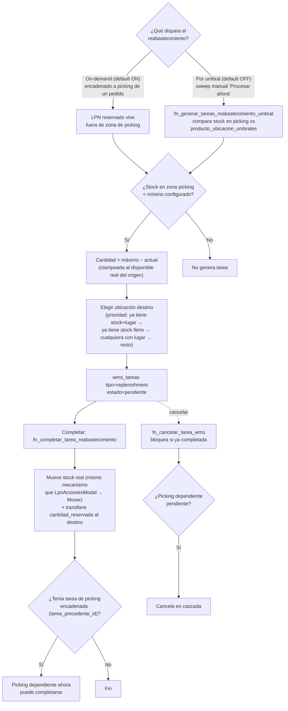

# WMS — Warehouse Management System

Visión: el sistema sugiere dónde almacenar cada SKU en base a dimensiones/peso, y genera listas de picking con tareas dirigidas.

> [!IMPORTANT] **🛑 Pivote de arquitectura (2026-07-22, mismo día que las Fases 3-5 de abajo) — de
> dónde nacen las tareas WMS cambió.** GO fue explícito: *"Ventas no tiene que generar tareas... las
> tareas (picking y replen) deben ser solo para los pedidos."* `fn_generar_tareas_picking_envio`
> (migs 290/291, descripta en "Fase 3" más abajo) queda **código muerto en la práctica** — la RPC
> sigue existiendo (sería correcta si alguien la invocara a mano, y ya era coherente con que nunca
> estuvo conectada a ningún botón), pero **no se le agrega ningún gancho nuevo** desde
> `VentasPage.tsx`/`EnviosPage.tsx`. De acá en más, **todo** el picking/reabastecimiento nace
> **exclusivamente** desde el módulo NUEVO [[wiki/features/pedidos]] (RPC futura
> `fn_generar_tareas_picking_pedido`, Fase PED3, todavía sin construir). El schema descripto en "Fase
> 3"/"Fase 4" (`zonas`/`wms_tareas`/RPCs de completar tarea) **sigue siendo la base real** que Pedidos
> va a reusar — solo cambia **quién genera las tareas**, no el mecanismo de picking en sí. No asumir
> que Ventas/Envíos siguen siendo el origen de las tareas al leer las secciones de abajo.

## 🔀 Diagrama de flujo — Reabastecimiento por umbral

Editable en draw.io: [`G360.Wiki/diagrams/09-wms-reabastecimiento-umbral.drawio`](../../diagrams/09-wms-reabastecimiento-umbral.drawio).



---

## Estado de fases

```
Fase 1 ✅ (producto_estructuras — rediseñada con niveles dinámicos por UdM en v1.137, migs 282-283)
  → Fase 2 ✅ (ubicaciones con dimensiones)
    → Fase 2.5 ✅ (KITs / Kitting)
    → Fase 3 ✅ (tareas WMS + picking — migs 289-290, ✅ **EN PROD desde v1.144.0**; fixes reales mig 291)
      → Fase 4 🔵 (reposición automática ✅ v1.143.0 — cross-docking real sigue pendiente; fix de
        transferencia de reserva mig 297, 2026-07-23, encontrado al construir Pedidos PED4)
```

---

## Fase 1 — Estructura de producto (migration 031 → rediseñada en 282, v1.137.0) ✅

> **Modelo actual (migs 282-283): niveles DINÁMICOS por Unidad de Medida** — estilo pack
> structure/footprint de Blue Yonder. Cada estructura tiene N niveles, cada nivel apunta a una
> UdM del tenant (`producto_estructura_niveles`), con factor contra el nivel anterior y
> `unidades_base` calculada server-side (RPC `fn_estructura_guardar_niveles`). Los 3 niveles
> fijos unidad/caja/pallet de la mig 031 quedaron deprecados.
> **Detalle completo + roadmap de fases 2-5 (operar por UdM, zonas + reglas de almacenaje,
> picking por UdM, reabastecimiento): [[wiki/features/estructuras-udm]].** Fases 3-5 (Zonas,
> Tareas WMS/picking, Reabastecimiento) ✅ **v1.143.0**, ver más abajo. Solo queda pendiente la
> Fase 2 (operar por UdM al ingresar stock).

- Varias estructuras por SKU, un único default (`UNIQUE INDEX WHERE is_default = true`),
  default reasignado automáticamente al eliminar el actual
- UI ProductosPage → Tab Estructura: buscador de producto, cards con cadena de conversión,
  modal de niveles dinámicos; panel expandible en tab Productos muestra la default

---

## Fase 2 — Dimensiones en ubicaciones (migration 032, v0.59.0) ✅

> ✅ **Rediseño en árbol + tipo lógico (migs 334/335, ✅ EN PROD desde v1.160.0 — el gap real de
> deploy que dejó 334/335 fuera de PROD hasta el 2026-08-08 se cerró con la mig 344) — ver página
> propia [[wiki/features/ubicaciones]].** `ubicaciones` pasa de tabla plana a **árbol** (self-FK
> `padre_ubicacion_id`, mismo patrón que `producto_presentaciones.padre_linea_id`) y el
> `tipo_ubicacion` de la tabla de abajo queda **deprecado** — reemplazado por `tipo_logico` (enum de
> negocio: exhibición/mostrador/picking/almacenamiento) + `subtipo_almacenamiento` (técnico WMS,
> mismos 5 valores de siempre, solo aplica dentro de `tipo_logico='almacenamiento'`). Guard
> server-side `SECURITY DEFINER` nuevo que bloquea crear un nivel bajo un padre operativo (tipo
> asignado / stock / umbrales / tareas WMS pendientes). Es el **1º de 4 relevamientos** acordados
> para desbloquear la Fase E (módulo Repositores) del backlog Comercial de Fede — ver
> [[wiki/features/precios-tiers-empaque]] → "Fase E".

**Nuevos campos en `ubicaciones`** (todos opcionales):
```sql
tipo_ubicacion TEXT CHECK IN ('picking','bulk','estiba','camara','cross_dock')  -- ⚠ deprecado desde mig 334, ver [[wiki/features/ubicaciones]]
alto_cm      DECIMAL(8,2)
ancho_cm     DECIMAL(8,2)
largo_cm     DECIMAL(8,2)
peso_max_kg  DECIMAL(8,2)
capacidad_pallets INT
```

**UI ConfigPage → Ubicaciones:**
- Sección colapsable "Dimensiones WMS (opcional)"
- Auto-abre si la ubicación ya tiene datos
- Badge tipo violeta + indicador `📏 alto×ancho×largo cm`

### Ocupación real (migs 321/322/325, v1.149-150) ✅

> ⚠ Estos campos existían desde la mig 032 y **durante ~290 migraciones no los leyó ningún cálculo**:
> se cargaban en Config y no servían para nada. La mig 321 los conectó.

Vista `vw_ubicacion_ocupacion` (`security_invoker`, respeta RLS) → badges por ubicación:

| Badge | Contra | Origen del dato |
|---|---|---|
| `3 de 4 LPN` | `capacidad_pallets` | `count(*)` de líneas activas |
| `120 de 500 kg` | `peso_max_kg` | peso del **nivel** de empaque si está cargado (incluye embalaje), si no `productos.peso_kg` |
| `0.8 de 1.01 m³` | dimensiones × factor de aprovechamiento | volumen de la presentación en la que está la mercadería |

**🛑 Regla de los tres: avisan, NUNCA bloquean.** El tope lo carga una persona y puede estar mal o
desactualizado; la mercadería ya está físicamente en la posición. Frenar un ingreso real por un
número de configuración sería peor que el problema.

**⚠ Sesgo del error, y por qué se muestra la cobertura.** A los tres les falta dato hacia el mismo
lado: una línea sin peso o sin medidas suma **0**, así que el total queda **CORTO** — el error empuja
hacia *"parece que hay lugar"* justo cuando la posición podría estar pasada. Por eso ninguna pantalla
muestra un verde limpio: se exhibe `lineas_con_peso`/`lineas_con_volumen` sobre `lineas_total` con ⚠,
y el aviso salta al **90%** del límite, no al 100% (con el total subestimado, esperar al 100% exacto
puede no avisar nunca).

### 📦 Cubicaje volumétrico opt-in (migs 322/325, v1.149-150) ✅

Idea de GO que resuelve la objeción de fondo al cubicaje —*"con medidas a medias el número miente, y
un número que miente es peor que no tener ninguno"*:

- **`tenants.cubicaje_habilitado`** (default `false`). Al activarlo, el peso y las tres medidas pasan
  a ser **obligatorios por nivel** en el editor de estructura → la cobertura es 100% **por
  construcción** de ahí en adelante. El que no lo necesita no paga el costo de cargar esos datos.
  Guard server-side: `trg_presentaciones_exige_medidas` (la UI se cachea y el importador/EFs escriben
  con service_role).
- **Peso obligatorio POR NIVEL, no derivado del factor** (decisión de GO): el peso real de un bulto
  incluye su embalaje — una caja de 12 pesa más que 12 unidades sueltas.
- **`tenants.cubicaje_factor_aprovechamiento`** (default **0.70**): ninguna posición real se llena al
  100% geométrico (pasillos, forma irregular, mercadería que no apila). Sin él el sistema diría
  "entra" cuando no entra.
- **Prender el toggle NO completa el catálogo existente** → `fn_cubicaje_cobertura(tenant)` alimenta
  un panel en Config → Inventario ("6 de 296 SKU medidos · 351 presentaciones sin medir").
- **Aviso al ubicar** (`AvisoCapacidadUbicacion`): al ingresar stock y al mover un LPN, si la
  ubicación elegida quedaría llena o excedida. Avisa, no bloquea.

**Almacenaje dirigido — ✅ mig 326 (v1.151.0).** `fn_wms_elegir_ubicacion_picking` (destino de un
reabastecimiento bulk→picking) ya no elige a ciegas: prefiere posiciones **con lugar** según estos
mismos números. Orden final: (a) la que ya tiene ese producto y tiene lugar · (b) la que ya lo tiene
aunque esté llena — mantiene el SKU consolidado en su cara de picking · (c) cualquiera con lugar ·
(d) el resto; después secuencia y prioridad de siempre.

🛑 **La capacidad DESEMPATA, nunca EXCLUYE.** Si todas están llenas devuelve una igual: filtrarlas
dejaría la tarea de reabastecimiento **sin destino** y el stock nunca llegaría al picking — un dato de
configuración cargado a mano frenando mercadería real. Y **sin capacidad configurada no cambia
nada**: "sin lugar" exige un tope CONFIGURADO y ALCANZADO, porque un campo vacío es "no sé" y no sé
no puede degradar una posición. Espejo JS: `ubicacionSinLugar()` en `src/lib/medidasLogistica.ts`.

---

## Fase 2.5 — KITs / Kitting (migrations 040+041, v0.65.0–v0.67.0) ✅

### Schema

```sql
kit_recetas(kit_producto_id, comp_producto_id, cantidad)
kitting_log(tipo 'armado'|'desarmado', estado, componentes_reservados JSONB)
productos.es_kit BOOLEAN
movimientos_stock.tipo: + 'kitting' + 'des_kitting'
```

### Armado en 2 fases (migration 041+052 v0.85.0)

1. **"Iniciar armado"** → incrementa `cantidad_reservada` en líneas de componentes + crea `kitting_log{estado='en_armado'}`
2. Sección "En Armado" muestra armados activos:
   - **Confirmar** → rebaja componentes + ingresa KIT + `estado='completado'`
   - **Cancelar** → libera reservas + `estado='cancelado'`

### Desarmado inverso (v0.67.0)

- Botón "Desarmar" en tab Kits
- Modal con preview de componentes
- Valida stock del KIT disponible
- Rebaja KIT + ingresa componentes al stock
- Movimiento tipo `des_kitting`

### UI InventarioPage — Tab Kits

- CRUD recetas por KIT
- Preview "puede armar: N" según stock mínimo de componentes
- Modal ejecutar kitting con consumo en tiempo real
- Botón Clonar: copia receta a otro KIT
- Badge "KIT" naranja en dropdown de búsqueda de VentasPage
- KIT como producto vendible (precio/stock igual que cualquier SKU)

**🆕 2026-08-07 (mig 343, ✅ EN DEV Y PROD — deploy de código EN CURSO, backlog Comercial de Fede —
Motor de Rotación, Opción 3): `iniciar_armado_kit` prioriza el lote en descuento** — si el
tenant/categoría/producto tiene `rotacion_armar_kits` activo (mig 341), la reserva de componentes ya no
es FIFO ciego al estado: los lotes en un estado con `dispara_rotacion=true` se reservan PRIMERO
(prioridad, no exclusividad). Para componentes sin la regla activa, 0 cambio de comportamiento. Además,
el bloque "Sugerido según la receta" en Inventario → Kits autogenera nombre/precio del KIT (precio de
lista × cantidad, sin restar descuento — el % lo aplica el estado en la venta), con modificar el precio
requiriendo autorización de supervisor si el rol no es DUEÑO/SUPERVISOR/SUPER_USUARIO/ADMIN. **E3
(prioridad de reserva) ✅ VERIFICADA end-to-end** (test permanente
`132_kit_armado_prioridad_rotacion_mutante.spec.ts`); **autogeneración/aprobación de precio (E2/E4)
también ✅ VERIFICADA end-to-end** (test permanente `133_kit_precio_sugerido_autorizacion_mutante.spec.ts`,
mismo día, sesión de deploy). Código commiteado y pusheado a `origin/dev` (`e4b5d9de`), migración ya
aplicada en PROD; falta el merge `dev`→`main` para que el código llegue a Vercel/EFs de PROD. Detalle
completo: [[wiki/features/precios-tiers-empaque]] → "Fase E" → Motor de Rotación → Opción 3.

---

## Fase 3 — Tareas WMS y Listas de Picking (✅ migs 289-291 — **EN PROD desde v1.144.0, 2026-07-28**)

> **🛑 Nota de vigencia (2026-07-22, mismo día): con el pivote F4 de [[wiki/features/pedidos]], la RPC
> `fn_generar_tareas_picking_envio` descripta abajo (que genera tareas desde envíos/ventas
> despachadas) es código correcto pero SIN gancho real desde el frontend** — nunca se le agregó ni se
> le va a agregar un botón en `VentasPage.tsx`/`EnviosPage.tsx`. El schema (`zonas`/`wms_tareas`/RPCs
> de completar tarea) sigue siendo la base válida; lo que cambia es que las tareas van a nacer desde
> Pedidos, no desde acá. Ver [[wiki/features/pedidos]] → "Decisión de arquitectura clave (F4)".

**Decisión de arquitectura clave** (confirmada con GO en el chat): el picking es una capa de
**logística pura** — nunca decide qué LPN consume una venta ni cuándo se rebaja stock. El motor de
ventas (`VentasPage.tsx`, `rebajeSort.ts`) no se tocó. Las tareas de picking leen la decisión YA
TOMADA por la venta (`venta_item_despachos` si el envío ya está despachado, `venta_items.lpn_plan`
si es una reserva pendiente) y guían al depósito hacia esos LPNs concretos. Con esto queda cerrada
la pregunta abierta que había dejado v1.137.0 ("¿picking solo envíos o también mostrador?" → solo
envíos/despachos) — **superada a su vez por el pivote F4 del mismo día**: ni siquiera envíos/despachos
de Ventas van a disparar tareas de acá en más, solo Pedidos.

**`zonas`** (catálogo nuevo, RLS tenant-only como `ubicaciones`): agrupa ubicaciones —
`ubicaciones.zona_id` columna nueva.

**`reglas_almacenaje`** (catálogo): sugiere una zona destino por Unidad de Medida al ingresar stock
— la sugerencia es editable, **nunca bloquea** (decisión ya tomada por GO en el relevamiento de
v1.137.0).

**`wms_tareas`** (operativa, RLS **por sucursal** — mismo patrón que `inventario_lineas`/`envios`),
bastante fiel al sketch original de esta página. Diferencia real vs. el sketch: se agregaron
`envio_id` y `tarea_precedente_id` (necesarias para el encadenamiento real reabastecimiento→picking,
no estaban previstas en el diseño original):
```sql
wms_tareas
  tipo        ENUM: picking | replenishment | putaway | conteo
  estado      ENUM: pendiente | en_curso | completada | cancelada
  prioridad   INT
  producto_id, cantidad (SIEMPRE en unidades base)
  ubicacion_origen_id, ubicacion_destino_id
  envio_id            → envios (de qué envío nace la tarea de picking)
  tarea_precedente_id → wms_tareas (encadena reabastecimiento → picking; una
                         tarea de picking con precedente pendiente NO se puede completar)
  origen ENUM: envio | manual | umbral
```

**RPCs (mig 290), todas SECURITY INVOKER:**
- `fn_generar_tareas_picking_envio(envio_id)` — genera las tareas de picking de un envío; por cada
  LPN que la venta ya decidió consumir, si el LPN vive fuera de una zona de picking, **encadena**
  automáticamente una tarea `replenishment` precedente (con `FOR UPDATE SKIP LOCKED` para evitar
  carreras entre dos generaciones concurrentes — mejora sumada por el subagente `migration-reviewer`
  antes de aplicar).
- `fn_completar_tarea_picking(tarea_id)` — **solo bookkeeping**: marca la tarea `completada`, nunca
  toca `inventario_lineas`/`movimientos_stock`. Bloqueada (error) si su `tarea_precedente_id` no
  está `completada`.
- Helpers `fn_wms_elegir_ubicacion_picking` (resuelve a qué ubicación de picking corresponde
  reponer/pickear un producto) y `fn_wms_describir_cantidad` (traduce la cantidad en unidades base a
  una descripción legible por UdM, ej. "2 cajas" — cierra el objetivo original de esta fase de
  "sugerir '2 cajas' en vez de '24 unidades'").
- `fn_cancelar_tarea_wms(p_tarea_id, p_motivo)` — **nueva, mig 291**: cancela una tarea de
  picking/reabastecimiento (bloquea si ya está `completada`, no-op si ya está `cancelada`); si
  cancela un `replenishment` con una tarea de picking dependiente todavía pendiente, la cancela en
  cascada (esa tarea de picking apunta a una ubicación destino que ya no va a recibir stock).

**UI:**
- Ruta nueva **`/picking`** (`src/pages/PickingPage.tsx`) — mobile-first, con escaneo de código de
  barras (reusa el componente `BarcodeScanner` ya existente) para completar tareas parado en el
  depósito.
- **Buscador de "píldoras" (agregado v1.153.0, 2026-08-03)**: GO probó el primer buscador de texto
  plano de esta misma sesión (LPN/SKU/pedido/venta/envío todos en un cuadro) y escribir un número de
  pedido lo tomaba ambiguo contra varios campos a la vez. Se reescribió como un buscador de criterios
  estructurados — `src/lib/pickingFiltro.ts` (lógica pura, 24 tests) + `src/components/
  BuscadorPildoras.tsx` (input tipo "chips"):
  - Cada criterio es una píldora `(Campo):valor` — campos LPN/SKU/Producto/Pedido/Venta/Envío.
    Operadores: `:`/`=` (contiene), `!=`/`<>` (no contiene) para todos los campos; además
    `>`/`</>=`/`<=` (comparación numérica real, no substring) para Pedido/Venta/Envío.
  - **Escribir texto SIN prefijo de campo (ej. tipear "20" a secas) ya NO matchea Pedido/Venta/
    Envío** — solo LPN/SKU/Producto (mismo comportamiento que existía antes de agregar esos 3
    campos). Para buscar por comprobante hace falta la píldora explícita `(Pedido):20` — es
    justamente lo que corrige la ambigüedad que encontró GO.
  - Varias píldoras se combinan con un **combinador global Y/O** (no árbol de expresiones anidado —
    no se pidió). Cambiar el campo de una píldora ya creada (selector dentro del chip) conserva el
    operador y el valor tipeado.
  - El botón "Ver en Picking" de `PedidosPage.tsx` pasa `?busqueda=Pedido:<número>` (antes pasaba el
    número pelado) — `PickingPage.tsx` lo parsea al montar: si matchea el patrón "Campo:valor" nace
    como píldora ya armada; si no, cae como texto libre.
  - La venta de una tarea se resuelve por DOS caminos — `pedidos.venta_origen_id` (viene de Pedidos)
    o `envios.venta_id` (envío armado directo desde una venta, sin pasar por Pedidos, el caso más
    común) — el segundo camino no existía antes de esta fecha: ni el buscador ni el badge "Venta #"
    de la card funcionaban para una tarea sin pedido de por medio.
  - **Verificado con e2e real contra datos de DEV** (8 aserciones: deep-link con píldora pre-armada,
    número suelto ya no matchea venta, cambiar de campo conserva valor, combinador Y exige las dos
    píldoras, combinador O alcanza con una, y el invariante de siempre — confirmar la tarea sigue
    dando cero movimiento de stock).
  - **🆕 Generalizado a Productos e Inventario (2026-08-06, ✅ PROD desde v1.158.0):** `pickingFiltro.ts`
    y este comportamiento de Picking **no se tocaron** — se escribió un núcleo genérico nuevo
    (`src/lib/pildorasFiltro.ts`) del que nacen `productosFiltro.ts`/`inventarioFiltro.ts`, y
    `BuscadorPildoras.tsx` pasó a recibir los campos por prop en vez de importarlos hardcodeados de
    Picking. Detalle completo: [[wiki/features/filtro-pildoras]].
- Tab **"Tareas WMS"** — vista de escritorio para el DUEÑO, con link directo a `/picking`. 🆕
  **2026-08-08, ✅ EN PROD desde v1.161.0: se MUDÓ de `InventarioPage` a `PedidosPage` (`PageTabs`
  'Pedidos' | 'Tareas WMS')**, a pedido de GO — ver más abajo "Asignación de tareas a un usuario" para
  el detalle completo (mismo pedido de GO, misma sesión).
- Gating: `modoAvanzado` + rol **DEPOSITO** (nav en `AppLayout.tsx` + redirect guard + ruta en
  `App.tsx`), mismo patrón que "Recepciones".

**Verificación:** revisado por el subagente `migration-reviewer` antes de aplicar. Smoke test manual
contra DEV con datos reales (producto + ubicaciones picking/bulk + venta despachada + envío →
generar tareas → completar reabastecimiento → verificar stock movido sin pérdida ni duplicación →
completar picking) — encontró y corrigió 2 bugs reales antes del e2e (un error de sintaxis PL/pgSQL,
un cast numeric→integer faltante). Verde: tsc · build · **1177 tests unitarios** · regresión e2e (13
specs) · **e2e nuevo 106** (mutante, verificación real en DB). `APP_VERSION` = v1.143.0, commit
`547ef330` en `dev`. Se deployó a PROD el 2026-07-28 dentro de v1.144.0 (PR #302). *(Nota histórica: al construirlo quedó solo en DEV, decisión explícita por ser una feature sobre movimiento
real de stock, el deploy queda para cuando GO lo pida).

Detalle completo del roadmap de las 5 fases: [[wiki/features/estructuras-udm]] → "Roadmap del plan".

### 🆕 Asignación de tareas a un usuario + tab "Tareas WMS" mudado a Pedidos (2026-08-08, ✅ EN PROD desde v1.161.0)

Pedido explícito de GO: mover la pestaña "Tareas WMS" del módulo Inventario al módulo
[[wiki/features/pedidos]], poder asignar cada tarea (picking/reabastecimiento, y a futuro armado, ver
"Motor de Rotación → Opción 3" y el punto de D2 más abajo) a un usuario puntual, y que en `/picking`
cada usuario vea únicamente las tareas sin asignar (las puede tomar) o las que le asignaron a él —
nunca las de otro.

- **`src/pages/InventarioPage.tsx`**: se eliminó por completo el tab `'wms'` (nav, query de
  `wms_tareas`, mutations `completarTareaWms`/`cancelarTareaWms`, bloque de render). Inventario ya NO
  tiene pestaña "Tareas WMS" — ver [[wiki/features/inventario-stock]].
- **`src/pages/PedidosPage.tsx`**: `PageTabs` nuevo 'Pedidos' | 'Tareas WMS' (solo modo avanzado), con
  la misma lista de tareas que antes vivía en Inventario, ahora con un `<select>` de asignación a
  usuario — gateado a DUEÑO/SUPERVISOR/SUPER_USUARIO (mismo criterio que `puedeVerAutorizaciones`;
  otros roles ven texto plano "Asignada a X"/"Sin asignar"). Escribe directo
  `wms_tareas.usuario_asignado_id` — **sin RPC nueva**, la columna y el RLS ya lo permitían.
- **`src/pages/PickingPage.tsx`**: la query de `wms_tareas` filtra `usuario_asignado_id IS NULL OR
  usuario_asignado_id = <usuario logueado>` (una tarea asignada a OTRO ya no aparece para nadie más),
  + badge "Asignada a mí" en la card cuando corresponde.
- **Sin migración nueva** — se reusó `wms_tareas.usuario_asignado_id`, columna del schema desde la mig
  289 que hasta esta sesión no tenía ninguna lógica de asignación implementada en todo el repo.
- **Verificado de verdad en el navegador** (no solo tsc/build) con Playwright headless contra el dev
  server y el tenant E2E real ("Almacén Jorgito", DEV): Pedidos muestra ambas pestañas, el select de
  asignación lista los usuarios reales del tenant y persiste tras reload, Inventario ya no muestra el
  tab, y — lo más importante — un usuario (deposito1) ve en `/picking` su propia tarea asignada con el
  badge "Asignada a mí" pero NO ve una tarea asignada a otro usuario (cajero1). Datos de prueba
  revertidos al estado original al terminar.
- **Deuda técnica encontrada y corregida de paso (misma sesión):** `tests/e2e/106_wms_picking_reabastecimiento_mutante.spec.ts`
  y `tests/e2e/107_pedidos_ciclo_completo_mutante.spec.ts` fallaban 6/7 por un problema preexistente,
  no causado por esta sesión — seguían creando ubicaciones de prueba con la columna
  `ubicaciones.tipo_ubicacion`, dropeada por la mig 339 (la verificación de "0 lectores" de esa
  migración había chequeado `src/`/`supabase/functions` pero no los fixtures de e2e). Fix:
  `tipo_ubicacion` → `tipo_logico`/`subtipo_almacenamiento` (mapeo real de la mig 334) +
  `disponible_surtido: true` explícito (la mig 336 cambió el default a `false`, decisión deliberada,
  ver [[wiki/features/ubicaciones]]). **7/7 verdes en ambos specs.** Detalle en
  `wiki/database/migraciones.md`.
- **Pendiente A PROPÓSITO en ESTE punto, resuelto más abajo en la continuación de la misma sesión:**
  "preset de operario por defecto para tareas de armado" que GO había pedido — pospuesto hasta
  construir el backend de armado automático de D2 (Combos TN/MELI). Ver "🆕 Tipo de tarea 'armado'
  (Fase D2, mig 345)" más abajo para el detalle completo, ya construido y verificado.
- **Estado real: ✅ commiteado y deployado a PROD (v1.161.0, PR #319).** `src/pages/InventarioPage.tsx`,
  `src/pages/PedidosPage.tsx`, `src/pages/PickingPage.tsx` y los 2 specs e2e de arriba, ya en `main`,
  sin migración nueva propia (reusa `wms_tareas.usuario_asignado_id`, mig 289).

### 🆕 Tipo de tarea 'armado' — backend de armado automático de kits (Fase D2, mig 345, ✅ EN PROD desde v1.161.0, 2026-08-08) — falta la prueba end-to-end con una orden real

Continuación, mismo día, del punto de arriba ("preset de operario para tareas de armado" quedaba
pendiente porque no existía consumidor). Ver [[wiki/integrations/tienda-nube]] → "BOM automático para
combos/kits" para el detalle completo del diseño de negocio (D2, relevamiento de Fede) — acá el foco es
el mecanismo WMS.

**`345_armado_kits_automatico_d2.sql`** (✅ aplicada en DEV Y PROD, confirmada con `list_migrations` +
queries directas contra ambos ambientes):
- `wms_tareas.tipo` CHECK suma `'armado'` (antes solo `picking | replenishment | putaway | conteo`).
  `wms_tareas.origen` CHECK suma `'marketplace'` (antes `envio | manual | umbral`).
- `wms_tareas.kitting_log_id` (FK nueva a `kitting_log`, Fase 2.5 de esta misma página) — la tarea de
  depósito queda linkeada al ledger real de kitting, no es un registro paralelo.
- `productos.ubicacion_kit_default_id` (FK a `ubicaciones`) — dónde se arma un kit por defecto (A3 del
  relevamiento), editable en `ProductoFormPage.tsx` cuando `es_kit=true`.
- `tenants.wms_armado_operario_default_id` (FK a `users`) — a quién nace pre-asignada una tarea de
  armado automático (cierra el pendiente del punto anterior), configurable en Config → Inventario →
  Zonas.
- **`fn_iniciar_armado_kit_auto(p_tenant_id, p_kit_producto_id, p_cantidad, p_canal, p_sucursal_id,
  p_origen_ref, p_notas)`** — variante de `iniciar_armado_kit` (mig 343, con prioridad de Rotación) SIN
  `auth.uid()` (recibe `p_tenant_id` explícito), pensada para invocarse con `service_role` desde un
  webhook server-side sin sesión de usuario — mismo molde que `liberar_reservas_vencidas_all`. Suma el
  filtro de "componentes en ubicaciones/estados habilitados para el canal"
  (`ubicaciones.disponible_tn/disponible_meli`, `estados_inventario.es_disponible_tn/es_disponible_meli`
  — el mismo criterio que `tn-stock-worker`/`meli-stock-worker` ya usaban para el push SALIENTE de
  stock, aplicado acá por primera vez también a la reserva de una orden ENTRANTE). Todo-o-nada real: si
  no alcanza, `RETURN NULL` sin reservar nada. `pg_advisory_xact_lock` por (tenant,kit) + chequeo final
  de `v_restante` con `RAISE EXCEPTION` (rollback automático) contra una carrera de stock entre el
  chequeo y la reserva — **encontrado y corregido por el `migration-reviewer` antes de aplicar
  (bloqueante #2)**. `REVOKE ALL FROM PUBLIC/anon/authenticated`, `GRANT` solo a `service_role` (a
  propósito: un `p_tenant_id` arbitrario en manos de un usuario común sería explotable).
- **`fn_completar_tarea_armado(p_tarea_id)`** — la ejecuta un operario logueado real desde
  Pedidos/Picking; reusa `confirmar_armado_kit` (mig 244/343) vía `PERFORM`, sin duplicar el camino de
  escritura de stock, y marca la tarea `completada`. `GRANT authenticated, service_role`.
- **`fn_cancelar_tarea_wms` extendida** (mismo nombre/firma): si la tarea es `tipo='armado'`, llama a
  `cancelar_armado_kit(kitting_log_id)` y libera la reserva de componentes antes de cancelar — sin esto
  quedaba `cantidad_reservada` bloqueada para siempre. **El `migration-reviewer` encontró como
  bloqueante #1** que la primera versión de este `CREATE OR REPLACE` perdía la rama de cascada de
  cancelación picking↔reabastecimiento de la mig 291 (cancelar un reabastecimiento cancela el picking
  encadenado) — restaurada, sigue intacta.

**Verificación real con SQL directo contra DEV** (no solo "aplicó sin error"): escenario completo en el
tenant E2E real (producto componente + producto kit + receta + ubicación con `disponible_tn=true` +
stock), impersonando usuario real con `SET LOCAL request.jwt.claim.sub` para los pasos que dependen de
`auth.uid()`:
- Todo-o-nada: pedir más de lo que hay devuelve `NULL` sin tocar nada (cero efectos secundarios).
- Camino exitoso: reserva correcta de componentes (3×2=6 de 10), `wms_tareas` con `tipo=armado`,
  `origen=marketplace`, `ubicacion_destino_id`=la default del kit, `usuario_asignado_id`=el preset del
  tenant, `kitting_log_id` linkeado; 4 notificaciones a DUEÑO/SUPERVISOR/SUPER_USUARIO reales.
- `fn_completar_tarea_armado`: componente consumido (10→4), reserva liberada, kit terminado ingresado
  (2 unidades) en la ubicación correcta, tarea marcada completada.
- Filtro de canal: la MISMA ubicación con `disponible_tn=true` pero `disponible_meli=false` devuelve
  `NULL` si se pide armar para MercadoLibre.
- Cancelación: libera la reserva de componentes y marca `kitting_log` como `cancelado`.
- Todos los datos de prueba se limpiaron al terminar.

**UI:**
- `src/pages/ConfigPage.tsx` — card "Armado automático de kits" en Config → Inventario → Zonas,
  `<select>` para el operario por defecto.
- `src/pages/ProductoFormPage.tsx` — `<select>` "Ubicación de armado por defecto", visible solo con
  `es_kit=true`.
- `src/pages/PedidosPage.tsx` (tab "Tareas WMS") y `src/pages/PickingPage.tsx` — reconocen
  `tipo='armado'`: badge morado "Armado", muestran la ubicación de DESTINO en vez de origen, "Completar"
  llama a `fn_completar_tarea_armado`, "Cancelar" sigue siendo el botón genérico existente.

**Webhooks — ✅ deployados, sanity check OK, TODAVÍA sin probar contra una orden real.** `tn-webhook` y
`meli-webhook`: después del loop de reserva FIFO existente contra el stock del kit (su propio SKU), si
sigue faltando cantidad y el producto tiene `es_kit=true`, invocan `fn_iniciar_armado_kit_auto` con el
cliente `service_role` que esos archivos ya usan — best-effort, nunca bloquea la venta (mismo patrón
que el envío automático). Deployados vía `deploy_edge_function` a DEV (v21/v25) y PROD (v20/v13).
Sanity check post-deploy contra DEV: `tn-webhook` con payload vacío devuelve 400 "Missing fields"
(esperado) y `meli-webhook` con un topic de test devuelve 200 `{ok:true, skipped:...}` (esperado) —
confirma que el deploy no rompió el boot de ninguna de las dos funciones. **Sigue sin probarse un
webhook real de TN/MELI con firma válida y una orden real** — la única verificación de la lógica de
armado en sí sigue siendo la de la RPC (arriba), con datos de prueba directos.

**Estado real: ✅ 100% DEPLOYADO A PROD (v1.161.0, 2026-08-08).** `APP_VERSION` bumpeada a `v1.161.0`
(commit `2e3b84e1`). Migración 345 aplicada en DEV y PROD. PR #319 (`dev`→`main`) mergeado limpio
(merge commit `7c26b3a641aafe3d39669badb7c61cf8e42ee3e5`), tag + release `v1.161.0` publicados
(`--latest`), Vercel PROD verificado de forma independiente (`dpl_CaSPmabR76uEBq6Uuv2d74x78PTP`,
`READY`, `production`). **Pendiente real, no bloqueante del deploy:** la prueba end-to-end contra una
orden real — requiere que GO o Fede creen un producto kit real mapeado en una de las 2 tiendas TN de
test ya conectadas en DEV (tenant `bbf7546e-69d6-4ec0-8464-96a6ddc3028d` store `7615512`, tenant
`3769b1db-10f4-46a6-bc7f-eb669307730d` store `7610321`) y generen una orden real ahí — acceso que
Claude Code no tiene; después se revisa el resultado (venta creada, tarea de armado generada,
notificación a supervisores) contra la base real.

### Fixes de la primera ronda de pruebas manuales de GO (mig 291, 2026-07-22 — ✅ EN PROD desde v1.144.0)

GO probó a mano el módulo (recién descripto arriba) contra datos reales del tenant "Almacén Jorgito"
en DEV y encontró varios problemas reales, corregidos en la misma sesión vía
`291_wms_fixes_picking_reabastecimiento.sql` (3 `CREATE OR REPLACE FUNCTION`, sin tablas/columnas
nuevas — **aplicada solo en DEV, sin deploy a PROD, `APP_VERSION` sigue v1.143.0 sin bump**):

1. **Bug real de trazabilidad** en `fn_generar_tareas_picking_envio` — la rama "Fuente 1"
   (`venta_item_despachos`, venta YA despachada, el rebaje real YA ocurrió) encadenaba una tarea de
   reabastecimiento igual que la rama "Fuente 2" (reserva pendiente, `lpn_plan`, nada consumido
   todavía) cuando el LPN vivía fuera de una zona de picking. Verificado con datos reales (venta
   #395, envío #44, "Bebida Coca Cola 2.5L"): `productos.stock_actual` quedaba matemáticamente
   correcto (114 = 115 − 1 vendida, el movimiento de reabastecimiento es neto cero), PERO se creaba
   un LPN nuevo en la zona de picking desvinculado del LPN que `venta_item_despachos` ya había
   fijado como el que cumplió la venta, y la tarea de picking quedaba con un `lpn_origen` que ya no
   estaba en la ubicación destino — rompía la trazabilidad por unidad (mismo criterio de ledger
   inmutable write-time, nunca heurística read-time, que [[wiki/features/reportes-metricas]] →
   "Trazabilidad-extendida"). **Fix:** Fuente 1 ahora SIEMPRE genera directo la tarea de picking,
   nunca encadena reabastecimiento, apuntando al LPN/ubicación real que la venta ya usó — sea o no
   zona de picking.
   Fuente 2 no cambió (ahí sí tiene sentido preparar stock a futuro, nada se consumió todavía).
2. **Bug real reproducido por GO** en `fn_generar_tareas_reabastecimiento_umbral` — pedía siempre
   `stock_maximo − stock_actual` sin chequear cuánto había disponible de verdad en el origen elegido
   → si no alcanzaba, `fn_completar_tarea_reabastecimiento` fallaba con "no hay stock suficiente" al
   completar. El máximo es un TECHO, no una obligación. **Fix:** clampea la cantidad de la tarea al
   disponible real (`SUM(cantidad - cantidad_reservada)`) en la ubicación origen elegida, antes de
   insertar la tarea — repone lo que haya, no falla.
3. **Gap encontrado por GO**: no existía ninguna forma de cancelar una tarea. **Fix:** RPC nueva
   `fn_cancelar_tarea_wms` (ver arriba).

**Frontend (sin migración), 2 gaps más encontrados por GO:**
- **Sin rastro en el Historial:** las tareas WMS no dejaban ningún rastro en
  `actividad_log`/`HistorialPage.tsx` — no había forma de saber quién completó o canceló una tarea y
  cuándo. Se agregó `logActividad()` (entidad nueva `wms_tarea`, con ícono `Truck` y label "Tarea
  WMS" en `HistorialPage.tsx`) en `PickingPage.tsx` e `InventarioPage.tsx` (tab "Tareas WMS") al
  completar y al cancelar, más un botón "Cancelar" nuevo en ambas superficies.
- **Venta sin visibilidad de su envío:** el modal de detalle de venta (`VentasPage.tsx`) no mostraba
  si esa venta tenía un envío asociado ni cuál — la relación solo se veía desde `/envios`. Badge
  nuevo "Envío #N · estado" en el header del modal, clickeable, navega a `/envios?busqueda=N`
  (soporte nuevo de ese query param en `EnviosPage.tsx` para pre-filtrar por número de envío). Ver
  [[wiki/features/ventas-pos]] y [[wiki/features/envios]].

**Verificación:** revisado por el subagente `migration-reviewer` (aprobado, sin hallazgos
bloqueantes) antes de aplicar. `tests/e2e/106_wms_picking_reabastecimiento_mutante.spec.ts`
reescrito en 2 tests separados (Fuente 1 sin reabastecimiento / Fuente 2 con reabastecimiento) — el
test viejo verificaba el comportamiento buggy anterior. `npm run build` (tsc + vite build) verde.
**Los tests e2e todavía no se corrieron en esta sesión** — pendiente antes de dar el trabajo por
cerrado. Cambios sin commitear al cierre de la sesión (ver `project_pendientes.md`).

**✅ Decisión de arquitectura resuelta la misma sesión (más tarde, 2026-07-22):** en la misma sesión
surgió una discusión más grande — GO cuestionó que el picking dependa de una venta ya
despachada/rebajada, en vez de un futuro módulo "Pedidos" separado de las ventas de mostrador. Se
relevó a fondo y GO decidió que **Pedidos es el único origen de tareas WMS de acá en más** (pivote
F4) — ver [[wiki/features/pedidos]] y la nota de vigencia al principio de "Fase 3" más arriba.

---

## Fase 4 — Surtido y Cross-docking (largo plazo) — reposición automática ✅ v1.143.0, cross-docking pendiente

- **Reposición automática** ✅ v1.143.0 (migs 289-290) — stock en zona picking bajo el mínimo
  configurado (`producto_ubicacion_umbrales`, mín/máx por producto+ubicación) genera una tarea
  `replenishment` desde bulk, por 2 caminos independientes (habilitables por separado, ambos o
  ninguno):
  - **On-demand** (`tenants.wms_reabastecimiento_on_demand`, default ON): encadenada
    automáticamente al generar tareas de picking de un envío (`fn_generar_tareas_picking_envio`)
    cuando el LPN reservado por la venta vive fuera de una zona de picking.
  - **Por umbral** (`tenants.wms_reabastecimiento_umbral`, default OFF): sweep on-demand
    `fn_generar_tareas_reabastecimiento_umbral(tenant_id)` — sin `pg_cron` (no está habilitado en el
    proyecto), mismo patrón "Procesar ahora" ya usado por Aging Profiles.
  - `fn_completar_tarea_reabastecimiento(tarea_id)` mueve el stock **DE VERDAD** ejecutando la misma
    operación que ya existía en `LpnAccionesModal` → tab Mover (reduce el LPN origen, crea uno
    nuevo en destino) — no se inventó un mecanismo nuevo de movimiento de stock.
  - Bug propio encontrado y corregido en la misma sesión: el sweep por umbral podía elegir la misma
    ubicación como origen y destino de la reposición.
  - **Bug real reproducido por GO probando a mano (mig 291, ver más arriba "Fixes de la primera
    ronda"):** pedía siempre `stock_maximo − stock_actual` sin chequear el disponible real en el
    origen elegido → fallaba al completar si no alcanzaba. Ahora clampea al disponible real.
  - **🔴 Bug real encontrado por el `migration-reviewer` al construir Pedidos PED4 (2026-07-23,
    `297_wms_reabastecimiento_transferir_reserva.sql`, ✅ PROD desde v1.144.0):** al mover stock de origen a destino,
    la función decrementaba `cantidad` en el origen pero **nunca transfería `cantidad_reservada`** al
    LPN nuevo del destino (nacía con reserva 0 por default). Esto es transversal a WMS — no
    específico de Pedidos: cualquier reserva (Ventas "Reservar stock" o Pedidos "Lanzar") que
    necesitara reabastecerse desde bulk quedaba con la reserva "pegada" en un origen que, tras
    moverse, puede tener menos stock físico del que aparenta, mientras el LPN de picking recién
    creado —adonde llegó el stock real— quedaba **sin reserva** ("stock fantasma", vendible a
    cualquier otro documento sin autorización). Fix: transfiere
    `LEAST(cantidad_movida, cantidad_reservada_origen)` al LPN nuevo. Verificado explícitamente
    contra datos reales en `tests/e2e/107_pedidos_ciclo_completo_mutante.spec.ts` (antes del fix el
    LPN nuevo nacía con `cantidad_reservada=0`; después nace con la cantidad correcta). Ver
    [[wiki/features/pedidos]] → PED4 para el detalle completo del hallazgo.
- **Cross-docking** (mercadería entrante → tarea putaway directo a zona despacho): **sin
  implementar**, sigue pendiente.
- **KPIs WMS** (tasa de error picking, tiempo promedio por tarea, utilización de ubicaciones): sin
  implementar, sigue pendiente.

> 🆕 **2026-08-11/12 (mig 355+356, ✅ EN PROD desde v1.168.0, 2026-08-12): `fn_completar_tarea_reabastecimiento` gana un 2do
> llamador — Repositores Fase 3 (reposición física a góndola).** El generador nuevo
> `fn_generar_tareas_reposicion_gondola` crea tareas `wms_tareas.tipo='reposicion_gondola'` (tipo
> nuevo, mismo precedente que `'armado'` de la mig 345 — separación conceptual para que la cola de
> Repositores no se mezcle con la de Picking) pero **REUSA tal cual el mecanismo real de mover stock**
> de esta función (mig 297), sin duplicar su lógica — único cambio acá, el guard de tipo pasa de
> `<> 'replenishment'` a `NOT IN ('replenishment', 'reposicion_gondola')`. Investigación previa
> importante que **corrige la resolución anterior de I3** (ver [[wiki/features/repositores]] → "Fase
> 3"): `fn_wms_elegir_ubicacion_picking` (camino de picking automático) sí filtra duro por
> `tipo_logico='picking'`, pero `fn_generar_tareas_reabastecimiento_umbral` (el camino de arriba, "Por
> umbral") **nunca tuvo ese filtro en SQL** — el único bloqueo real para apuntar a una góndola era la
> UI de Config, que solo ofrecía ubicaciones picking en el selector de umbrales. `PickingPage.tsx` y
> la tab de WMS de `PedidosPage.tsx` excluyen `reposicion_gondola` de su cola (`.neq('tipo',
> 'reposicion_gondola')`) para no mezclarla con el trabajo de depósito. Detalle completo, incluida la
> mig 356 (fix de dedupe no atómico), en [[wiki/features/repositores]] → "Fase 3".

---

## Módulo Recepciones / ASN (migration 059, v0.88.0) ✅

Relacionado con WMS: recepción física de mercadería desde proveedores.

**Tablas (migration 050+059):**
```sql
recepciones(tenant_id, numero AUTO, oc_id nullable, proveedor_id, estado, sucursal_id)
recepcion_items(recepcion_id, producto_id, oc_item_id nullable, 
                cantidad_esperada, cantidad_recibida, estado_id, 
                ubicacion_id, nro_lote, fecha_vencimiento, lpn, 
                series_txt, inventario_linea_id)
```

**Flujo:**
- Opcional: vincular a una OC confirmada → pre-popula ítems
- Al confirmar: genera `inventario_lineas` + `movimientos_stock`
- Actualiza estado OC a `recibida_parcial` o `recibida`
- Roles: OWNER · SUPERVISOR · DEPOSITO

**UI:** `RecepcionesPage.tsx` (`/recepciones`)

### Escaneo de ticket en RecepcionesPage (v1.8.38)

Botón **"📷 Escanear ticket"** en la sección "Productos a recibir" del formulario de recepción.

1. Usuario selecciona foto del ticket de supermercado (comprimida a JPEG 1200px en el browser)
2. EF `scan-ticket` (Claude Sonnet 4.6 vision) extrae `[{barcode, nombre, cantidad, precio_unitario}]`
3. Modal muestra tabla con matching contra DB:
   - ✅ Encontrado en catálogo (por SKU/barcode exacto o nombre fuzzy 2 palabras)
   - ❌ No encontrado — no se carga al formulario
4. Cantidad y precio unitario editables
5. "Cargar N productos al formulario" → pre-popula `FormItem[]` con el `precio_costo` del ticket

El `precio_costo` del ticket se usa como `precio_costo_snapshot` en `inventario_lineas`.

Ver detalle técnico: [[wiki/features/escaneo-barcode]]

---

## Conteo de inventario (migration 050, v0.83.0) ✅

**Tablas:**
```sql
inventario_conteos(estado 'borrador'|'finalizado')
inventario_conteo_items(cantidad_esperada, cantidad_contada, ajuste_aplicado)
```

**UI Tab "Conteo" en InventarioPage:**
- Toggle tipo: Por ubicación / Por producto
- Tabla editable por LPN con color de diferencias (verde/ámbar/rojo)
- Guardar borrador (no afecta stock)
- Finalizar y ajustar: `ajuste_ingreso` o `ajuste_rebaje` automático

---

## Mono-SKU en ubicaciones (migration 052) ✅

`ubicaciones.mono_sku BOOLEAN DEFAULT FALSE` — una sola SKU por ubicación.  
Validación en `ingresoMutation`: si hay otro producto distinto con stock > 0 → error.

---

## Traslados entre sucursales (migration 205, v1.53.0) ✅

Proceso formal de movimiento de stock entre sucursales con estado **en tránsito** y
confirmación del destino (mismo LPN/lote/series = identidad trazable; faltantes auditados).
Detalle completo en [[wiki/features/multi-sucursal]] → "Traslados entre sucursales".

---

## Links relacionados

- [[wiki/features/ubicaciones]] — **rediseño en árbol + tipo lógico (migs 334/335, ✅ EN PROD desde
  v1.160.0, mig 344 cerró el gap real de deploy)**: `ubicaciones` pasa de plana a árbol,
  `tipo_ubicacion` (arriba, Fase 2) dropeado (mig 339) a favor de `tipo_logico`/`subtipo_almacenamiento`.
  1º de 4 relevamientos hacia Repositores.
- [[wiki/features/pedidos]] — **módulo NUEVO (2026-07-22/23) que desde el pivote F4 es el único
  origen real de tareas de picking/reabastecimiento** (ciclo de vida completo PED1-PED5+PED7 ya
  construido) — leer antes de asumir que Ventas/Envíos generan tareas; encontró el fix de mig 297
  de `fn_completar_tarea_reabastecimiento` (arriba, Fase 4)
- [[wiki/features/estructuras-udm]] — estructuras con niveles dinámicos por UdM (footprints) + roadmap picking/almacenaje/reabastecimiento por UdM (Fases 3-5 ✅ v1.143.0) + Fase 2 (ingreso/rebaje por UdM, ✅ mig 293)
- [[wiki/features/modo-basico-avanzado]] — desde v1.55.0 las superficies WMS solo se muestran en modo de operación **Avanzado** (toggle por tenant, plan Pro+); el modo gatea UI, nunca datos
- [[wiki/features/inventario-stock]] — 🆕 2026-08-08, ✅ EN PROD desde v1.161.0: el tab "Tareas WMS"
  (v1.143.0) se MUDÓ de acá a [[wiki/features/pedidos]], ver "Asignación de tareas a un usuario" más arriba
- [[wiki/features/configuracion]] — sección "Zonas y picking" en Config → Inventario (v1.143.0)
- [[wiki/features/multi-sucursal]]
- [[wiki/features/clientes-proveedores]]
- [[wiki/database/migraciones]] — migs 289, 290, 291, 292, 297, 334, 335, 339, 344
- [[wiki/database/schema-overview]]
