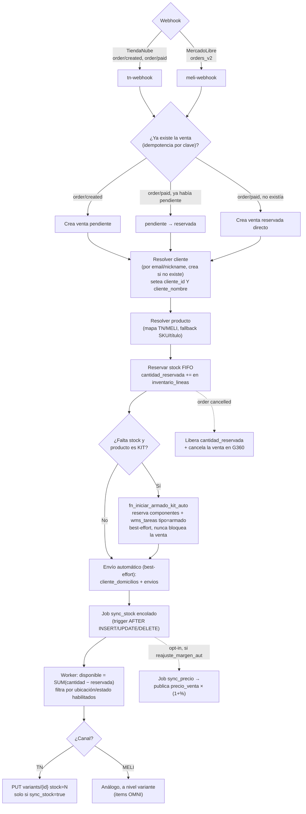

# Integración TiendaNube

Primera integración de marketplaces en Genesis360. Orden: **TiendaNube → MercadoPago → MELI**.

## 🔀 Diagrama de flujo — Webhook → Venta → Sincronización de stock

Flujo compartido con [[wiki/integrations/mercado-libre]] (mismo mecanismo, distinto canal) — editable
en draw.io: [`G360.Wiki/diagrams/10-integraciones-ml-tn.drawio`](../../diagrams/10-integraciones-ml-tn.drawio).



---

## Registro de la app

- **TiendaNube Partners App ID:** `30376`
- **Redirect URI PROD:** `https://jjffnbrdjchquexdfgwq.supabase.co/functions/v1/tn-oauth-callback`
- **Permisos:** Edit Products + Edit Orders + View Customers
- **Secret:** `TN_CLIENT_SECRET` en Supabase EF secrets
- **Frontend env var:** `VITE_TN_APP_ID=30376` en Vercel (no secreto)

---

## Credenciales

**Tabla `tiendanube_credentials`** (migration 061):
```
tenant_id, sucursal_id, store_id BIGINT, store_name, store_url,
access_token, conectado, UNIQUE(tenant_id, sucursal_id)
```
Token **permanente** — TiendaNube no expira access tokens.

---

## OAuth flow

**EF `tn-oauth-callback`** (sin JWT):
1. Recibe `?code&state` del redirect de TN
2. Intercambia code por token: `user_id` (= store_id) viene en el **cuerpo** del token response, no en la URL
3. Obtiene store info (nombre, URL)
4. Upsert en `tiendanube_credentials`
5. **Registra automáticamente** webhooks `order/created` + `order/paid` en TN (ignora 422 si ya existen)
6. Redirige a `APP_URL/configuracion?tab=integraciones&tn=ok`

`state` = `btoa(tenantId:sucursalId)`

---

## Mapeo de productos

**Tabla `inventario_tn_map`** (migration 061):
- Mapeo producto Genesis360 ↔ variante TN (tn_product_id + tn_variant_id)
- Flags: `sync_stock`, `sync_precio`, `ultimo_sync_at`
- Auto-complete por SKU con **EF `tn-search-products`**: busca productos en TN API

---

## Webhooks de órdenes

**EF `tn-webhook`** (sin JWT):
- `order/created` → crea venta `pendiente`
- `order/paid` → si existe venta `pendiente` la actualiza a `reservada`; si no existe, la crea directamente como `reservada`
- **Idempotencia**: clave `{store_id}-{event}-{orderId}` en `ventas_externas_logs`
- Mapeo de producto: primero por `inventario_tn_map`, fallback por SKU ilike
- Crea cliente si no existe (por nombre del comprador)
- Venta con `origen='TiendaNube'`

**Race condition resuelta (v1.0.0):**
- `order/paid` + `order/created` pueden llegar simultáneos
- Si `order/created` llega después y ya existe venta, la saltea

> [!NOTE] **ISS-073 corregida en el wiki (2026-08-06)**: `project_pendientes.md` tenía una fila
> vieja diciendo que TN "hoy: solo rebaja stock" — eso era **falso desde hace tiempo**, este webhook
> ya crea venta + cliente + reserva de stock automáticamente (arriba). Marcada ✅ cerrada.

> [!BUG] **🐛✅ 2026-08-12 — bug real corregido: venta de TiendaNube mostraba "Sin cliente" — ✅ EN PROD
> desde v1.169.0 (deploy real 2026-08-13, PR #329).** GO había sospechado que el matching contra
> `clientes` fallaba — investigado a fondo (código real + datos reales de DEV), la sospecha era
> **incorrecta**: el matching/creación de `clientes` de acá arriba (busca por email, si no existe lo
> crea) **SIEMPRE funcionó bien**, verificado con pedidos reales de abril y con TODAS las ventas TN de
> agosto 2026 (`cliente_id` resuelto en el 100% de los casos). **Causa raíz real**: `VentasPage.tsx`
> muestra el cliente vía la columna DENORMALIZADA `ventas.cliente_nombre` (no vía join a `clientes` por
> `cliente_id`) — este webhook seteaba `cliente_id` en el INSERT de la venta pero nunca
> `cliente_nombre`, confirmado con SQL real en DEV (15 ventas TN con `cliente_id` válido y
> `cliente_nombre IS NULL`). Comparado contra `meli-webhook`/`registrarVenta()` del POS (ambos setean
> los 2 campos siempre juntos) — la omisión era específica y aislada de `tn-webhook`, no un gap de
> diseño. **Fix**: captura `clienteNombre` en las 3 ramas de resolución de cliente (match existente,
> insert nuevo, fallback por race condition de email duplicado) y lo incluye en el INSERT de la venta;
> de paso se agregó un `console.error` que faltaba en la rama de fallo silencioso de creación de
> cliente. **Deploy**: EF `tn-webhook` deployada a PROD (v21) el 2026-08-13. PROD tiene 0 filas en
> `tiendanube_credentials` (nadie conectó TiendaNube todavía) y 0 ventas rotas — no hizo falta backfill
> en PROD. **Backfill de DEV** (previo, 2026-08-12): 8/15 ventas TN rotas corregidas
> (`created_at > 2026-04-30`); las 7 más viejas (abril 2026) quedaron sin tocar —
> `trg_ventas_periodo_cerrado` las bloqueó correctamente (período contable cerrado, REGLA #0: nunca
> reescribir ventas de un período contable cerrado). Ver `sources/raw/project_pendientes.md` ("ARRANCÁ
> ACÁ").

---

## 🆕 Envío automático al confirmar el pago (2026-08-06, ✅ PROD desde v1.159.0)

`tn-webhook` ahora crea automáticamente `cliente_domicilios` + `envios` con los datos reales del
comprador al confirmar el pago del pedido (`order/paid`) — antes había que armarlo a mano en
`EnviosPage`.

- Campos leídos de `order.shipping_address` (confirmados contra la doc oficial de TiendaNube y
  contra un payload real ya capturado en DEV): `address`, `number`, `floor`, `locality`, `city`,
  `province`, `zipcode`, `phone`.
- **Best-effort**: si falla la creación del envío, la venta se crea igual — nunca bloquea.
- Verificado end-to-end contra DEV con pedidos reales.
- Archivo: `supabase/functions/tn-webhook/index.ts`.
- **✅ Deployado a PROD el 2026-08-06** (PR #314, tag `v1.159.0`, EF `tn-webhook` v18→v19).

(Ver también [[wiki/integrations/mercado-libre]] → "Envío automático" para el equivalente MELI, que
necesita un fetch adicional a `GET /shipments/{id}` porque la orden no trae dirección.)

---

## 🆕 Fulfillment sync — aviso a TiendaNube al despachar/entregar (Fase C del roadmap, migración 338, ✅ PROD desde v1.159.0)

Cuando un envío de canal TiendaNube pasa a `despachado`/`entregado` en G360, ahora se le avisa a TN
vía su API real de **Fulfillment Orders**: `PATCH /orders/{id}/fulfillment-orders/{fulfillment_id}`
con `status` `DISPATCHED`/`DELIVERED`.

**Mecanismo server-side** (mismo patrón que `trg_tn_stock_sync`/`tn-stock-worker`, no depende de que
el usuario no cierre la pestaña):
1. Trigger **`trg_tn_fulfillment_sync`** (migración 338) — `AFTER UPDATE OF estado ON envios`, filtra
   canal `TiendaNube` + estado `despachado`/`entregado`.
2. Encola job `sync_fulfillment` en `integration_job_queue`.
3. Edge Function nueva **`tn-fulfillment-worker`** procesa el job y hace el PATCH real.

- **`ventas.tn_order_id BIGINT`** (migración 338, nueva) — el endpoint de fulfillment-orders necesita
  el **ID interno** de la orden en TN, distinto de `tracking_id`/el número visible al comerciante
  (`order.number`). `tn-webhook` lo guarda en cada venta nueva.
- **Cron cada 5 min** vía `pg_cron` (job `tn-fulfillment-sync`, mismo patrón que `meli-stock-sync`) +
  backup **`.github/workflows/tn-fulfillment-sync.yml`**.

> [!WARNING] **Este trabajo estuvo bloqueado y se desbloqueó recién en la sesión del 2026-08-06**: la
> app de TiendaNube Partners (App ID 30376) no tenía los scopes `read_fulfillment_orders`/
> `write_fulfillment_orders`. GO los agregó (categoría "Shipping" → "Edit/View Fulfillment orders" en
> el panel de permisos de la app) y reconectó la tienda Almacén Jorgito. Verificado con una llamada
> real: PATCH exitoso, confirmado con un GET posterior que el pedido real (orden TN 1955532685) quedó
> en estado `DISPATCHED`.

> [!NOTE] **MercadoLibre queda deliberadamente fuera de esta fase** — no se sabe si los tenants usan
> Mercado Envíos (ahí el vendedor NO controla el estado por API, lo hace la logística de MELI) o
> envío propio. Ver [[wiki/integrations/mercado-libre]] → "Sync de fulfillment — diferido".

Archivos: `supabase/migrations/338_tn_fulfillment_sync.sql`,
`supabase/functions/tn-fulfillment-worker/index.ts` (nueva), `supabase/functions/tn-webhook/index.ts`.

**✅ Deployado a PROD el 2026-08-06** (PR #314, tag `v1.159.0`): mig 338 aplicada en `jjffnbrdjchquexdfgwq`
(el `cron.schedule` se corrigió a mano a la URL de PROD, mismo criterio que `meli-stock-sync`), EF
`tn-fulfillment-worker` deployada (v1) y `tn-webhook` redeployada (v18→v19).

---

## 🟢 BOM automático para combos/kits (Fase D2 del roadmap) — ✅ EN PROD desde v1.161.0 (mig 345 + webhooks deployados, 2026-08-08), falta la prueba end-to-end con una orden real

Investigado el 2026-08-06: en TODA la app el único modelo de venta de kits era "armar primero
(`iniciar_armado_kit`/`confirmar_armado_kit`), vender después" — nunca existió desarme de kit en el
momento de la venta, y esas funciones SQL dependen de `auth.uid()` (usuario logueado), así que no se
podían invocar desde un webhook server-side tal como estaban. El relevamiento de negocio quedó **100%
respondido por Fede** el mismo 2026-08-06 (`relevamiento-integraciones-ml-tn-reglas-negocio.html`, raíz
del repo, respuestas transcriptas en `sources/raw/relevamiento_ml_tn_combos_repricing_respuestas.md`) y
el 2026-08-08, misma sesión, se construyó y verificó el backend real:

- Armado **mixto**: cuando hay stock suficiente de los componentes en las ubicaciones habilitadas para
  ese canal, el sistema genera automáticamente la TAREA de armado — no arma en silencio sin que nadie
  se entere.
- Todo-o-nada si falta cualquier componente (mismo criterio que el armado manual hoy).
- **El kit pasa a ser su propio SKU**, con ubicación predefinida en su ficha (o sugerida
  automáticamente según volumen, editable a mano) — conecta con el cubicaje volumétrico ya
  parcialmente construido. Cada armado resta las unidades de los componentes y suma una unidad al SKU
  del kit.
- Nunca silencioso: tarea asignada (automática o preset del supervisor) + alerta a supervisor/dueño.
- Al resolverse con SKU propio, sirve para MELI y TiendaNube por igual, sin lógica separada por canal.
- **Idea nueva de Fede, fuera del relevamiento original**: ficha técnica de armado por kit (texto/
  imágenes/video), opcional, con un botón visible del lado de quien arma solo si existe una cargada
  para ESE kit — **sigue sin construir, fuera de esta fase a propósito**.

### ✅ Backend construido, verificado Y DEPLOYADO A PROD (mig `345_armado_kits_automatico_d2.sql`, ✅ EN PROD desde v1.161.0, 2026-08-08)

- `wms_tareas.tipo` suma `'armado'` y `wms_tareas.origen` suma `'marketplace'`; `wms_tareas.kitting_log_id`
  (FK nueva a `kitting_log`, mig 040) linkea la tarea de depósito con el ledger real de kitting.
- `productos.ubicacion_kit_default_id` (FK a `ubicaciones`) — ubicación de armado por defecto de un kit
  (A3 del relevamiento), editable en `src/pages/ProductoFormPage.tsx` cuando `es_kit=true`.
- `tenants.wms_armado_operario_default_id` (FK a `users`) — a quién nace pre-asignada una tarea de
  armado automático, configurable en `src/pages/ConfigPage.tsx` → Inventario → Zonas.
- **RPC nueva `fn_iniciar_armado_kit_auto(p_tenant_id, p_kit_producto_id, p_cantidad, p_canal,
  p_sucursal_id, p_origen_ref, p_notas)`** — SIN `auth.uid()` (recibe `p_tenant_id` explícito),
  invocable con el cliente `service_role` desde un webhook. Replica el algoritmo de reserva de
  `iniciar_armado_kit` (mig 343, con prioridad de Rotación) y agrega el filtro de "componentes en
  ubicaciones/estados habilitados para el canal" (`ubicaciones.disponible_tn/disponible_meli`,
  `estados_inventario.es_disponible_tn/es_disponible_meli` — mismo criterio que `tn-stock-worker`/
  `meli-stock-worker` ya usaban para el push saliente, aplicado ACÁ por primera vez también a la
  reserva de una orden ENTRANTE). Todo-o-nada real (A2): si no alcanza, `RETURN NULL` sin reservar
  nada; `pg_advisory_xact_lock` por (tenant,kit) + chequeo final con `RAISE EXCEPTION` (rollback
  automático) contra una carrera de stock entre el chequeo y la reserva — encontrado y corregido por el
  `migration-reviewer` antes de aplicar. `REVOKE ALL FROM PUBLIC/anon/authenticated`, `GRANT` solo a
  `service_role`.
- **RPC nueva `fn_completar_tarea_armado(p_tarea_id)`** — la ejecuta un operario logueado real desde
  Pedidos/Picking, reusa `confirmar_armado_kit` (mig 244/343) sin duplicar el camino de escritura de
  stock. `GRANT authenticated, service_role`.
- **`fn_cancelar_tarea_wms` extendida**: si la tarea es `'armado'`, llama a
  `cancelar_armado_kit(kitting_log_id)` y libera la reserva de componentes antes de cancelar — el
  `migration-reviewer` encontró que la primera versión perdía la cascada de cancelación
  picking↔reabastecimiento de la mig 291; restaurada.
- **Verificado con SQL directo contra DEV** (tenant E2E real, impersonando usuario con `SET LOCAL
  request.jwt.claim.sub`): todo-o-nada, camino exitoso (reserva + tarea + 4 notificaciones reales),
  `fn_completar_tarea_armado` (stock consumido/kit ingresado correcto), filtro de canal (misma
  ubicación con `disponible_meli=false` devuelve `NULL` para MELI), cancelación (libera reserva).
  Datos de prueba limpiados al terminar.
- **UI**: `src/pages/PedidosPage.tsx` (tab "Tareas WMS") y `src/pages/PickingPage.tsx` reconocen
  `tipo='armado'` — badge morado "Armado", ubicación de destino en vez de origen, botón "Completar"
  llama a `fn_completar_tarea_armado`.
- **Webhooks — ✅ deployados a DEV y PROD, sanity check OK, TODAVÍA sin probar contra una orden real**:
  `tn-webhook`/`meli-webhook`, después del loop de reserva FIFO existente contra el stock del kit, si
  sigue faltando cantidad y el producto tiene `es_kit=true`, invocan `fn_iniciar_armado_kit_auto` con el
  cliente `service_role` — best-effort, nunca bloquea la venta si falla (mismo patrón que el envío
  automático). Deployados vía `deploy_edge_function` a DEV (v21/v25) y PROD (v20/v13). Sanity check
  post-deploy contra DEV (payload vacío/topic de test → respuesta esperada sin crashear) confirma que
  el deploy no rompió el boot de ninguna función; sigue sin probarse contra un webhook real de TN/MELI
  con firma válida y una orden real.

**✅ Deploy 100% cerrado — PR #319 (`dev`→`main`) mergeado limpio** (merge commit
`7c26b3a641aafe3d39669badb7c61cf8e42ee3e5`), **tag + GitHub release `v1.161.0`** publicados
(`--latest`), Vercel PROD verificado de forma independiente (`dpl_CaSPmabR76uEBq6Uuv2d74x78PTP`,
`READY`, `production`). **Pendiente real, no bloqueante del deploy:** la prueba end-to-end contra una
orden real — requiere que GO o Fede creen un producto kit real mapeado en una de las 2 tiendas TN de
test ya conectadas en DEV (tenant `bbf7546e-69d6-4ec0-8464-96a6ddc3028d` store `7615512`, tenant
`3769b1db-10f4-46a6-bc7f-eb669307730d` store `7610321`) y generen una orden real ahí — acceso que
Claude Code no tiene. Fase D2.3 (ficha técnica) sigue sin construir. Ver
[[wiki/integrations/roadmap-apis]] (1.2), [[wiki/features/wms]] (tipo de tarea "armado"),
`wiki/database/migraciones.md` (mig 345), `sources/raw/project_pendientes.md` ("ARRANCÁ ACÁ").

---

## 🟢 Repricing automático por margen (Fase D3 del roadmap) — backend CONSTRUIDO, VERIFICADO y con la infraestructura YA EN PROD (migración 346, 2026-08-08) — falta cerrar el release de código + probar el mecanismo 2 con un canal real

Mismo mecanismo que MELI, documentación primaria en [[wiki/integrations/mercado-libre]] →
"Repricing automático por margen". Para TiendaNube puntualmente:

- **Mecanismo 2 — ajuste % PROPIO por canal** (`productos.precio_ajuste_tn_pct`, independiente del
  ajuste por margen objetivo): el precio PUBLICADO en TN se deriva del precio base
  (`productos.precio_venta`) + ese %, sin tocar el precio base.
- **`tn-stock-worker` no soportaba precio EN ABSOLUTO hasta esta feature** — el flag
  `inventario_tn_map.sync_precio` existía desde la mig 061 pero nada lo usaba. Ahora, cuando llega un
  job `sync_precio`, calcula `precio_venta * (1 + precio_ajuste_tn_pct / 100)` (o el precio base tal
  cual si no hay % cargado) y lo publica con el mismo endpoint `PUT
  /v1/{store_id}/products/{tn_product_id}/variants/{tn_variant_id}` que ya usaba para stock
  (`{ price: N }` en vez de `{ stock: N }`).
- El trigger que encola el job (`trg_enqueue_sync_precio`, `AFTER UPDATE OF precio_venta,
  precio_ajuste_meli_pct, precio_ajuste_tn_pct ON productos`) solo dispara para productos que
  participan de D3 (`reajuste_margen_auto=true` o algún `precio_ajuste_*_pct` seteado) — mismo gate
  que para MELI, para no despertar de golpe el push de precio de productos ya mapeados que nunca
  pidieron participar (hallazgo real del `migration-reviewer`, ver detalle en
  [[wiki/integrations/mercado-libre]]).
- **Migración `346_repricing_margen_meli_d3.sql` aplicada en DEV (`gcmhzdedrkmmzfzfveig`) y PROD
  (`jjffnbrdjchquexdfgwq`)**, `tn-stock-worker` deployado en DEV y PROD con el soporte de
  `sync_precio` nuevo. **`APP_VERSION` bumpeada a `v1.162.0`, commit `792bda42` en la rama LOCAL
  `dev` — falta push a `origin/dev` + PR `dev→main` + merge + tag/release para cerrar el pipeline de
  release del código** (la migración y las Edge Functions ya están aplicadas/deployadas en los
  proyectos Supabase de DEV y PROD).
- **Pendiente real**: el push real de precio a TiendaNube sigue sin probarse contra una tienda de
  test real conectada (requiere acceso que Claude Code no tiene, mismo motivo que D2).

Ver [[wiki/integrations/roadmap-apis]] (1.5), `wiki/database/migraciones.md` (mig 346),
`sources/raw/relevamiento_ml_tn_combos_repricing_respuestas.md`.

---

## Sync de stock hacia TiendaNube

**EF `tn-stock-worker`** (sin JWT):
- Procesa jobs `sync_stock` y, desde D3 (2026-08-08, mig 346), también `sync_precio` de
  `integration_job_queue` — ver "Repricing automático por margen" arriba.
- Calcula `SUM(cantidad - cantidad_reservada)` en `inventario_lineas`
- `PUT /v1/{store_id}/products/{tn_product_id}/variants/{tn_variant_id}` con `{ stock: N }`
- Solo productos en `inventario_tn_map` con `sync_stock=true`
- Filtra por `es_disponible_tn` en estados + `disponible_tn` en ubicaciones
- BATCH_SIZE=50 (mejorado a 200 en v1.4.0) · CONCURRENCY=20
- Backoff exponencial: 1/2/4/8/16 min, máx 5 reintentos

**Trigger `trg_tn_stock_sync`** (migration 062):
```sql
AFTER INSERT/UPDATE/DELETE ON inventario_lineas
→ fn_enqueue_tn_stock_sync() SECURITY DEFINER
→ INSERT en integration_job_queue (NOT EXISTS dedup)
```

**GitHub Actions** `.github/workflows/tn-stock-sync.yml`:
- Cron `*/5 * * * *`
- `pg_cron` también corre como mecanismo principal (más confiable)

**Throughput v1.4.0:** ~2.400 jobs/minuto (~15× vs v1.3.0)

---

## Reserva de stock al recibir orden

Al crear venta `Reservada` desde webhook TN:
1. Incrementa `cantidad_reservada` en `inventario_lineas` (FIFO)
2. El sync worker usa `cantidad - cantidad_reservada` → sin oversell
3. `order/cancelled` → libera `cantidad_reservada` y cancela venta

---

## UI en ConfigPage → Integraciones → TN

- Botón **"Conectar"** → OAuth redirect con `state`
- Badge "Conectada" + fecha (token no vence)
- Muestra `store_name` + `store_url` post-conexión
- Botón **"↑ Sync stock"** manual → encola jobs + llama worker inmediatamente
- **CRUD mapeo** por sucursal: producto Genesis360, TN Product ID, TN Variant ID, toggle `sync_stock`

---

## Permisos de estados y ubicaciones

- `estados_inventario.es_disponible_tn BOOLEAN DEFAULT TRUE` (migration 063)
- `ubicaciones.disponible_tn BOOLEAN DEFAULT TRUE` (migration 066)

Config UI en ConfigPage → Estados (sub-tab Permisos) y ConfigPage → Ubicaciones.

---

## Documentación de soporte

Existe guía para el equipo: `docs/soporte_tiendanube.html` — flujo completo, pasos de conexión, mapeo de productos, verificación, estados, troubleshooting y FAQ.

---

## Links relacionados

- [[wiki/integrations/mercado-libre]]
- [[wiki/integrations/mercado-pago]]
- [[wiki/architecture/edge-functions]]
- [[wiki/database/schema-overview]]
